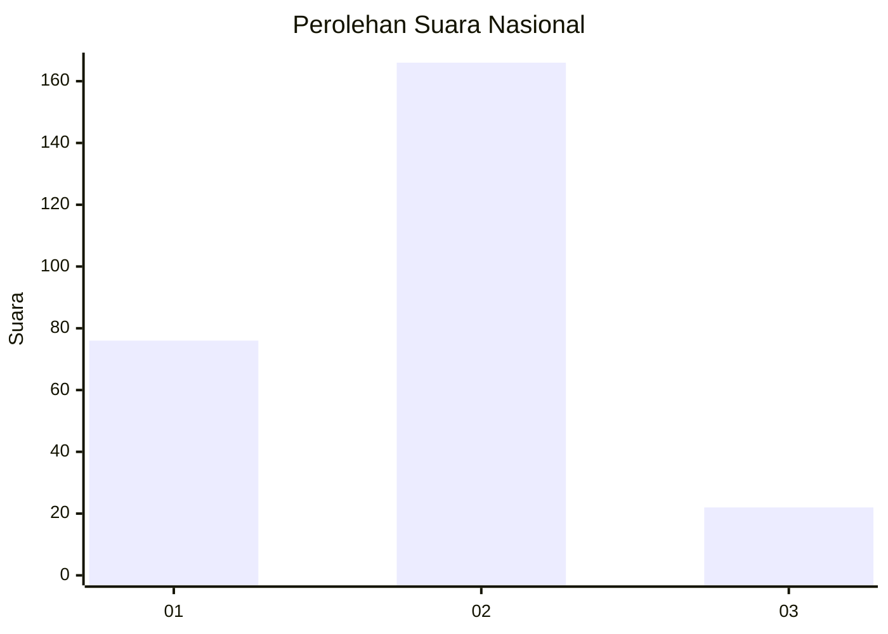
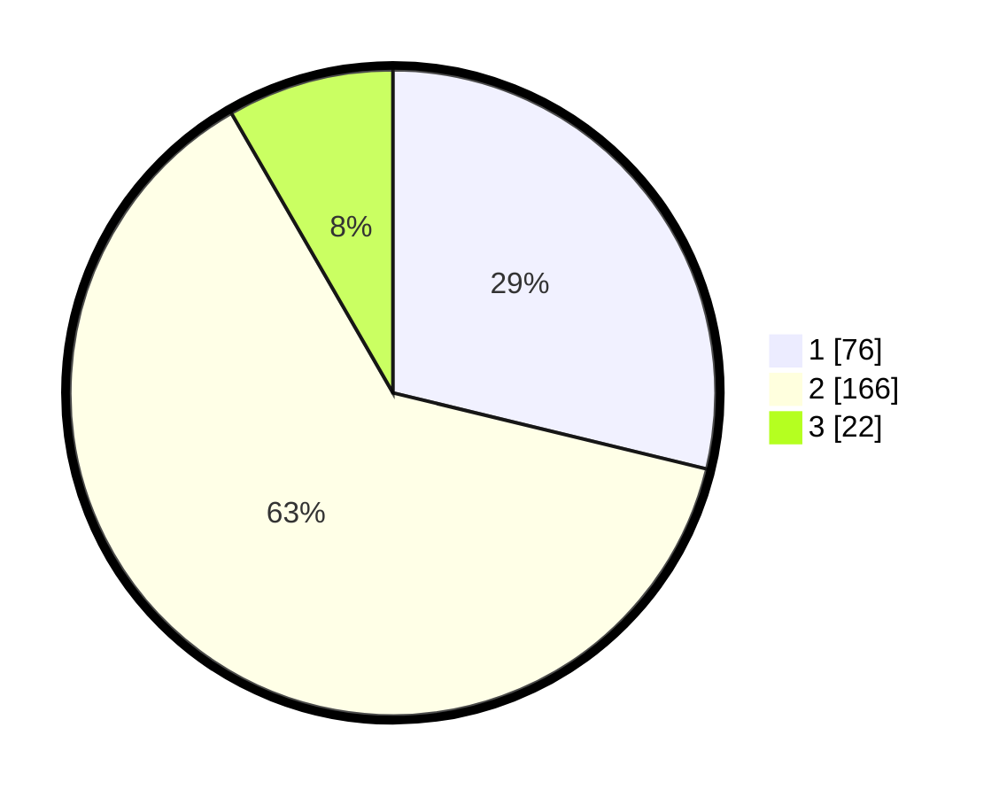

# Hasil

## Grafik

## Tabel

| No. | Nama Paslon    | Suara | Suara (raw) | Persentase |
|:--- |:-------------- | -----:| -----------:| ----------:|
| 1   | ANIES MUHAIMIN | 76    | [76][p-1]   | 28,79      |
| 2   | PRABOWO GIBRAN | 166   | [166][p-2]  | 62,88      |
| 3   | GANJAR MAHFUD  | 22    | [22][p-3]   | 8,33       |

[p-1]: https://github.com/gigit-pemilu/pemilu-2024/blob/main/pilpres/hitung-suara/sub/19-kepulauan-bangka-belitung/sub/01-bangka/sub/04-mendo-barat/sub/2012-rukam/sub/002-tps/sub/paslon-1.txt
[p-2]: https://github.com/gigit-pemilu/pemilu-2024/blob/main/pilpres/hitung-suara/sub/19-kepulauan-bangka-belitung/sub/01-bangka/sub/04-mendo-barat/sub/2012-rukam/sub/002-tps/sub/paslon-2.txt
[p-3]: https://github.com/gigit-pemilu/pemilu-2024/blob/main/pilpres/hitung-suara/sub/19-kepulauan-bangka-belitung/sub/01-bangka/sub/04-mendo-barat/sub/2012-rukam/sub/002-tps/sub/paslon-3.txt

## Foto C Plano

https://sirekap-obj-formc.kpu.go.id/bb7b/pemilu/ppwp/19/01/04/20/12/1901042012002-20240215-015726--f0611a8b-0a9d-4bd2-bedf-2f3da41212fb.jpg

https://sirekap-obj-formc.kpu.go.id/bb7b/pemilu/ppwp/19/01/04/20/12/1901042012002-20240215-015918--0d07afb2-3b05-4a9b-af08-eda4ef6ec9c0.jpg

https://sirekap-obj-formc.kpu.go.id/bb7b/pemilu/ppwp/19/01/04/20/12/1901042012002-20240215-020030--1c6b6638-d372-4c3d-9668-85d040edf476.jpg

## Metadata

| Key        | Value               |
| ---------- | ------------------- |
| Time Stamp | 2024-02-17 14:56:33 |

