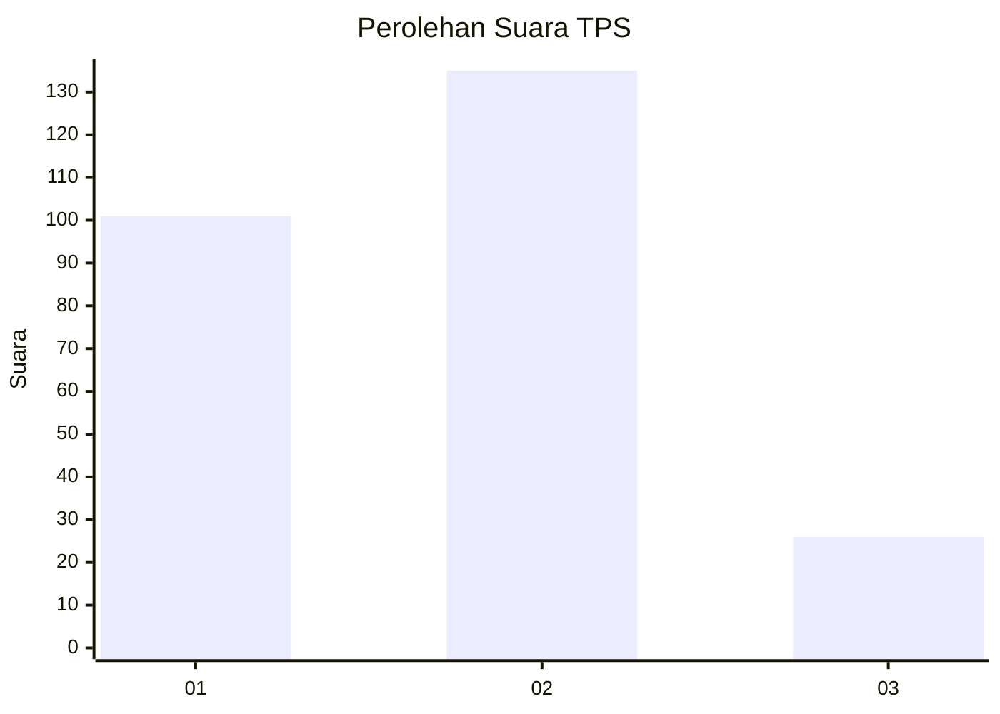
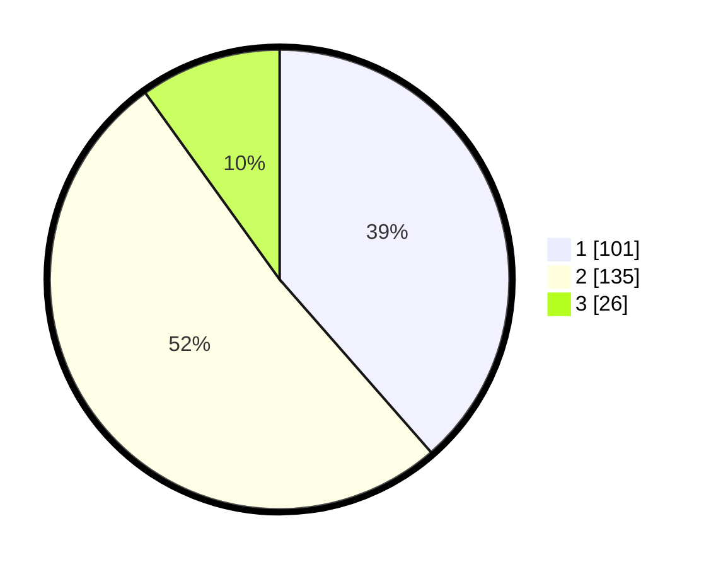

# Hasil

## Grafik

## Tabel

| No. | Nama Paslon    | Suara | Suara (raw) | Persentase |
|:--- |:-------------- | -----:| -----------:| ----------:|
| 1   | ANIES MUHAIMIN | 101   | [101][p-1]  | 38,55      |
| 2   | PRABOWO GIBRAN | 135   | [135][p-2]  | 51,53      |
| 3   | GANJAR MAHFUD  | 26    | [26][p-3]   | 9,92       |

[p-1]: https://github.com/gigit-pemilu/pemilu-2024-19-kepulauan-bangka-belitung/blob/main/pilpres/hitung-suara/sub/19-kepulauan-bangka-belitung/sub/01-bangka/sub/04-mendo-barat/sub/2012-rukam/sub/003-tps/sub/paslon-1.txt
[p-2]: https://github.com/gigit-pemilu/pemilu-2024-19-kepulauan-bangka-belitung/blob/main/pilpres/hitung-suara/sub/19-kepulauan-bangka-belitung/sub/01-bangka/sub/04-mendo-barat/sub/2012-rukam/sub/003-tps/sub/paslon-2.txt
[p-3]: https://github.com/gigit-pemilu/pemilu-2024-19-kepulauan-bangka-belitung/blob/main/pilpres/hitung-suara/sub/19-kepulauan-bangka-belitung/sub/01-bangka/sub/04-mendo-barat/sub/2012-rukam/sub/003-tps/sub/paslon-3.txt

## Foto C Plano

https://sirekap-obj-formc.kpu.go.id/ef37/pemilu/ppwp/19/01/04/20/12/1901042012003-20240215-030728--68a8aafa-9524-4388-b8cf-ba6288074c1f.jpg

https://sirekap-obj-formc.kpu.go.id/ef37/pemilu/ppwp/19/01/04/20/12/1901042012003-20240215-064702--0734b935-95cd-4352-a6de-eb48efcaa22a.jpg

https://sirekap-obj-formc.kpu.go.id/ef37/pemilu/ppwp/19/01/04/20/12/1901042012003-20240215-030657--550f9a80-5c88-4eb6-a907-0447f0778002.jpg

## Metadata

| Key        | Value               |
| ---------- | ------------------- |
| Time Stamp | 2024-02-17 14:56:33 |

