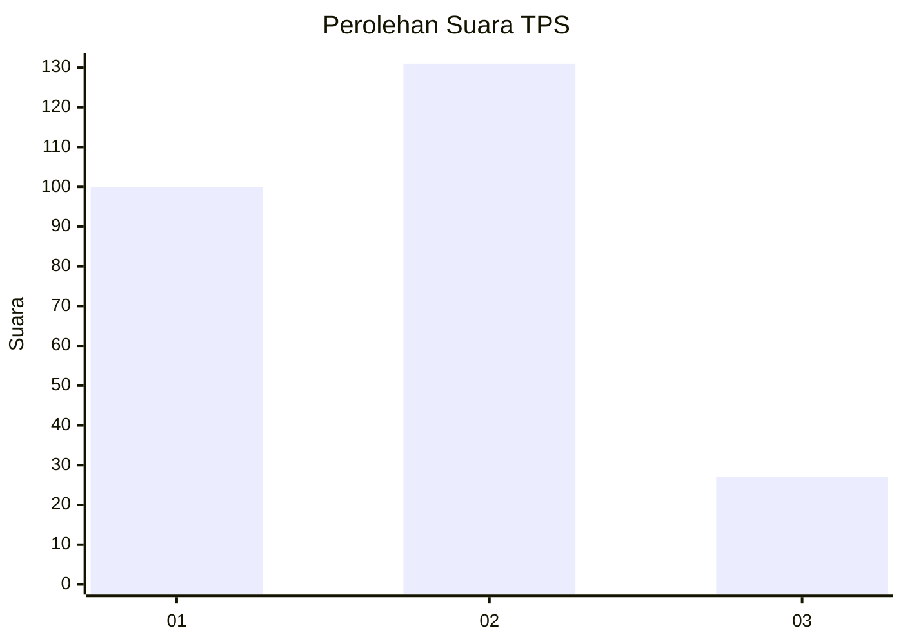
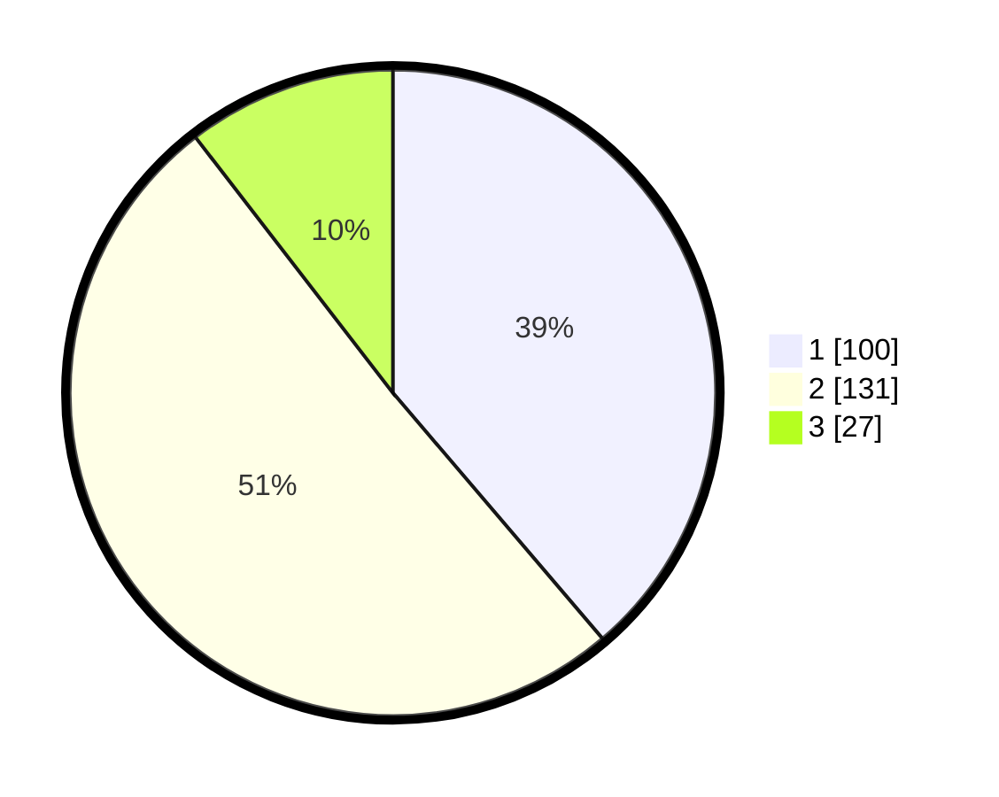

# Hasil

## Grafik

## Tabel

| No. | Nama Paslon    | Suara | Suara (raw) | Persentase |
|:--- |:-------------- | -----:| -----------:| ----------:|
| 1   | ANIES MUHAIMIN | 100   | [100][p-1]  | 38,76      |
| 2   | PRABOWO GIBRAN | 131   | [131][p-2]  | 50,78      |
| 3   | GANJAR MAHFUD  | 27    | [27][p-3]   | 10,47      |

[p-1]: https://github.com/gigit-pemilu/pemilu-2024-19-kepulauan-bangka-belitung/blob/main/pilpres/hitung-suara/sub/19-kepulauan-bangka-belitung/sub/01-bangka/sub/04-mendo-barat/sub/2013-labuh-air-pandan/sub/001-tps/sub/paslon-1.txt
[p-2]: https://github.com/gigit-pemilu/pemilu-2024-19-kepulauan-bangka-belitung/blob/main/pilpres/hitung-suara/sub/19-kepulauan-bangka-belitung/sub/01-bangka/sub/04-mendo-barat/sub/2013-labuh-air-pandan/sub/001-tps/sub/paslon-2.txt
[p-3]: https://github.com/gigit-pemilu/pemilu-2024-19-kepulauan-bangka-belitung/blob/main/pilpres/hitung-suara/sub/19-kepulauan-bangka-belitung/sub/01-bangka/sub/04-mendo-barat/sub/2013-labuh-air-pandan/sub/001-tps/sub/paslon-3.txt

## Foto C Plano

https://sirekap-obj-formc.kpu.go.id/e489/pemilu/ppwp/19/01/04/20/13/1901042013001-20240223-154640--e9e669a3-43a1-4d15-8656-b5cdefbadaf5.jpg

https://sirekap-obj-formc.kpu.go.id/e489/pemilu/ppwp/19/01/04/20/13/1901042013001-20240223-154801--7c0c4274-dc8b-4b31-8886-40915a74ce9e.jpg

https://sirekap-obj-formc.kpu.go.id/e489/pemilu/ppwp/19/01/04/20/13/1901042013001-20240223-154947--ebf4a9c7-aa4f-4d88-a6f5-84de20791f70.jpg

## Metadata

| Key        | Value               |
| ---------- | ------------------- |
| Time Stamp | 2024-02-24 22:31:28 |

