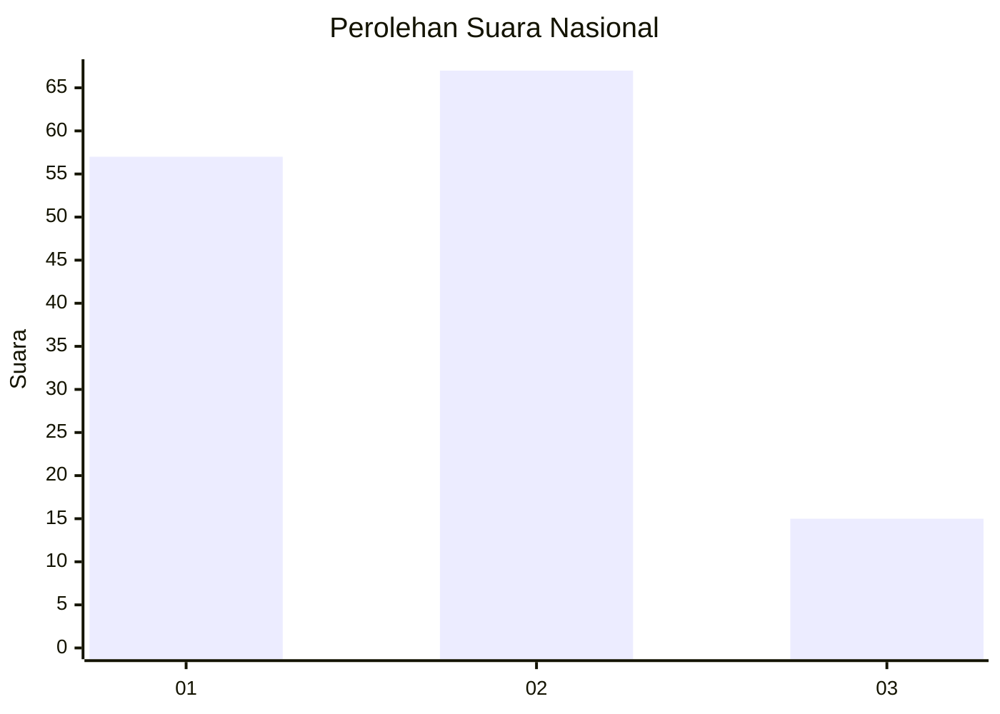
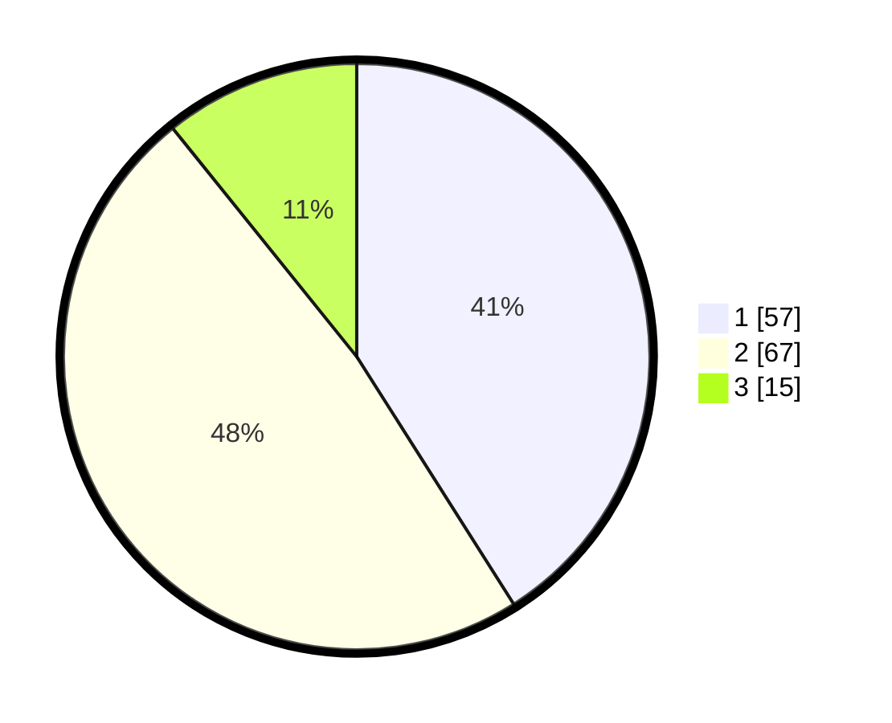

# Hasil

## Grafik

## Tabel

| No. | Nama Paslon    | Suara | Suara (raw) | Persentase |
|:--- |:-------------- | -----:| -----------:| ----------:|
| 1   | ANIES MUHAIMIN | 57    | [57][p-1]   | 41,01      |
| 2   | PRABOWO GIBRAN | 67    | [67][p-2]   | 48,20      |
| 3   | GANJAR MAHFUD  | 15    | [15][p-3]   | 10,79      |

[p-1]: https://github.com/gigit-pemilu/pemilu-2024/blob/main/pilpres/hitung-suara/sub/19-kepulauan-bangka-belitung/sub/01-bangka/sub/04-mendo-barat/sub/2015-petaling-banjar/sub/006-tps/sub/paslon-1.txt
[p-2]: https://github.com/gigit-pemilu/pemilu-2024/blob/main/pilpres/hitung-suara/sub/19-kepulauan-bangka-belitung/sub/01-bangka/sub/04-mendo-barat/sub/2015-petaling-banjar/sub/006-tps/sub/paslon-2.txt
[p-3]: https://github.com/gigit-pemilu/pemilu-2024/blob/main/pilpres/hitung-suara/sub/19-kepulauan-bangka-belitung/sub/01-bangka/sub/04-mendo-barat/sub/2015-petaling-banjar/sub/006-tps/sub/paslon-3.txt

## Foto C Plano

https://sirekap-obj-formc.kpu.go.id/18e6/pemilu/ppwp/19/01/04/20/15/1901042015006-20240221-093728--2a819de0-f065-4cfa-83cb-94ada68eaaa6.jpg

https://sirekap-obj-formc.kpu.go.id/18e6/pemilu/ppwp/19/01/04/20/15/1901042015006-20240221-093843--4c713f87-8a44-4777-8395-7cf0d6b830c3.jpg

https://sirekap-obj-formc.kpu.go.id/18e6/pemilu/ppwp/19/01/04/20/15/1901042015006-20240221-094240--20af7498-9441-4ef9-b66d-d4fc249fc37a.jpg

## Metadata

| Key        | Value               |
| ---------- | ------------------- |
| Time Stamp | 2024-02-24 22:31:28 |

