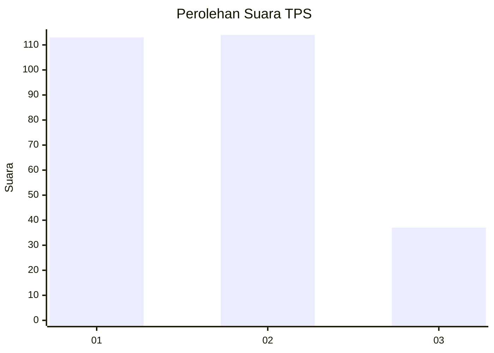
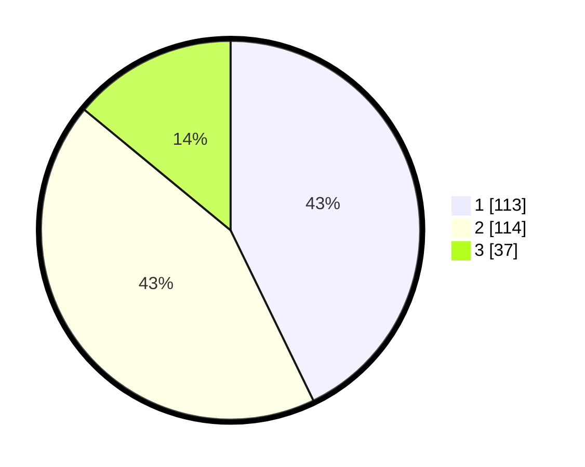

# Hasil

## Grafik

## Tabel

| No. | Nama Paslon    | Suara | Suara (raw) | Persentase |
|:--- |:-------------- | -----:| -----------:| ----------:|
| 1   | ANIES MUHAIMIN | 113   | [113][p-1]  | 42,80      |
| 2   | PRABOWO GIBRAN | 114   | [114][p-2]  | 43,18      |
| 3   | GANJAR MAHFUD  | 37    | [37][p-3]   | 14,02      |

[p-1]: https://github.com/gigit-pemilu/pemilu-2024-19-kepulauan-bangka-belitung/blob/main/pilpres/hitung-suara/sub/19-kepulauan-bangka-belitung/sub/01-bangka/sub/05-pemali/sub/2004-sempan/sub/004-tps/sub/paslon-1.txt
[p-2]: https://github.com/gigit-pemilu/pemilu-2024-19-kepulauan-bangka-belitung/blob/main/pilpres/hitung-suara/sub/19-kepulauan-bangka-belitung/sub/01-bangka/sub/05-pemali/sub/2004-sempan/sub/004-tps/sub/paslon-2.txt
[p-3]: https://github.com/gigit-pemilu/pemilu-2024-19-kepulauan-bangka-belitung/blob/main/pilpres/hitung-suara/sub/19-kepulauan-bangka-belitung/sub/01-bangka/sub/05-pemali/sub/2004-sempan/sub/004-tps/sub/paslon-3.txt

## Foto C Plano

https://sirekap-obj-formc.kpu.go.id/a284/pemilu/ppwp/19/01/05/20/04/1901052004004-20240214-191649--a78bbcf6-4b93-4824-ac23-61fcd001a174.jpg

https://sirekap-obj-formc.kpu.go.id/a284/pemilu/ppwp/19/01/05/20/04/1901052004004-20240214-155433--e2f33dad-e574-4104-af7e-40bb3aa9fc03.jpg

https://sirekap-obj-formc.kpu.go.id/a284/pemilu/ppwp/19/01/05/20/04/1901052004004-20240214-191814--12ddbdfa-d72d-4a87-b555-c7cd6f8d997b.jpg

## Metadata

| Key        | Value               |
| ---------- | ------------------- |
| Time Stamp | 2024-02-15 05:00:24 |

