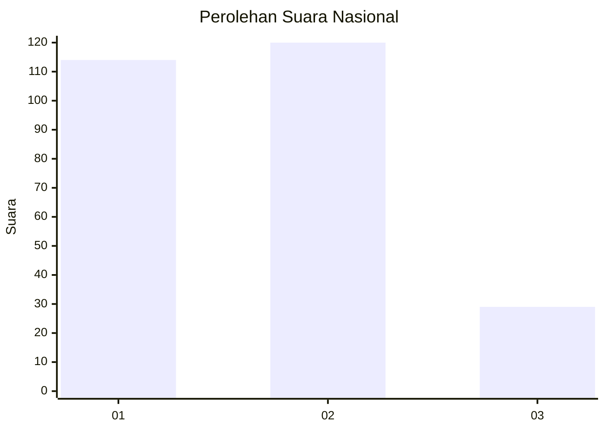
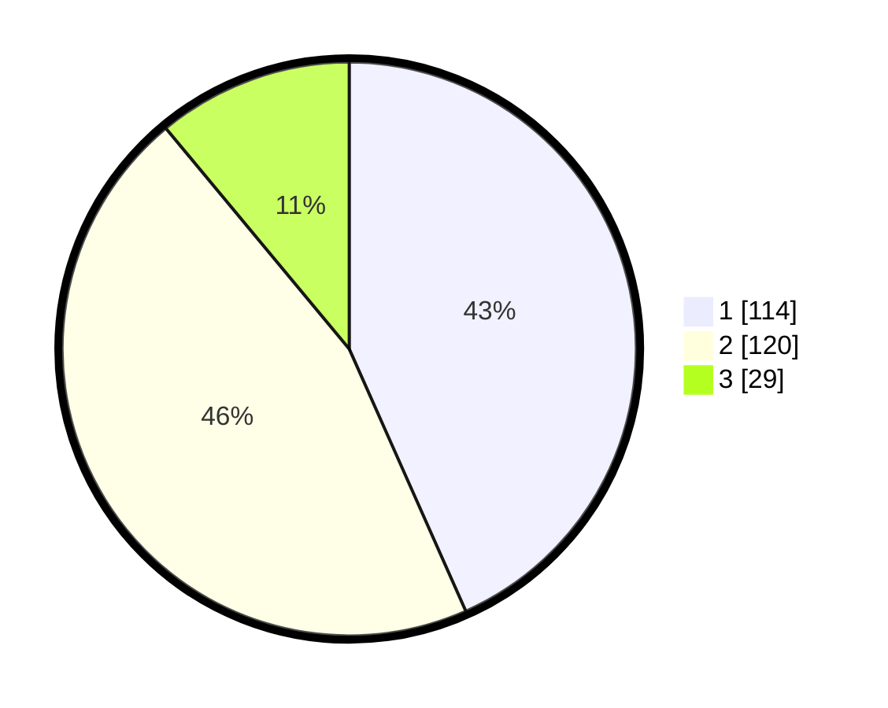

# Hasil

## Grafik

## Tabel

| No. | Nama Paslon    | Suara | Suara (raw) | Persentase |
|:--- |:-------------- | -----:| -----------:| ----------:|
| 1   | ANIES MUHAIMIN | 114   | [114][p-1]  | 43,35      |
| 2   | PRABOWO GIBRAN | 120   | [120][p-2]  | 45,63      |
| 3   | GANJAR MAHFUD  | 29    | [29][p-3]   | 11,03      |

[p-1]: https://github.com/gigit-pemilu/pemilu-2024/blob/main/pilpres/hitung-suara/sub/19-kepulauan-bangka-belitung/sub/01-bangka/sub/05-pemali/sub/2004-sempan/sub/010-tps/sub/paslon-1.txt
[p-2]: https://github.com/gigit-pemilu/pemilu-2024/blob/main/pilpres/hitung-suara/sub/19-kepulauan-bangka-belitung/sub/01-bangka/sub/05-pemali/sub/2004-sempan/sub/010-tps/sub/paslon-2.txt
[p-3]: https://github.com/gigit-pemilu/pemilu-2024/blob/main/pilpres/hitung-suara/sub/19-kepulauan-bangka-belitung/sub/01-bangka/sub/05-pemali/sub/2004-sempan/sub/010-tps/sub/paslon-3.txt

## Foto C Plano

https://sirekap-obj-formc.kpu.go.id/55d2/pemilu/ppwp/19/01/05/20/04/1901052004010-20240215-004857--a2859863-aadc-4fed-9dd4-043c2b44679f.jpg

https://sirekap-obj-formc.kpu.go.id/55d2/pemilu/ppwp/19/01/05/20/04/1901052004010-20240215-004904--6a8e3bc4-6039-494b-bc0a-d5abc4f09e4e.jpg

https://sirekap-obj-formc.kpu.go.id/55d2/pemilu/ppwp/19/01/05/20/04/1901052004010-20240215-004911--122749fe-a5fe-4fc4-a49c-339467acae22.jpg

## Metadata

| Key        | Value               |
| ---------- | ------------------- |
| Time Stamp | 2024-02-26 11:00:00 |

