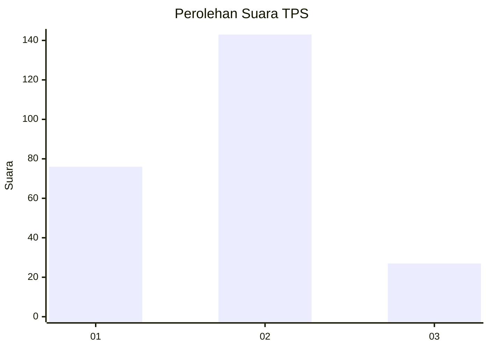
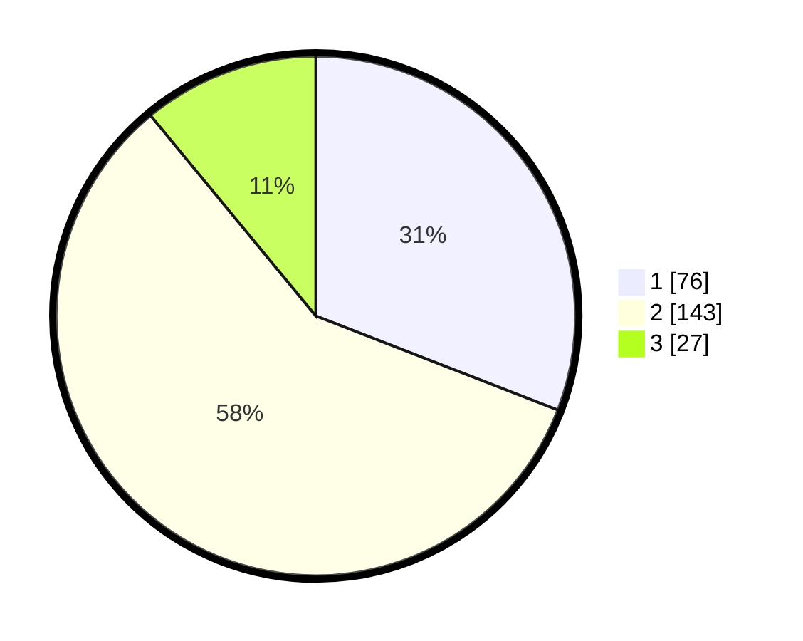

# Hasil

## Grafik

## Tabel

| No. | Nama Paslon    | Suara | Suara (raw) | Persentase |
|:--- |:-------------- | -----:| -----------:| ----------:|
| 1   | ANIES MUHAIMIN | 76    | [76][p-1]   | 30,89      |
| 2   | PRABOWO GIBRAN | 143   | [143][p-2]  | 58,13      |
| 3   | GANJAR MAHFUD  | 27    | [27][p-3]   | 10,98      |

[p-1]: https://github.com/gigit-pemilu/pemilu-2024-19-kepulauan-bangka-belitung/blob/main/pilpres/hitung-suara/sub/19-kepulauan-bangka-belitung/sub/01-bangka/sub/05-pemali/sub/2005-pemali/sub/006-tps/sub/paslon-1.txt
[p-2]: https://github.com/gigit-pemilu/pemilu-2024-19-kepulauan-bangka-belitung/blob/main/pilpres/hitung-suara/sub/19-kepulauan-bangka-belitung/sub/01-bangka/sub/05-pemali/sub/2005-pemali/sub/006-tps/sub/paslon-2.txt
[p-3]: https://github.com/gigit-pemilu/pemilu-2024-19-kepulauan-bangka-belitung/blob/main/pilpres/hitung-suara/sub/19-kepulauan-bangka-belitung/sub/01-bangka/sub/05-pemali/sub/2005-pemali/sub/006-tps/sub/paslon-3.txt

## Foto C Plano

https://sirekap-obj-formc.kpu.go.id/8f74/pemilu/ppwp/19/01/05/20/05/1901052005006-20240214-214734--0abc11c0-38ac-4aba-8d46-92d33be1d545.jpg

https://sirekap-obj-formc.kpu.go.id/8f74/pemilu/ppwp/19/01/05/20/05/1901052005006-20240214-214859--7a9d2b45-7482-46a7-87d1-4496796ef574.jpg

https://sirekap-obj-formc.kpu.go.id/8f74/pemilu/ppwp/19/01/05/20/05/1901052005006-20240214-214954--c5ec9d6a-ebe1-487a-bbdb-53b5a77e3ae4.jpg

## Metadata

| Key        | Value               |
| ---------- | ------------------- |
| Time Stamp | 2024-02-25 13:00:00 |

