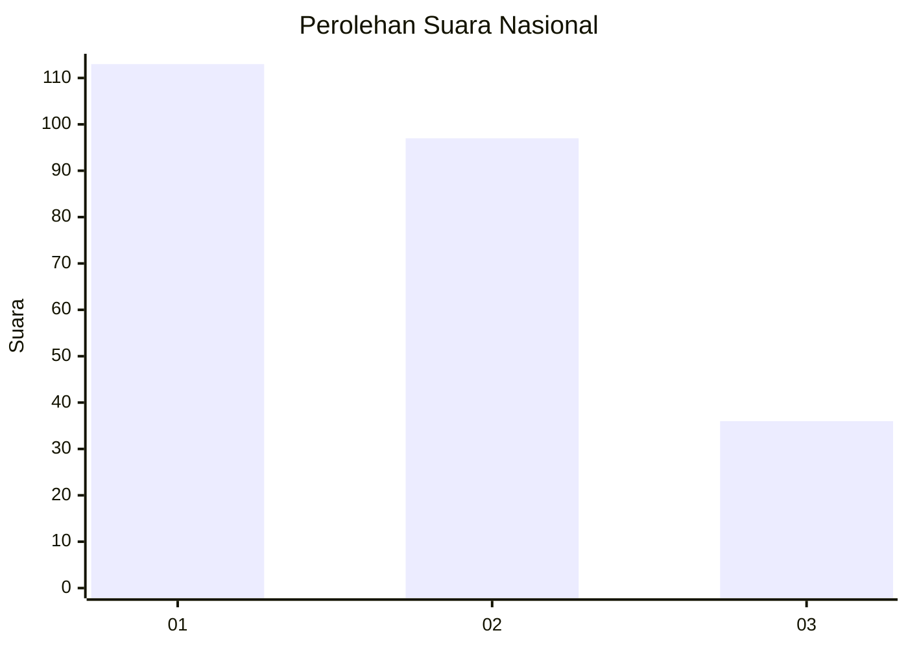
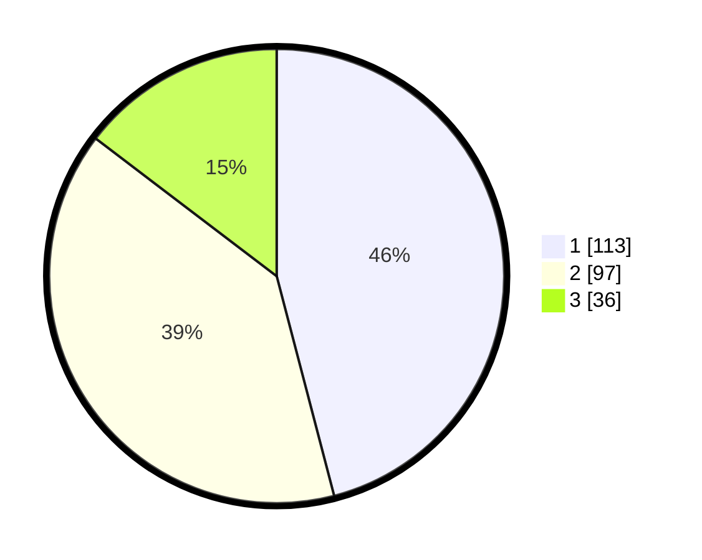

# Hasil

## Grafik

## Tabel

| No. | Nama Paslon    | Suara | Suara (raw) | Persentase |
|:--- |:-------------- | -----:| -----------:| ----------:|
| 1   | ANIES MUHAIMIN | 113   | [113][p-1]  | 45,93      |
| 2   | PRABOWO GIBRAN | 97    | [97][p-2]   | 39,43      |
| 3   | GANJAR MAHFUD  | 36    | [36][p-3]   | 14,63      |

[p-1]: https://github.com/gigit-pemilu/pemilu-2024/blob/main/pilpres/hitung-suara/sub/19-kepulauan-bangka-belitung/sub/01-bangka/sub/06-bakam/sub/2003-dalil/sub/001-tps/sub/paslon-1.txt
[p-2]: https://github.com/gigit-pemilu/pemilu-2024/blob/main/pilpres/hitung-suara/sub/19-kepulauan-bangka-belitung/sub/01-bangka/sub/06-bakam/sub/2003-dalil/sub/001-tps/sub/paslon-2.txt
[p-3]: https://github.com/gigit-pemilu/pemilu-2024/blob/main/pilpres/hitung-suara/sub/19-kepulauan-bangka-belitung/sub/01-bangka/sub/06-bakam/sub/2003-dalil/sub/001-tps/sub/paslon-3.txt

## Foto C Plano

https://sirekap-obj-formc.kpu.go.id/e0f7/pemilu/ppwp/19/01/06/20/03/1901062003001-20240215-054611--0df2446d-6fc2-425c-bb9a-b19a589eddb5.jpg

https://sirekap-obj-formc.kpu.go.id/e0f7/pemilu/ppwp/19/01/06/20/03/1901062003001-20240215-054752--2c965052-84fe-4800-a715-a93aefb63341.jpg

https://sirekap-obj-formc.kpu.go.id/e0f7/pemilu/ppwp/19/01/06/20/03/1901062003001-20240215-054837--18933732-2952-4381-a3d8-3e0898d79b35.jpg

## Metadata

| Key        | Value               |
| ---------- | ------------------- |
| Time Stamp | 2024-02-17 14:45:18 |

