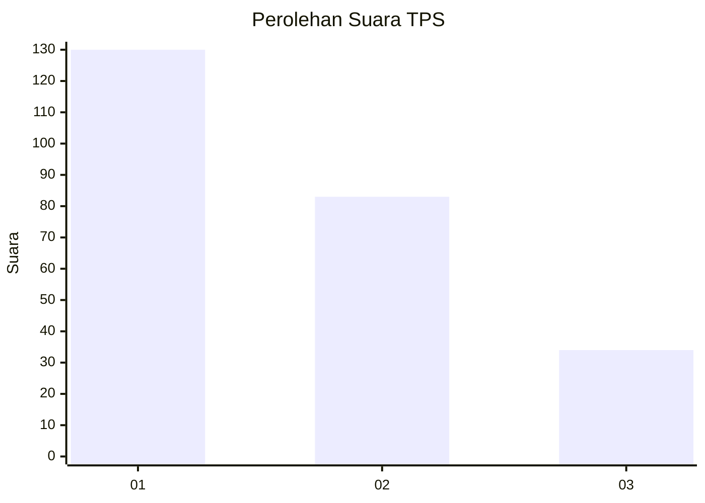
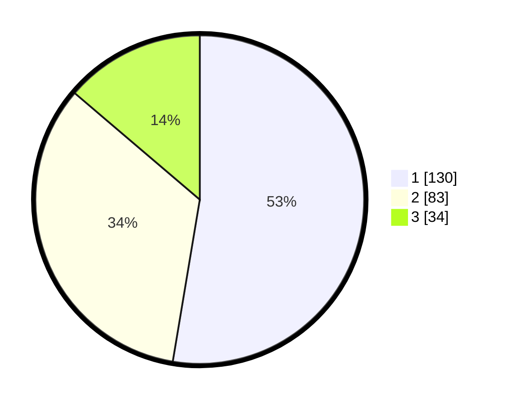

# Hasil

## Grafik

## Tabel

| No. | Nama Paslon    | Suara | Suara (raw) | Persentase |
|:--- |:-------------- | -----:| -----------:| ----------:|
| 1   | ANIES MUHAIMIN | 130   | [130][p-1]  | 52,63      |
| 2   | PRABOWO GIBRAN | 83    | [83][p-2]   | 33,60      |
| 3   | GANJAR MAHFUD  | 34    | [34][p-3]   | 13,77      |

[p-1]: https://github.com/gigit-pemilu/pemilu-2024-19-kepulauan-bangka-belitung/blob/main/pilpres/hitung-suara/sub/19-kepulauan-bangka-belitung/sub/01-bangka/sub/06-bakam/sub/2003-dalil/sub/003-tps/sub/paslon-1.txt
[p-2]: https://github.com/gigit-pemilu/pemilu-2024-19-kepulauan-bangka-belitung/blob/main/pilpres/hitung-suara/sub/19-kepulauan-bangka-belitung/sub/01-bangka/sub/06-bakam/sub/2003-dalil/sub/003-tps/sub/paslon-2.txt
[p-3]: https://github.com/gigit-pemilu/pemilu-2024-19-kepulauan-bangka-belitung/blob/main/pilpres/hitung-suara/sub/19-kepulauan-bangka-belitung/sub/01-bangka/sub/06-bakam/sub/2003-dalil/sub/003-tps/sub/paslon-3.txt

## Foto C Plano

https://sirekap-obj-formc.kpu.go.id/18d3/pemilu/ppwp/19/01/06/20/03/1901062003003-20240215-045941--0bb25c09-ec37-40c2-8d20-95520dc54458.jpg

https://sirekap-obj-formc.kpu.go.id/18d3/pemilu/ppwp/19/01/06/20/03/1901062003003-20240215-050049--9e4ca346-500a-43ed-8965-e3a3be807ad5.jpg

https://sirekap-obj-formc.kpu.go.id/18d3/pemilu/ppwp/19/01/06/20/03/1901062003003-20240215-053816--f095a969-83aa-4446-a475-38e2ff04add9.jpg

## Metadata

| Key        | Value               |
| ---------- | ------------------- |
| Time Stamp | 2024-02-17 14:45:18 |

