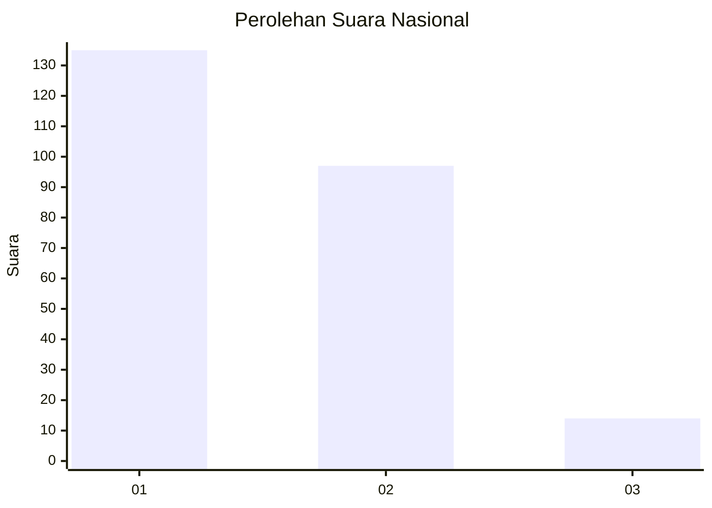
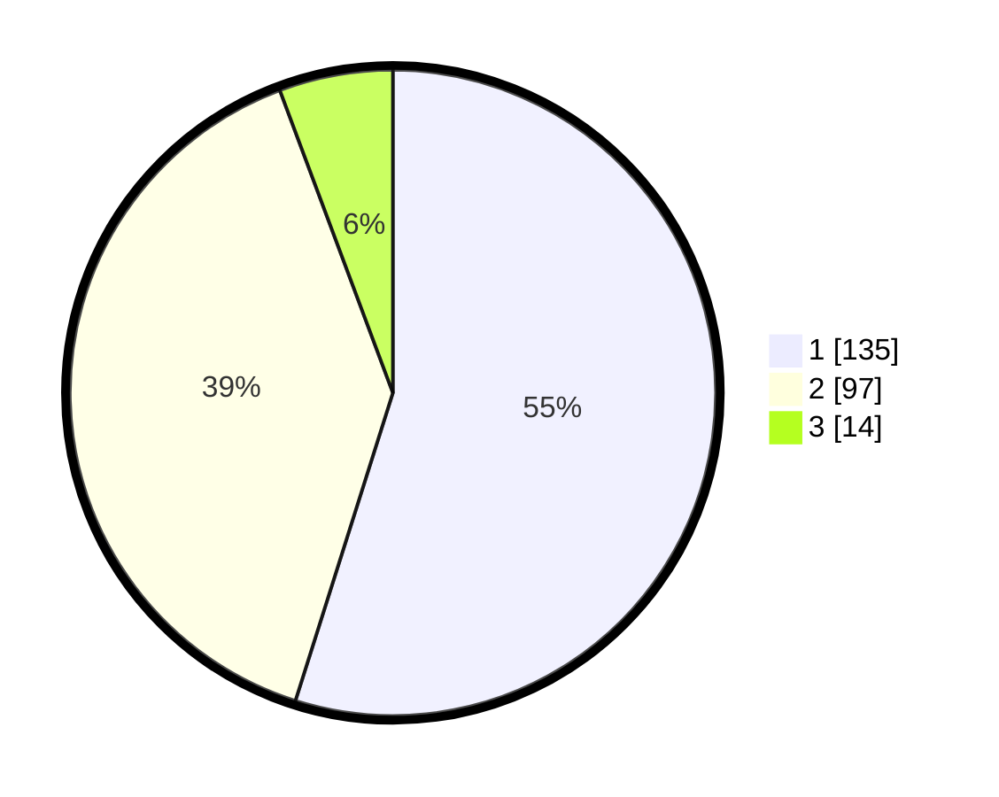

# Hasil

## Grafik

## Tabel

| No. | Nama Paslon    | Suara | Suara (raw) | Persentase |
|:--- |:-------------- | -----:| -----------:| ----------:|
| 1   | ANIES MUHAIMIN | 135   | [135][p-1]  | 54,88      |
| 2   | PRABOWO GIBRAN | 97    | [97][p-2]   | 39,43      |
| 3   | GANJAR MAHFUD  | 14    | [14][p-3]   | 5,69       |

[p-1]: https://github.com/gigit-pemilu/pemilu-2024/blob/main/pilpres/hitung-suara/sub/19-kepulauan-bangka-belitung/sub/01-bangka/sub/06-bakam/sub/2003-dalil/sub/005-tps/sub/paslon-1.txt
[p-2]: https://github.com/gigit-pemilu/pemilu-2024/blob/main/pilpres/hitung-suara/sub/19-kepulauan-bangka-belitung/sub/01-bangka/sub/06-bakam/sub/2003-dalil/sub/005-tps/sub/paslon-2.txt
[p-3]: https://github.com/gigit-pemilu/pemilu-2024/blob/main/pilpres/hitung-suara/sub/19-kepulauan-bangka-belitung/sub/01-bangka/sub/06-bakam/sub/2003-dalil/sub/005-tps/sub/paslon-3.txt

## Foto C Plano

https://sirekap-obj-formc.kpu.go.id/fca3/pemilu/ppwp/19/01/06/20/03/1901062003005-20240215-034126--7e1b17fb-9ca0-4ee0-9b03-edc475517f3c.jpg

https://sirekap-obj-formc.kpu.go.id/fca3/pemilu/ppwp/19/01/06/20/03/1901062003005-20240215-034130--7a205f01-7ce9-4fcd-a02c-caf72112ec9c.jpg

https://sirekap-obj-formc.kpu.go.id/fca3/pemilu/ppwp/19/01/06/20/03/1901062003005-20240215-034133--32b2c81d-94a7-4c65-8116-d833030e51e4.jpg

## Metadata

| Key        | Value               |
| ---------- | ------------------- |
| Time Stamp | 2024-02-15 12:00:28 |

