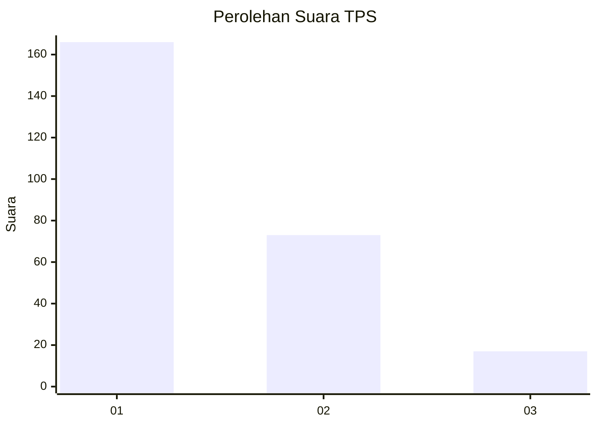
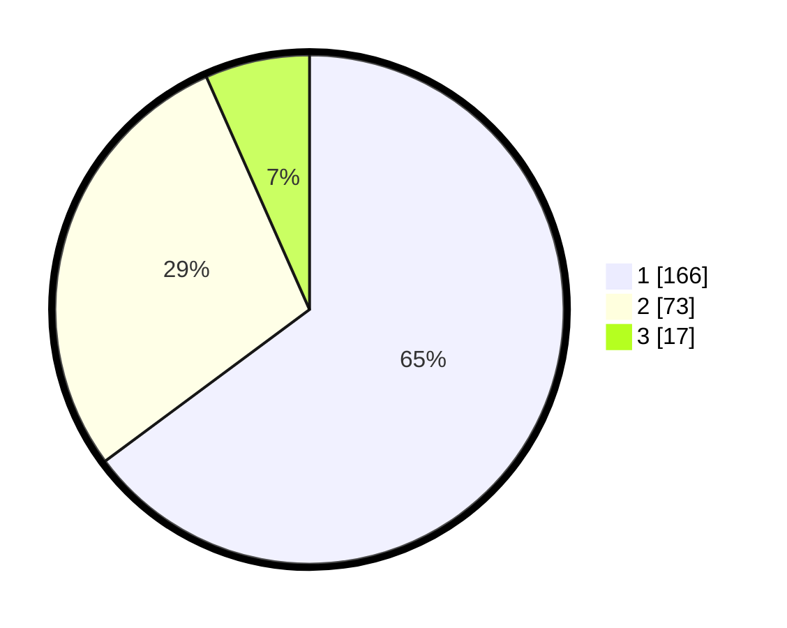

# Hasil

## Grafik

## Tabel

| No. | Nama Paslon    | Suara | Suara (raw) | Persentase |
|:--- |:-------------- | -----:| -----------:| ----------:|
| 1   | ANIES MUHAIMIN | 166   | [166][p-1]  | 64,84      |
| 2   | PRABOWO GIBRAN | 73    | [73][p-2]   | 28,52      |
| 3   | GANJAR MAHFUD  | 17    | [17][p-3]   | 6,64       |

[p-1]: https://github.com/gigit-pemilu/pemilu-2024-19-kepulauan-bangka-belitung/blob/main/pilpres/hitung-suara/sub/19-kepulauan-bangka-belitung/sub/01-bangka/sub/06-bakam/sub/2003-dalil/sub/006-tps/sub/paslon-1.txt
[p-2]: https://github.com/gigit-pemilu/pemilu-2024-19-kepulauan-bangka-belitung/blob/main/pilpres/hitung-suara/sub/19-kepulauan-bangka-belitung/sub/01-bangka/sub/06-bakam/sub/2003-dalil/sub/006-tps/sub/paslon-2.txt
[p-3]: https://github.com/gigit-pemilu/pemilu-2024-19-kepulauan-bangka-belitung/blob/main/pilpres/hitung-suara/sub/19-kepulauan-bangka-belitung/sub/01-bangka/sub/06-bakam/sub/2003-dalil/sub/006-tps/sub/paslon-3.txt

## Foto C Plano

https://sirekap-obj-formc.kpu.go.id/5bf5/pemilu/ppwp/19/01/06/20/03/1901062003006-20240215-021722--82238e87-1871-449a-aa2e-b9d37ef290e5.jpg

https://sirekap-obj-formc.kpu.go.id/5bf5/pemilu/ppwp/19/01/06/20/03/1901062003006-20240215-021854--4377f520-fcf5-4c3b-84d3-c00d16ce6d66.jpg

https://sirekap-obj-formc.kpu.go.id/5bf5/pemilu/ppwp/19/01/06/20/03/1901062003006-20240215-022001--12014809-db07-425a-b24d-e0c779c83dcd.jpg

## Metadata

| Key        | Value               |
| ---------- | ------------------- |
| Time Stamp | 2024-02-17 14:45:18 |

