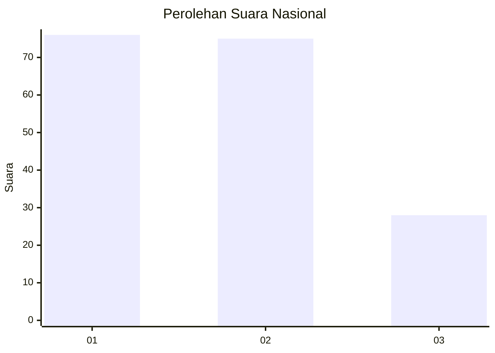
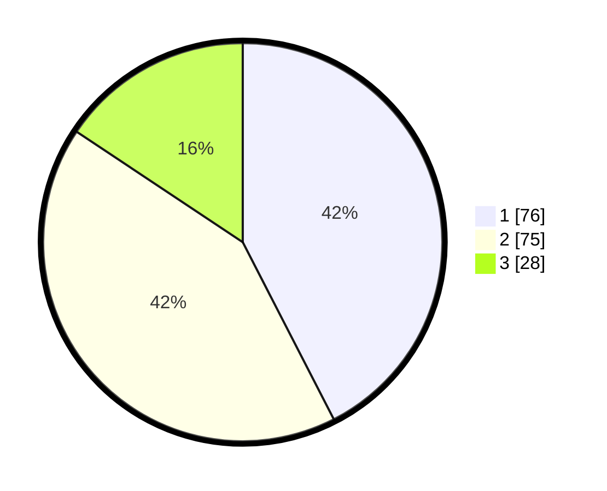

# Hasil

## Grafik

## Tabel

| No. | Nama Paslon    | Suara | Suara (raw) | Persentase |
|:--- |:-------------- | -----:| -----------:| ----------:|
| 1   | ANIES MUHAIMIN | 76    | [76][p-1]   | 42,46      |
| 2   | PRABOWO GIBRAN | 75    | [75][p-2]   | 41,90      |
| 3   | GANJAR MAHFUD  | 28    | [28][p-3]   | 15,64      |

[p-1]: https://github.com/gigit-pemilu/pemilu-2024/blob/main/pilpres/hitung-suara/sub/19-kepulauan-bangka-belitung/sub/01-bangka/sub/06-bakam/sub/2004-neknang/sub/004-tps/sub/paslon-1.txt
[p-2]: https://github.com/gigit-pemilu/pemilu-2024/blob/main/pilpres/hitung-suara/sub/19-kepulauan-bangka-belitung/sub/01-bangka/sub/06-bakam/sub/2004-neknang/sub/004-tps/sub/paslon-2.txt
[p-3]: https://github.com/gigit-pemilu/pemilu-2024/blob/main/pilpres/hitung-suara/sub/19-kepulauan-bangka-belitung/sub/01-bangka/sub/06-bakam/sub/2004-neknang/sub/004-tps/sub/paslon-3.txt

## Foto C Plano

https://sirekap-obj-formc.kpu.go.id/af8f/pemilu/ppwp/19/01/06/20/04/1901062004004-20240221-090648--80818b2d-32b1-432f-8d81-c6ec7b7b0685.jpg

https://sirekap-obj-formc.kpu.go.id/af8f/pemilu/ppwp/19/01/06/20/04/1901062004004-20240221-090931--29122e67-bd99-4508-9cc9-7725946bb40d.jpg

https://sirekap-obj-formc.kpu.go.id/af8f/pemilu/ppwp/19/01/06/20/04/1901062004004-20240221-091006--f3d1c9fb-a07d-4f2e-a08e-1178bc7e56e0.jpg

## Metadata

| Key        | Value               |
| ---------- | ------------------- |
| Time Stamp | 2024-02-24 22:31:28 |

