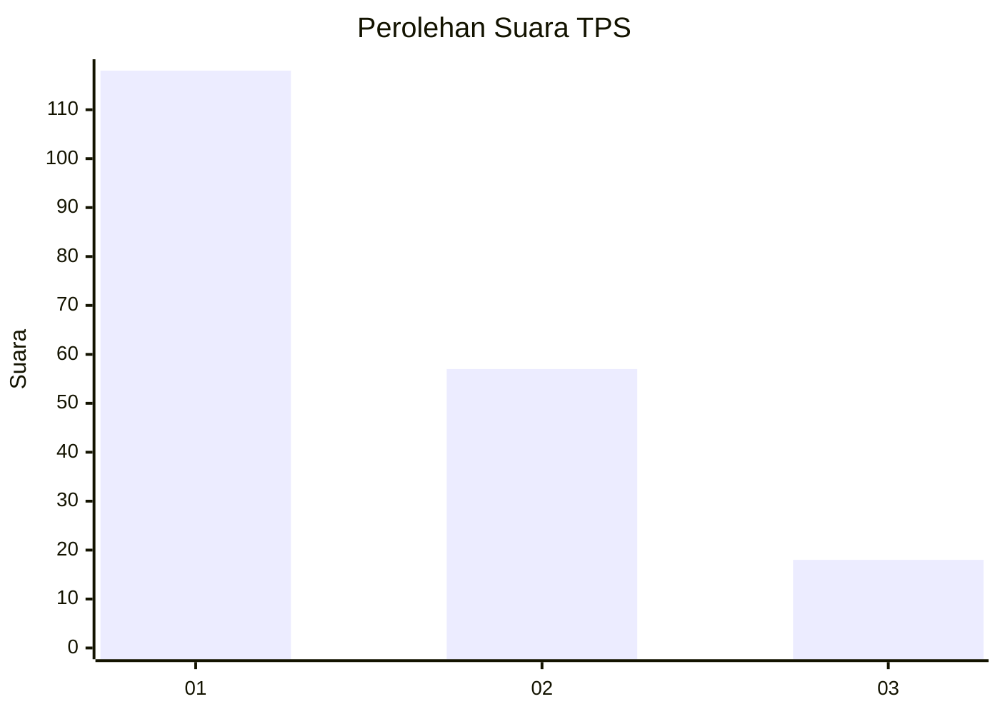
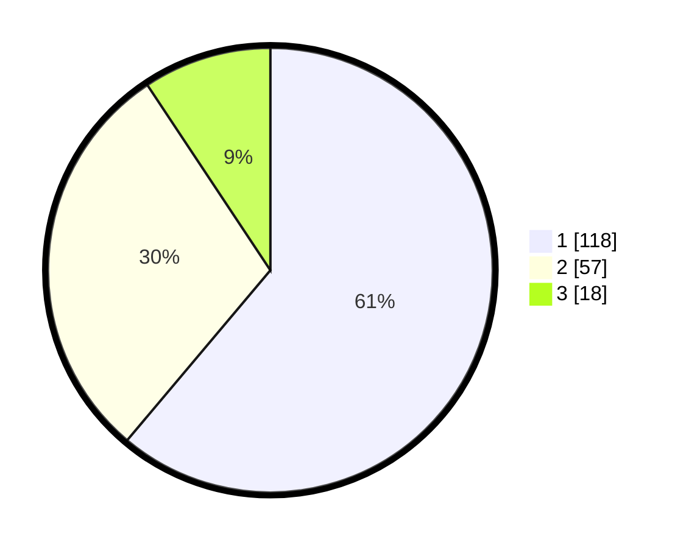

# Hasil

## Grafik

## Tabel

| No. | Nama Paslon    | Suara | Suara (raw) | Persentase |
|:--- |:-------------- | -----:| -----------:| ----------:|
| 1   | ANIES MUHAIMIN | 118   | [118][p-1]  | 61,14      |
| 2   | PRABOWO GIBRAN | 57    | [57][p-2]   | 29,53      |
| 3   | GANJAR MAHFUD  | 18    | [18][p-3]   | 9,33       |

[p-1]: https://github.com/gigit-pemilu/pemilu-2024-19-kepulauan-bangka-belitung/blob/main/pilpres/hitung-suara/sub/19-kepulauan-bangka-belitung/sub/01-bangka/sub/06-bakam/sub/2004-neknang/sub/005-tps/sub/paslon-1.txt
[p-2]: https://github.com/gigit-pemilu/pemilu-2024-19-kepulauan-bangka-belitung/blob/main/pilpres/hitung-suara/sub/19-kepulauan-bangka-belitung/sub/01-bangka/sub/06-bakam/sub/2004-neknang/sub/005-tps/sub/paslon-2.txt
[p-3]: https://github.com/gigit-pemilu/pemilu-2024-19-kepulauan-bangka-belitung/blob/main/pilpres/hitung-suara/sub/19-kepulauan-bangka-belitung/sub/01-bangka/sub/06-bakam/sub/2004-neknang/sub/005-tps/sub/paslon-3.txt

## Foto C Plano

https://sirekap-obj-formc.kpu.go.id/945c/pemilu/ppwp/19/01/06/20/04/1901062004005-20240214-203710--ce4c690c-3544-4cb5-854e-d26c966eec7f.jpg

https://sirekap-obj-formc.kpu.go.id/945c/pemilu/ppwp/19/01/06/20/04/1901062004005-20240214-203402--fbf6b6a3-0581-47b3-980d-e54d484dc8c3.jpg

https://sirekap-obj-formc.kpu.go.id/945c/pemilu/ppwp/19/01/06/20/04/1901062004005-20240214-203521--150e2f31-e510-4688-8f1b-6eb58f207f9b.jpg

## Metadata

| Key        | Value               |
| ---------- | ------------------- |
| Time Stamp | 2024-02-17 14:56:33 |

