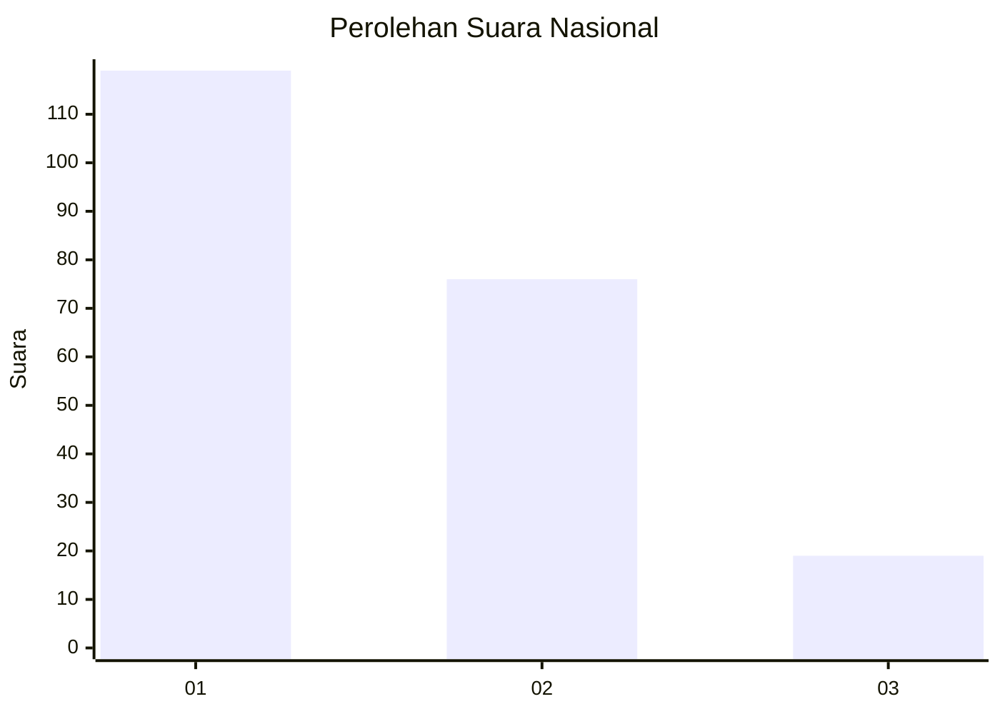
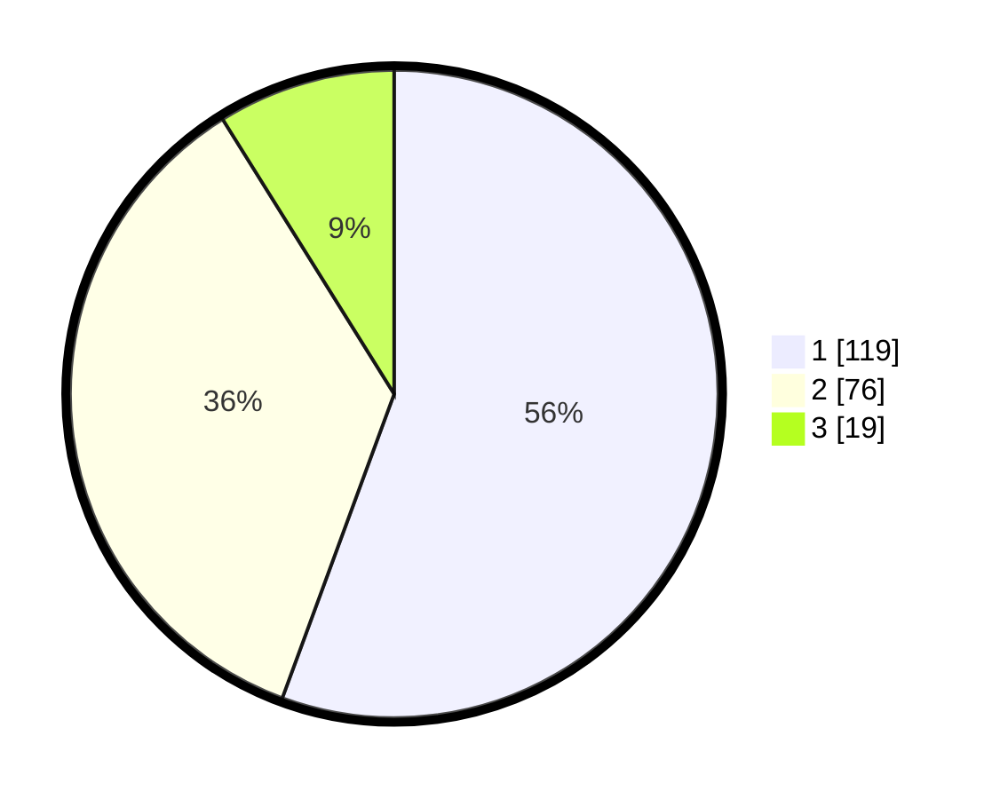

# Hasil

## Grafik

## Tabel

| No. | Nama Paslon    | Suara | Suara (raw) | Persentase |
|:--- |:-------------- | -----:| -----------:| ----------:|
| 1   | ANIES MUHAIMIN | 119   | [119][p-1]  | 55,61      |
| 2   | PRABOWO GIBRAN | 76    | [76][p-2]   | 35,51      |
| 3   | GANJAR MAHFUD  | 19    | [19][p-3]   | 8,88       |

[p-1]: https://github.com/gigit-pemilu/pemilu-2024/blob/main/pilpres/hitung-suara/sub/19-kepulauan-bangka-belitung/sub/01-bangka/sub/06-bakam/sub/2007-mabat/sub/003-tps/sub/paslon-1.txt
[p-2]: https://github.com/gigit-pemilu/pemilu-2024/blob/main/pilpres/hitung-suara/sub/19-kepulauan-bangka-belitung/sub/01-bangka/sub/06-bakam/sub/2007-mabat/sub/003-tps/sub/paslon-2.txt
[p-3]: https://github.com/gigit-pemilu/pemilu-2024/blob/main/pilpres/hitung-suara/sub/19-kepulauan-bangka-belitung/sub/01-bangka/sub/06-bakam/sub/2007-mabat/sub/003-tps/sub/paslon-3.txt

## Foto C Plano

https://sirekap-obj-formc.kpu.go.id/b1fd/pemilu/ppwp/19/01/06/20/07/1901062007003-20240215-031454--1773212a-a633-4ebd-98e5-6de7838fbcfb.jpg

https://sirekap-obj-formc.kpu.go.id/b1fd/pemilu/ppwp/19/01/06/20/07/1901062007003-20240214-235659--a213a28d-b6ac-4325-a38e-02bff158a257.jpg

https://sirekap-obj-formc.kpu.go.id/b1fd/pemilu/ppwp/19/01/06/20/07/1901062007003-20240214-235849--49d531af-8769-4839-984c-07b3f0988953.jpg

## Metadata

| Key        | Value               |
| ---------- | ------------------- |
| Time Stamp | 2024-02-15 15:30:25 |

