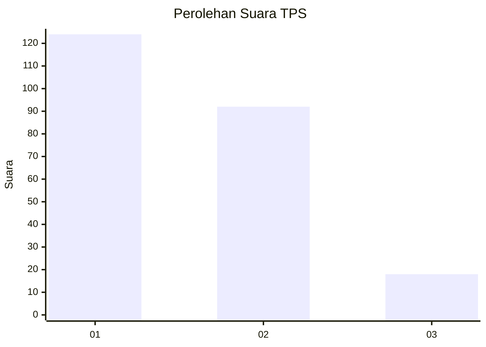
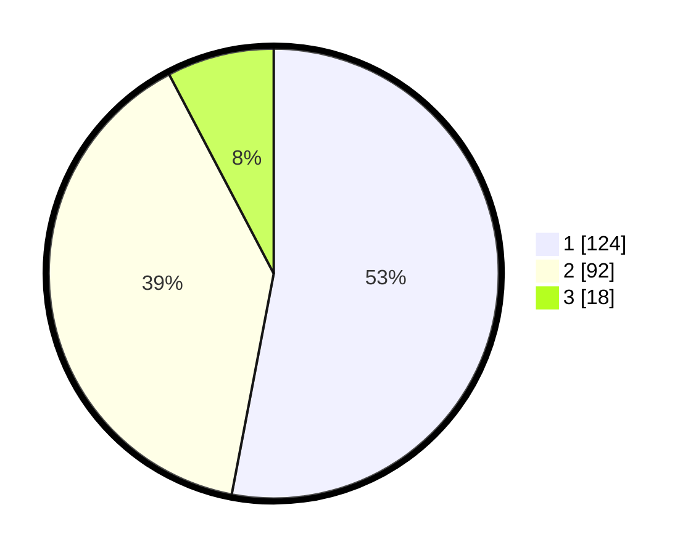

# Hasil

## Grafik

## Tabel

| No. | Nama Paslon    | Suara | Suara (raw) | Persentase |
|:--- |:-------------- | -----:| -----------:| ----------:|
| 1   | ANIES MUHAIMIN | 124   | [124][p-1]  | 52,99      |
| 2   | PRABOWO GIBRAN | 92    | [92][p-2]   | 39,32      |
| 3   | GANJAR MAHFUD  | 18    | [18][p-3]   | 7,69       |

[p-1]: https://github.com/gigit-pemilu/pemilu-2024-19-kepulauan-bangka-belitung/blob/main/pilpres/hitung-suara/sub/19-kepulauan-bangka-belitung/sub/01-bangka/sub/06-bakam/sub/2007-mabat/sub/004-tps/sub/paslon-1.txt
[p-2]: https://github.com/gigit-pemilu/pemilu-2024-19-kepulauan-bangka-belitung/blob/main/pilpres/hitung-suara/sub/19-kepulauan-bangka-belitung/sub/01-bangka/sub/06-bakam/sub/2007-mabat/sub/004-tps/sub/paslon-2.txt
[p-3]: https://github.com/gigit-pemilu/pemilu-2024-19-kepulauan-bangka-belitung/blob/main/pilpres/hitung-suara/sub/19-kepulauan-bangka-belitung/sub/01-bangka/sub/06-bakam/sub/2007-mabat/sub/004-tps/sub/paslon-3.txt

## Foto C Plano

https://sirekap-obj-formc.kpu.go.id/fe6f/pemilu/ppwp/19/01/06/20/07/1901062007004-20240220-115040--2fdb5bd1-88e9-47d7-855f-0060ef5a7b35.jpg

https://sirekap-obj-formc.kpu.go.id/fe6f/pemilu/ppwp/19/01/06/20/07/1901062007004-20240220-115120--cc0b95b3-47c4-465e-af65-8a7075b12f1f.jpg

https://sirekap-obj-formc.kpu.go.id/fe6f/pemilu/ppwp/19/01/06/20/07/1901062007004-20240220-115206--0d19b184-9cea-425a-b0a4-150af5cf5607.jpg

## Metadata

| Key        | Value               |
| ---------- | ------------------- |
| Time Stamp | 2024-02-24 22:31:28 |

