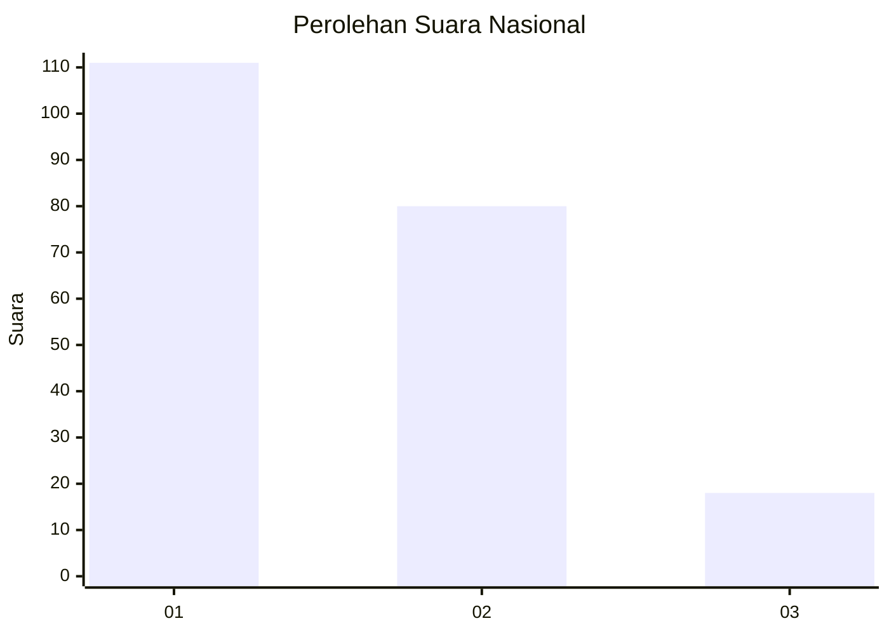
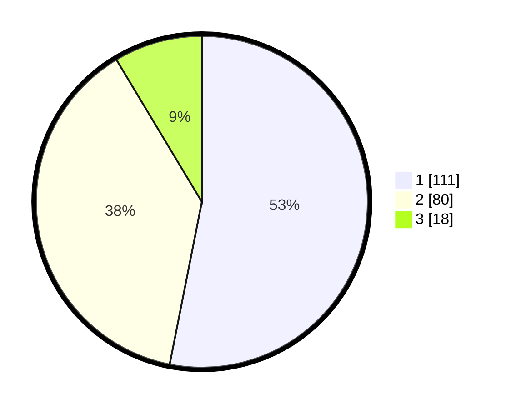

# Hasil

## Grafik

## Tabel

| No. | Nama Paslon    | Suara | Suara (raw) | Persentase |
|:--- |:-------------- | -----:| -----------:| ----------:|
| 1   | ANIES MUHAIMIN | 111   | [111][p-1]  | 53,11      |
| 2   | PRABOWO GIBRAN | 80    | [80][p-2]   | 38,28      |
| 3   | GANJAR MAHFUD  | 18    | [18][p-3]   | 8,61       |

[p-1]: https://github.com/gigit-pemilu/pemilu-2024/blob/main/pilpres/hitung-suara/sub/19-kepulauan-bangka-belitung/sub/01-bangka/sub/06-bakam/sub/2008-bukit-layang/sub/001-tps/sub/paslon-1.txt
[p-2]: https://github.com/gigit-pemilu/pemilu-2024/blob/main/pilpres/hitung-suara/sub/19-kepulauan-bangka-belitung/sub/01-bangka/sub/06-bakam/sub/2008-bukit-layang/sub/001-tps/sub/paslon-2.txt
[p-3]: https://github.com/gigit-pemilu/pemilu-2024/blob/main/pilpres/hitung-suara/sub/19-kepulauan-bangka-belitung/sub/01-bangka/sub/06-bakam/sub/2008-bukit-layang/sub/001-tps/sub/paslon-3.txt

## Foto C Plano

https://sirekap-obj-formc.kpu.go.id/8d06/pemilu/ppwp/19/01/06/20/08/1901062008001-20240215-011707--20d8c0ff-6ace-431e-9187-9e6d9082e21f.jpg

https://sirekap-obj-formc.kpu.go.id/8d06/pemilu/ppwp/19/01/06/20/08/1901062008001-20240215-011946--bbe85a6d-a8fe-43be-9aba-f8c951f8b672.jpg

https://sirekap-obj-formc.kpu.go.id/8d06/pemilu/ppwp/19/01/06/20/08/1901062008001-20240215-012318--cbaa3e3c-dd8a-4605-aa11-a020b71348d1.jpg

## Metadata

| Key        | Value               |
| ---------- | ------------------- |
| Time Stamp | 2024-02-17 14:56:33 |

