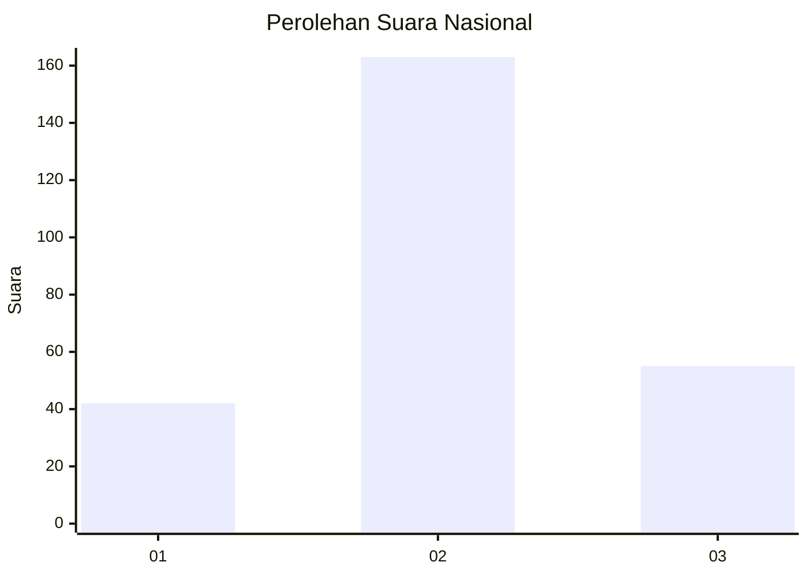
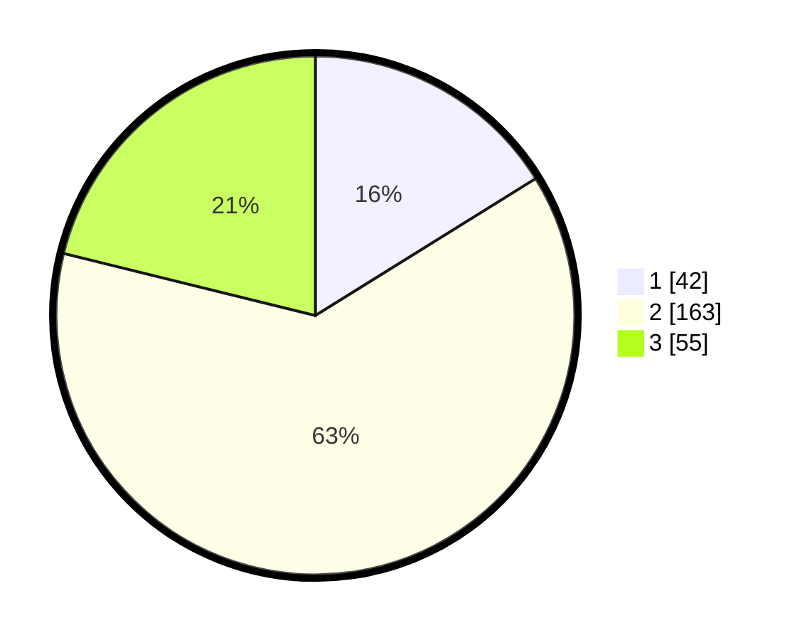

# Hasil

## Grafik

## Tabel

| No. | Nama Paslon    | Suara | Suara (raw) | Persentase |
|:--- |:-------------- | -----:| -----------:| ----------:|
| 1   | ANIES MUHAIMIN | 42    | [42][p-1]   | 16,15      |
| 2   | PRABOWO GIBRAN | 163   | [163][p-2]  | 62,69      |
| 3   | GANJAR MAHFUD  | 55    | [55][p-3]   | 21,15      |

[p-1]: https://github.com/gigit-pemilu/pemilu-2024/blob/main/pilpres/hitung-suara/sub/19-kepulauan-bangka-belitung/sub/01-bangka/sub/06-bakam/sub/2008-bukit-layang/sub/008-tps/sub/paslon-1.txt
[p-2]: https://github.com/gigit-pemilu/pemilu-2024/blob/main/pilpres/hitung-suara/sub/19-kepulauan-bangka-belitung/sub/01-bangka/sub/06-bakam/sub/2008-bukit-layang/sub/008-tps/sub/paslon-2.txt
[p-3]: https://github.com/gigit-pemilu/pemilu-2024/blob/main/pilpres/hitung-suara/sub/19-kepulauan-bangka-belitung/sub/01-bangka/sub/06-bakam/sub/2008-bukit-layang/sub/008-tps/sub/paslon-3.txt

## Foto C Plano

https://sirekap-obj-formc.kpu.go.id/01dd/pemilu/ppwp/19/01/06/20/08/1901062008008-20240214-202726--2f68cdcb-99a7-4757-8117-73b7fb21f19b.jpg

https://sirekap-obj-formc.kpu.go.id/01dd/pemilu/ppwp/19/01/06/20/08/1901062008008-20240214-234604--484276cb-e530-4535-a30a-eddf791c00f4.jpg

https://sirekap-obj-formc.kpu.go.id/01dd/pemilu/ppwp/19/01/06/20/08/1901062008008-20240214-203236--2e6490ab-2955-42a2-a362-1c5d3b5b93e4.jpg

## Metadata

| Key        | Value               |
| ---------- | ------------------- |
| Time Stamp | 2024-02-17 14:56:33 |

