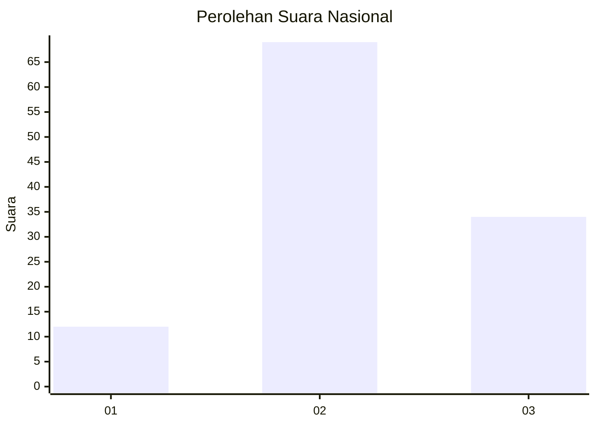
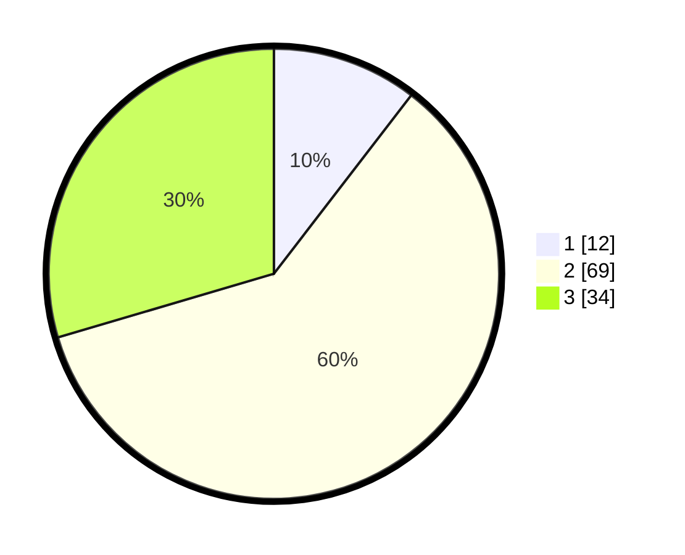

# Hasil

## Grafik

## Tabel

| No. | Nama Paslon    | Suara | Suara (raw) | Persentase |
|:--- |:-------------- | -----:| -----------:| ----------:|
| 1   | ANIES MUHAIMIN | 12    | [12][p-1]   | 10,43      |
| 2   | PRABOWO GIBRAN | 69    | [69][p-2]   | 60,00      |
| 3   | GANJAR MAHFUD  | 34    | [34][p-3]   | 29,57      |

[p-1]: https://github.com/gigit-pemilu/pemilu-2024/blob/main/pilpres/hitung-suara/sub/19-kepulauan-bangka-belitung/sub/01-bangka/sub/07-riau-silip/sub/2007-mapur/sub/006-tps/sub/paslon-1.txt
[p-2]: https://github.com/gigit-pemilu/pemilu-2024/blob/main/pilpres/hitung-suara/sub/19-kepulauan-bangka-belitung/sub/01-bangka/sub/07-riau-silip/sub/2007-mapur/sub/006-tps/sub/paslon-2.txt
[p-3]: https://github.com/gigit-pemilu/pemilu-2024/blob/main/pilpres/hitung-suara/sub/19-kepulauan-bangka-belitung/sub/01-bangka/sub/07-riau-silip/sub/2007-mapur/sub/006-tps/sub/paslon-3.txt

## Foto C Plano

https://sirekap-obj-formc.kpu.go.id/e864/pemilu/ppwp/19/01/07/20/07/1901072007006-20240214-215413--1ffcc8cd-9a52-4408-b773-5058165222d8.jpg

https://sirekap-obj-formc.kpu.go.id/e864/pemilu/ppwp/19/01/07/20/07/1901072007006-20240214-221618--3072d4c4-6370-4d0f-8781-a9fdebee8a2c.jpg

https://sirekap-obj-formc.kpu.go.id/e864/pemilu/ppwp/19/01/07/20/07/1901072007006-20240214-205927--c89c20cb-a4c2-4c95-8e30-27fd30dfe8ad.jpg

## Metadata

| Key        | Value               |
| ---------- | ------------------- |
| Time Stamp | 2024-02-17 14:45:18 |

