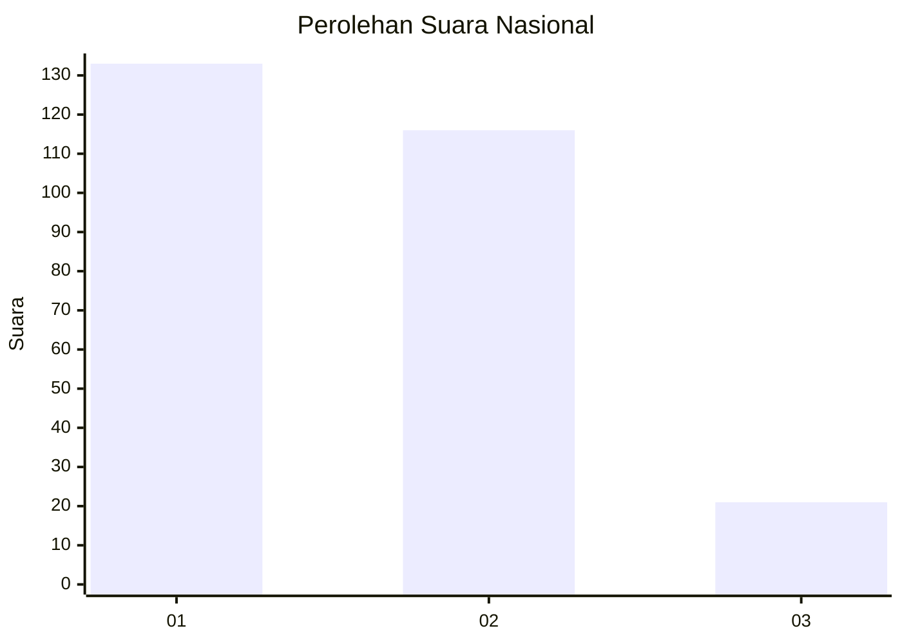
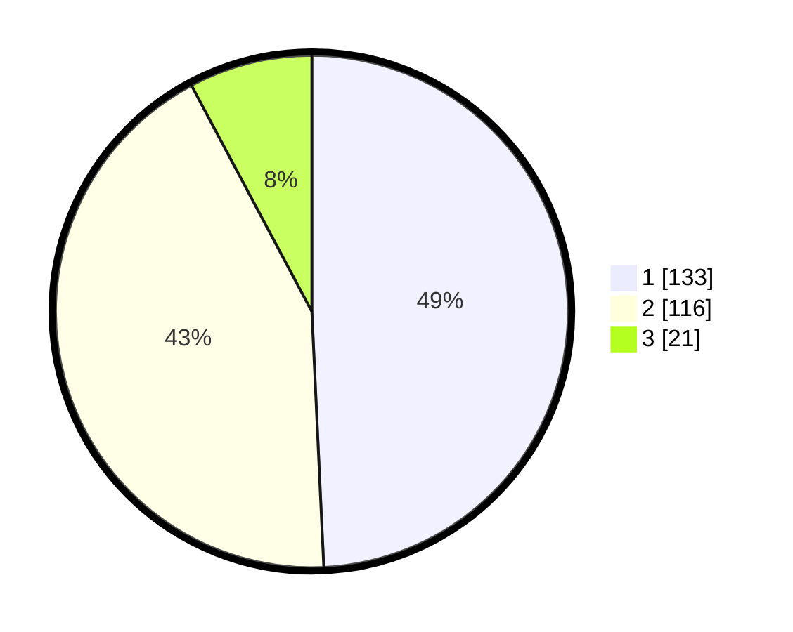

# Hasil

## Grafik

## Tabel

| No. | Nama Paslon    | Suara | Suara (raw) | Persentase |
|:--- |:-------------- | -----:| -----------:| ----------:|
| 1   | ANIES MUHAIMIN | 133   | [133][p-1]  | 49,26      |
| 2   | PRABOWO GIBRAN | 116   | [116][p-2]  | 42,96      |
| 3   | GANJAR MAHFUD  | 21    | [21][p-3]   | 7,78       |

[p-1]: https://github.com/gigit-pemilu/pemilu-2024/blob/main/pilpres/hitung-suara/sub/19-kepulauan-bangka-belitung/sub/01-bangka/sub/08-puding-besar/sub/2001-puding-besar/sub/002-tps/sub/paslon-1.txt
[p-2]: https://github.com/gigit-pemilu/pemilu-2024/blob/main/pilpres/hitung-suara/sub/19-kepulauan-bangka-belitung/sub/01-bangka/sub/08-puding-besar/sub/2001-puding-besar/sub/002-tps/sub/paslon-2.txt
[p-3]: https://github.com/gigit-pemilu/pemilu-2024/blob/main/pilpres/hitung-suara/sub/19-kepulauan-bangka-belitung/sub/01-bangka/sub/08-puding-besar/sub/2001-puding-besar/sub/002-tps/sub/paslon-3.txt

## Foto C Plano

https://sirekap-obj-formc.kpu.go.id/b949/pemilu/ppwp/19/01/08/20/01/1901082001002-20240214-191649--263bc35d-ae72-4fe6-90d1-f387ce71f455.jpg

https://sirekap-obj-formc.kpu.go.id/b949/pemilu/ppwp/19/01/08/20/01/1901082001002-20240214-192136--66bfa90b-f6a4-41d9-a31b-fa9b5f542ff6.jpg

## Metadata

| Key        | Value               |
| ---------- | ------------------- |
| Time Stamp | 2024-02-16 11:00:29 |

