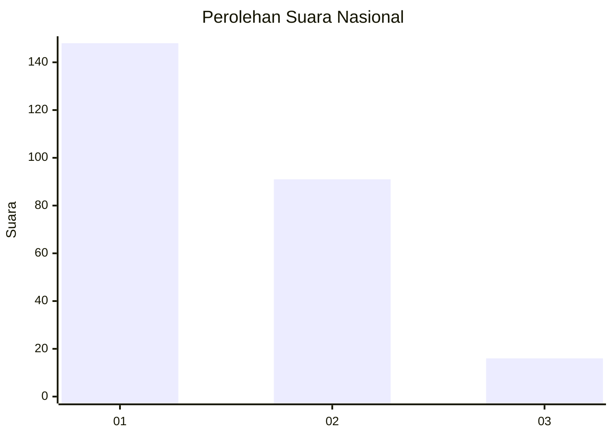
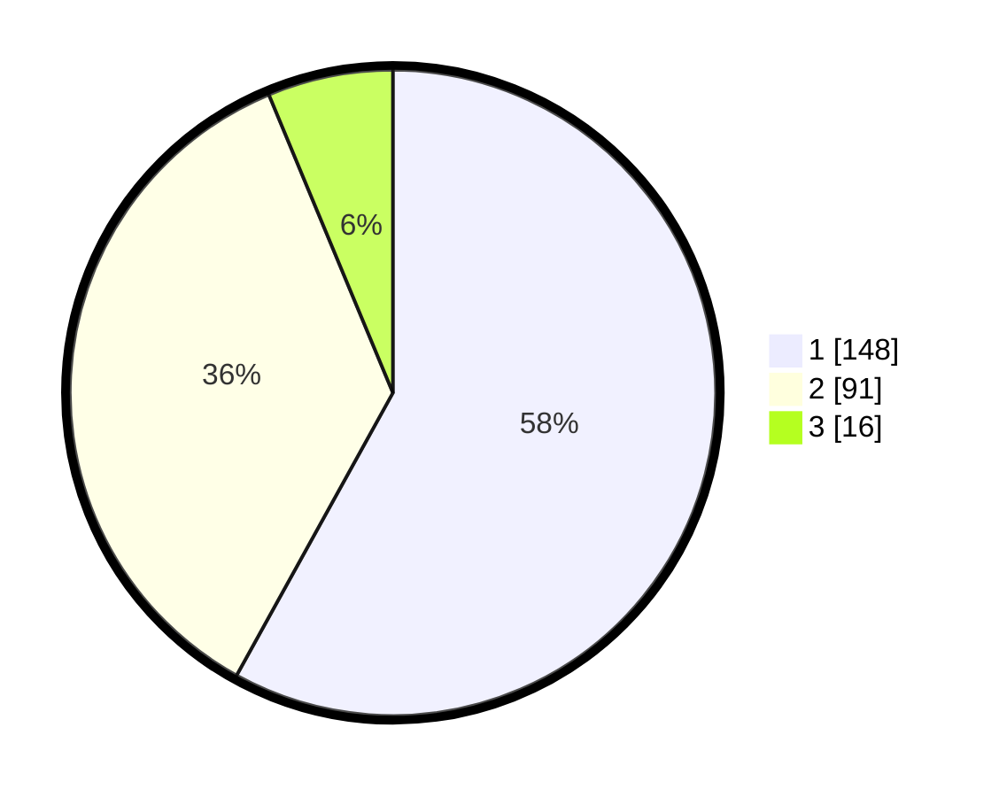

# Hasil

## Grafik

## Tabel

| No. | Nama Paslon    | Suara | Suara (raw) | Persentase |
|:--- |:-------------- | -----:| -----------:| ----------:|
| 1   | ANIES MUHAIMIN | 148   | [148][p-1]  | 58,04      |
| 2   | PRABOWO GIBRAN | 91    | [91][p-2]   | 35,69      |
| 3   | GANJAR MAHFUD  | 16    | [16][p-3]   | 6,27       |

[p-1]: https://github.com/gigit-pemilu/pemilu-2024/blob/main/pilpres/hitung-suara/sub/19-kepulauan-bangka-belitung/sub/01-bangka/sub/08-puding-besar/sub/2003-nibung/sub/005-tps/sub/paslon-1.txt
[p-2]: https://github.com/gigit-pemilu/pemilu-2024/blob/main/pilpres/hitung-suara/sub/19-kepulauan-bangka-belitung/sub/01-bangka/sub/08-puding-besar/sub/2003-nibung/sub/005-tps/sub/paslon-2.txt
[p-3]: https://github.com/gigit-pemilu/pemilu-2024/blob/main/pilpres/hitung-suara/sub/19-kepulauan-bangka-belitung/sub/01-bangka/sub/08-puding-besar/sub/2003-nibung/sub/005-tps/sub/paslon-3.txt

## Foto C Plano

https://sirekap-obj-formc.kpu.go.id/0c4e/pemilu/ppwp/19/01/08/20/03/1901082003005-20240215-003109--158ef218-4d5a-439e-8008-bfd0a093de1e.jpg

https://sirekap-obj-formc.kpu.go.id/0c4e/pemilu/ppwp/19/01/08/20/03/1901082003005-20240215-003343--57385adb-3f52-433e-ac85-eba0ad9551b0.jpg

https://sirekap-obj-formc.kpu.go.id/0c4e/pemilu/ppwp/19/01/08/20/03/1901082003005-20240215-030444--59d5d363-4977-43e6-8a25-6e4e2cc76208.jpg

## Metadata

| Key        | Value               |
| ---------- | ------------------- |
| Time Stamp | 2024-02-17 14:45:18 |

