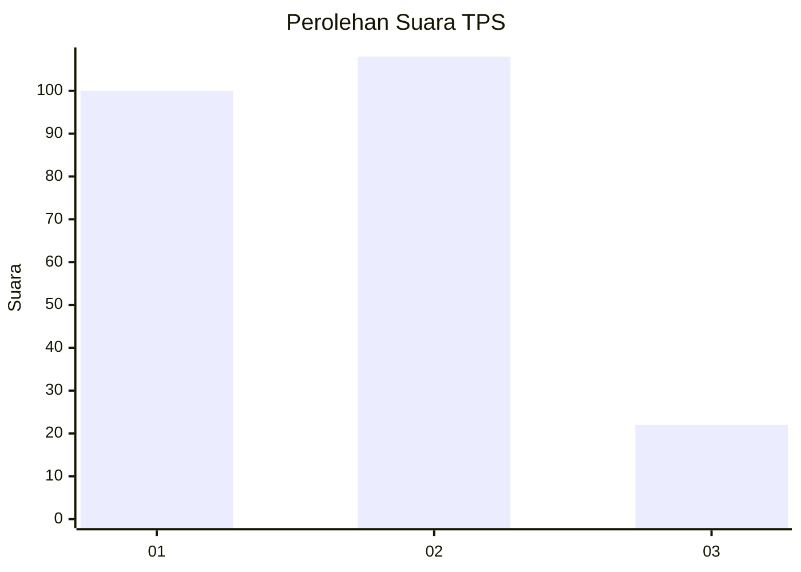
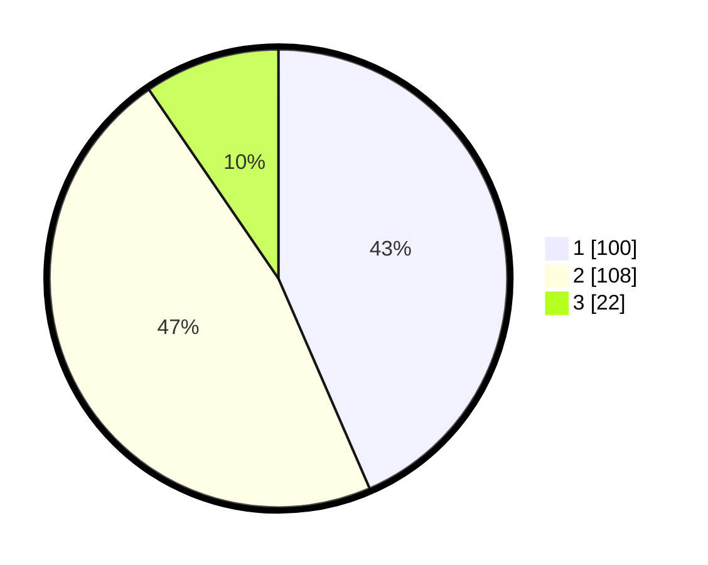

# Hasil

## Grafik

## Tabel

| No. | Nama Paslon    | Suara | Suara (raw) | Persentase |
|:--- |:-------------- | -----:| -----------:| ----------:|
| 1   | ANIES MUHAIMIN | 100   | [100][p-1]  | 43,48      |
| 2   | PRABOWO GIBRAN | 108   | [108][p-2]  | 46,96      |
| 3   | GANJAR MAHFUD  | 22    | [22][p-3]   | 9,57       |

[p-1]: https://github.com/gigit-pemilu/pemilu-2024-19-kepulauan-bangka-belitung/blob/main/pilpres/hitung-suara/sub/19-kepulauan-bangka-belitung/sub/01-bangka/sub/08-puding-besar/sub/2005-saing/sub/002-tps/sub/paslon-1.txt
[p-2]: https://github.com/gigit-pemilu/pemilu-2024-19-kepulauan-bangka-belitung/blob/main/pilpres/hitung-suara/sub/19-kepulauan-bangka-belitung/sub/01-bangka/sub/08-puding-besar/sub/2005-saing/sub/002-tps/sub/paslon-2.txt
[p-3]: https://github.com/gigit-pemilu/pemilu-2024-19-kepulauan-bangka-belitung/blob/main/pilpres/hitung-suara/sub/19-kepulauan-bangka-belitung/sub/01-bangka/sub/08-puding-besar/sub/2005-saing/sub/002-tps/sub/paslon-3.txt

## Foto C Plano

https://sirekap-obj-formc.kpu.go.id/3b4c/pemilu/ppwp/19/01/08/20/05/1901082005002-20240215-080921--a2b44816-eb39-45fd-a237-7b7b45a43733.jpg

https://sirekap-obj-formc.kpu.go.id/3b4c/pemilu/ppwp/19/01/08/20/05/1901082005002-20240215-081202--adfd28d7-cad7-4822-9779-fb3b5b388ddc.jpg

https://sirekap-obj-formc.kpu.go.id/3b4c/pemilu/ppwp/19/01/08/20/05/1901082005002-20240215-081336--b35245b0-b40b-4545-9cb7-d05d1abadfe7.jpg

## Metadata

| Key        | Value               |
| ---------- | ------------------- |
| Time Stamp | 2024-02-17 14:45:18 |

