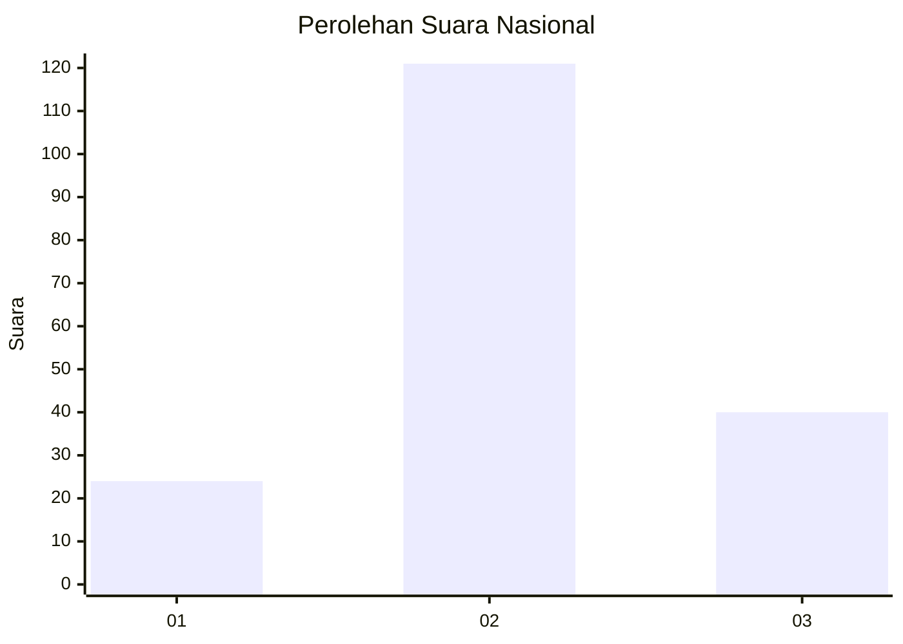
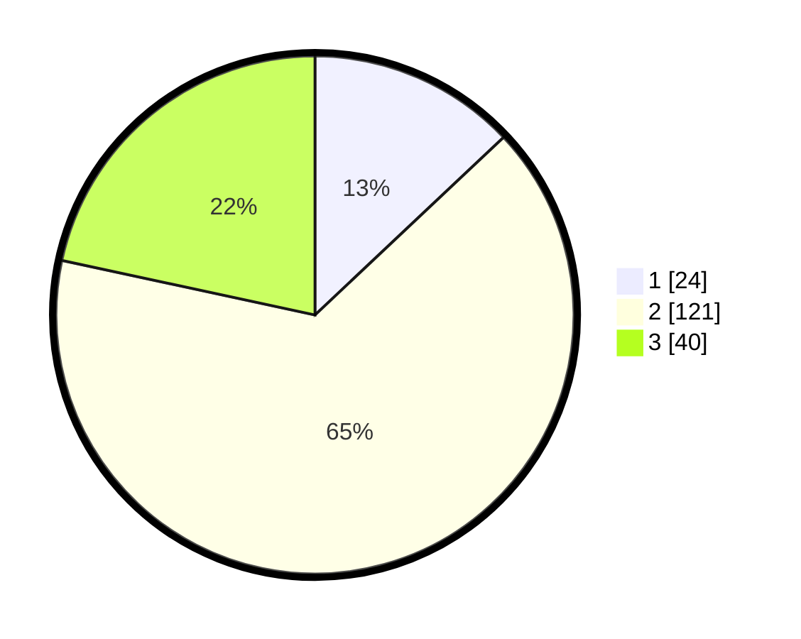

# Hasil

## Grafik

## Tabel

| No. | Nama Paslon    | Suara | Suara (raw) | Persentase |
|:--- |:-------------- | -----:| -----------:| ----------:|
| 1   | ANIES MUHAIMIN | 24    | [24][p-1]   | 12,97      |
| 2   | PRABOWO GIBRAN | 121   | [121][p-2]  | 65,41      |
| 3   | GANJAR MAHFUD  | 40    | [40][p-3]   | 21,62      |

[p-1]: https://github.com/gigit-pemilu/pemilu-2024/blob/main/pilpres/hitung-suara/sub/19-kepulauan-bangka-belitung/sub/02-belitung/sub/02-membalong/sub/2001-membalong/sub/008-tps/sub/paslon-1.txt
[p-2]: https://github.com/gigit-pemilu/pemilu-2024/blob/main/pilpres/hitung-suara/sub/19-kepulauan-bangka-belitung/sub/02-belitung/sub/02-membalong/sub/2001-membalong/sub/008-tps/sub/paslon-2.txt
[p-3]: https://github.com/gigit-pemilu/pemilu-2024/blob/main/pilpres/hitung-suara/sub/19-kepulauan-bangka-belitung/sub/02-belitung/sub/02-membalong/sub/2001-membalong/sub/008-tps/sub/paslon-3.txt

## Foto C Plano

https://sirekap-obj-formc.kpu.go.id/6c9a/pemilu/ppwp/19/02/02/20/01/1902022001008-20240215-124243--57fe107d-e087-494f-b1fd-608dd9b0e8aa.jpg

https://sirekap-obj-formc.kpu.go.id/6c9a/pemilu/ppwp/19/02/02/20/01/1902022001008-20240215-124248--38f8b6bf-ee0f-4e7e-a512-34dd26ec3976.jpg

https://sirekap-obj-formc.kpu.go.id/6c9a/pemilu/ppwp/19/02/02/20/01/1902022001008-20240215-124256--ce35aac7-d8bb-428d-af56-b5566dec9814.jpg

## Metadata

| Key        | Value               |
| ---------- | ------------------- |
| Time Stamp | 2024-02-16 00:00:26 |

