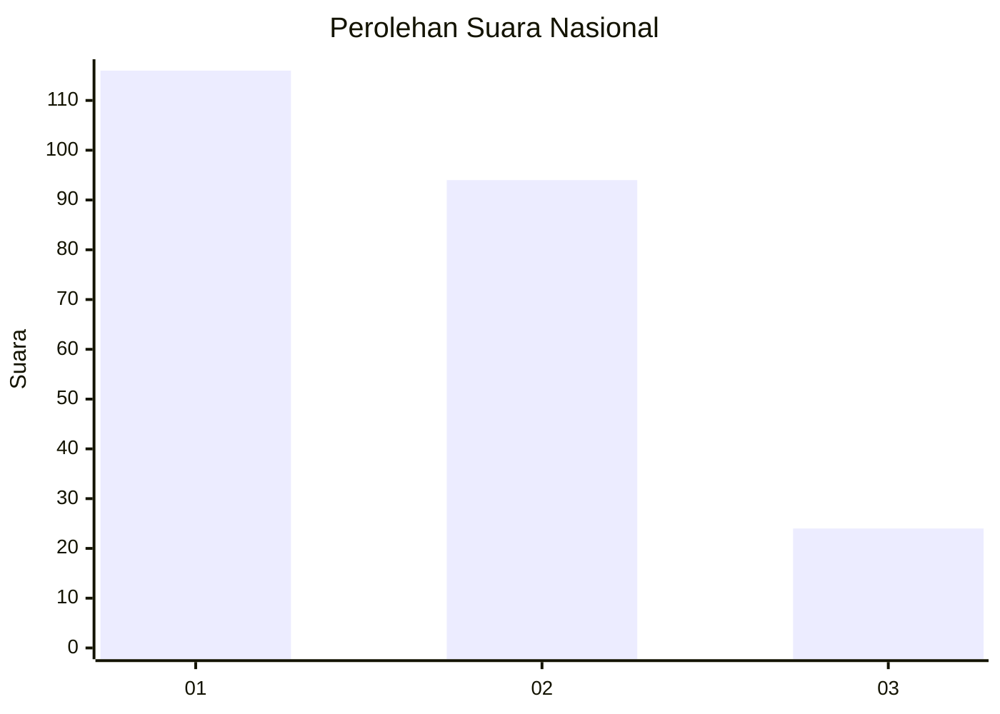
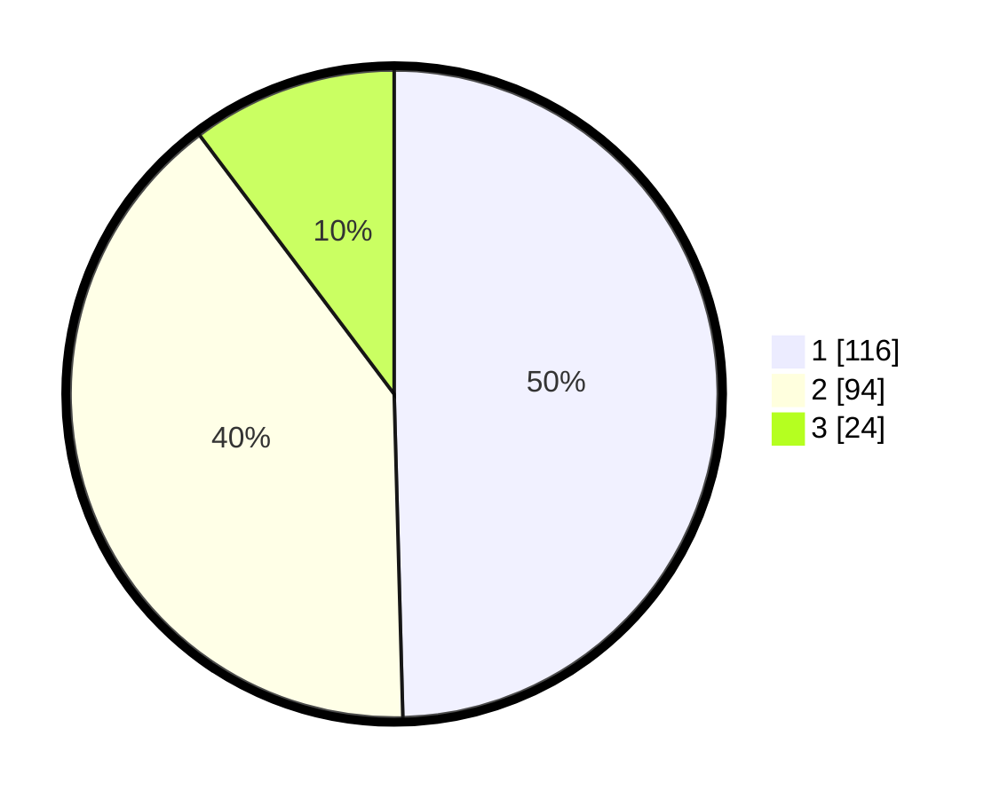

# Hasil

## Grafik

## Tabel

| No. | Nama Paslon    | Suara | Suara (raw) | Persentase |
|:--- |:-------------- | -----:| -----------:| ----------:|
| 1   | ANIES MUHAIMIN | 116   | [116][p-1]  | 49,57      |
| 2   | PRABOWO GIBRAN | 94    | [94][p-2]   | 40,17      |
| 3   | GANJAR MAHFUD  | 24    | [24][p-3]   | 10,26      |

[p-1]: https://github.com/gigit-pemilu/pemilu-2024/blob/main/pilpres/hitung-suara/sub/19-kepulauan-bangka-belitung/sub/04-bangka-tengah/sub/04-simpang-katis/sub/2003-sungkap/sub/004-tps/sub/paslon-1.txt
[p-2]: https://github.com/gigit-pemilu/pemilu-2024/blob/main/pilpres/hitung-suara/sub/19-kepulauan-bangka-belitung/sub/04-bangka-tengah/sub/04-simpang-katis/sub/2003-sungkap/sub/004-tps/sub/paslon-2.txt
[p-3]: https://github.com/gigit-pemilu/pemilu-2024/blob/main/pilpres/hitung-suara/sub/19-kepulauan-bangka-belitung/sub/04-bangka-tengah/sub/04-simpang-katis/sub/2003-sungkap/sub/004-tps/sub/paslon-3.txt

## Foto C Plano

https://sirekap-obj-formc.kpu.go.id/90a1/pemilu/ppwp/19/04/04/20/03/1904042003004-20240215-084157--5d317a57-7616-4537-bcb2-35275687cd37.jpg

https://sirekap-obj-formc.kpu.go.id/90a1/pemilu/ppwp/19/04/04/20/03/1904042003004-20240215-084321--9013b962-5ba4-48f9-bee3-a360c385321e.jpg

https://sirekap-obj-formc.kpu.go.id/90a1/pemilu/ppwp/19/04/04/20/03/1904042003004-20240215-084508--31b55ad6-5e92-43be-a754-6f14fa3bf47f.jpg

## Metadata

| Key        | Value               |
| ---------- | ------------------- |
| Time Stamp | 2024-02-19 23:00:00 |

