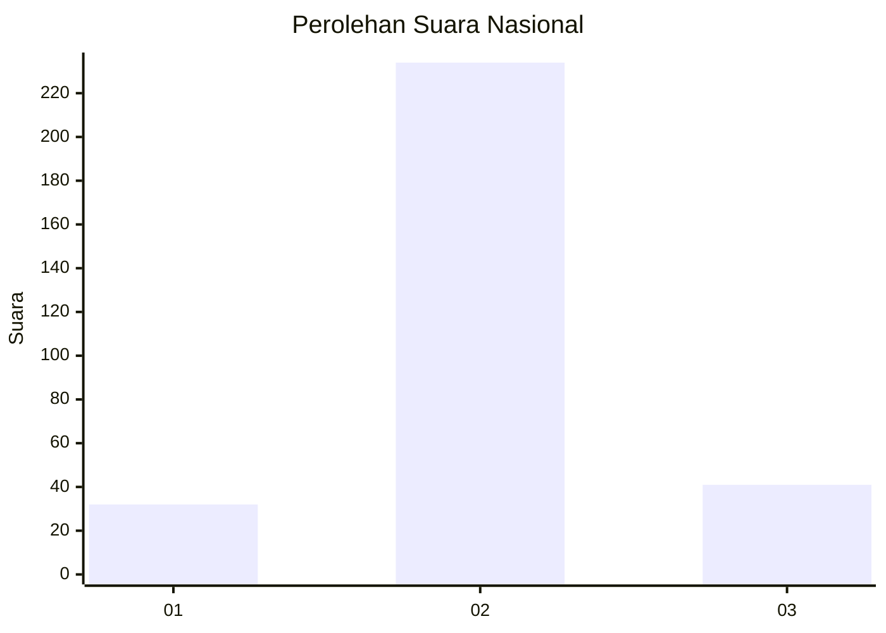
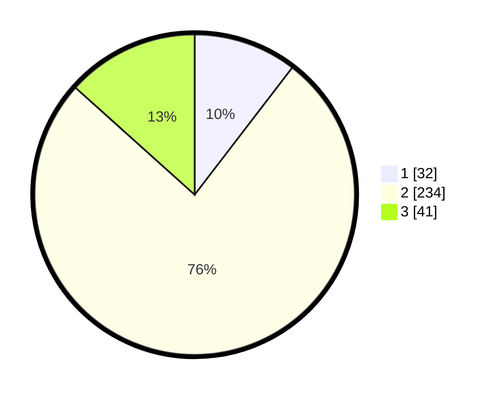

# Hasil

## Grafik

## Tabel

| No. | Nama Paslon    | Suara | Suara (raw) | Persentase |
|:--- |:-------------- | -----:| -----------:| ----------:|
| 1   | ANIES MUHAIMIN | 32    | [32][p-1]   | 10,42      |
| 2   | PRABOWO GIBRAN | 234   | [234][p-2]  | 76,22      |
| 3   | GANJAR MAHFUD  | 41    | [41][p-3]   | 13,36      |

[p-1]: https://github.com/gigit-pemilu/pemilu-2024/blob/main/pilpres/hitung-suara/sub/19-kepulauan-bangka-belitung/sub/04-bangka-tengah/sub/06-lubuk-besar/sub/2003-lubuk-besar/sub/012-tps/sub/paslon-1.txt
[p-2]: https://github.com/gigit-pemilu/pemilu-2024/blob/main/pilpres/hitung-suara/sub/19-kepulauan-bangka-belitung/sub/04-bangka-tengah/sub/06-lubuk-besar/sub/2003-lubuk-besar/sub/012-tps/sub/paslon-2.txt
[p-3]: https://github.com/gigit-pemilu/pemilu-2024/blob/main/pilpres/hitung-suara/sub/19-kepulauan-bangka-belitung/sub/04-bangka-tengah/sub/06-lubuk-besar/sub/2003-lubuk-besar/sub/012-tps/sub/paslon-3.txt

## Foto C Plano

https://sirekap-obj-formc.kpu.go.id/df80/pemilu/ppwp/19/04/06/20/03/1904062003012-20240214-215927--130e9e82-b28b-4c11-abb3-57131ae1d74a.jpg

https://sirekap-obj-formc.kpu.go.id/df80/pemilu/ppwp/19/04/06/20/03/1904062003012-20240214-220114--77d21e59-f549-4035-a7e9-9df15d8b170e.jpg

https://sirekap-obj-formc.kpu.go.id/df80/pemilu/ppwp/19/04/06/20/03/1904062003012-20240214-220238--306f7413-79cd-424f-a106-4b4c0f483a81.jpg

## Metadata

| Key        | Value               |
| ---------- | ------------------- |
| Time Stamp | 2024-02-15 15:30:25 |

