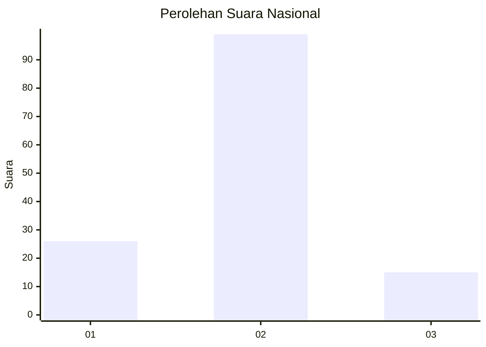
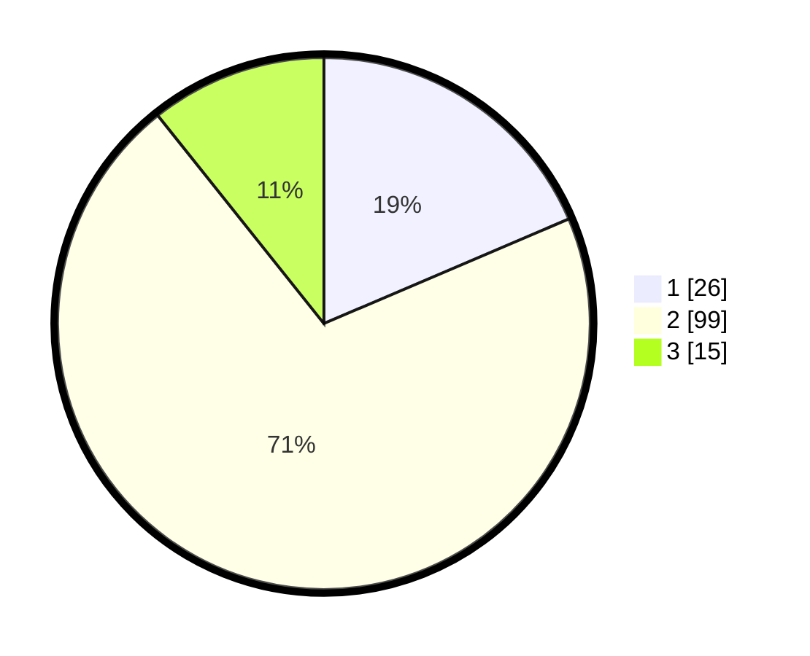

# Hasil

## Grafik

## Tabel

| No. | Nama Paslon    | Suara | Suara (raw) | Persentase |
|:--- |:-------------- | -----:| -----------:| ----------:|
| 1   | ANIES MUHAIMIN | 26    | [26][p-1]   | 18,57      |
| 2   | PRABOWO GIBRAN | 99    | [99][p-2]   | 70,71      |
| 3   | GANJAR MAHFUD  | 15    | [15][p-3]   | 10,71      |

[p-1]: https://github.com/gigit-pemilu/pemilu-2024/blob/main/pilpres/hitung-suara/sub/19-kepulauan-bangka-belitung/sub/04-bangka-tengah/sub/06-lubuk-besar/sub/2003-lubuk-besar/sub/015-tps/sub/paslon-1.txt
[p-2]: https://github.com/gigit-pemilu/pemilu-2024/blob/main/pilpres/hitung-suara/sub/19-kepulauan-bangka-belitung/sub/04-bangka-tengah/sub/06-lubuk-besar/sub/2003-lubuk-besar/sub/015-tps/sub/paslon-2.txt
[p-3]: https://github.com/gigit-pemilu/pemilu-2024/blob/main/pilpres/hitung-suara/sub/19-kepulauan-bangka-belitung/sub/04-bangka-tengah/sub/06-lubuk-besar/sub/2003-lubuk-besar/sub/015-tps/sub/paslon-3.txt

## Foto C Plano

https://sirekap-obj-formc.kpu.go.id/312e/pemilu/ppwp/19/04/06/20/03/1904062003015-20240214-184555--88fd89a1-7cbc-43a9-959d-e2d24973255a.jpg

https://sirekap-obj-formc.kpu.go.id/312e/pemilu/ppwp/19/04/06/20/03/1904062003015-20240214-185023--f9d76e66-a48b-4aae-9547-cec9dfe3b353.jpg

https://sirekap-obj-formc.kpu.go.id/312e/pemilu/ppwp/19/04/06/20/03/1904062003015-20240214-231103--2a0477d3-1c90-4caf-afbd-e9764b4b0352.jpg

## Metadata

| Key        | Value               |
| ---------- | ------------------- |
| Time Stamp | 2024-02-24 22:31:28 |

