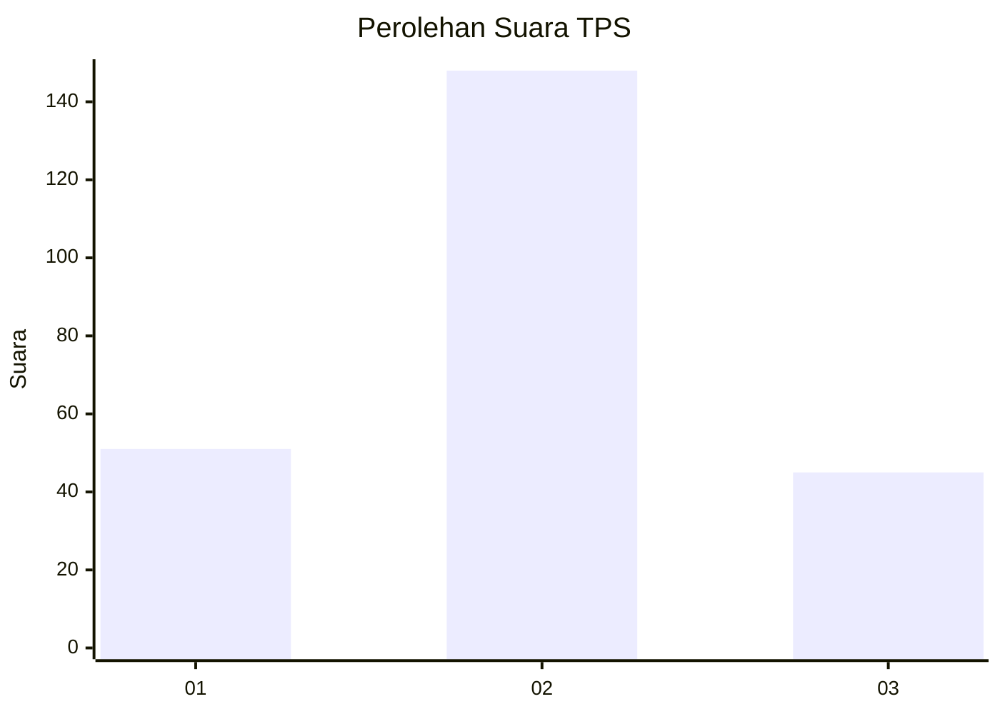
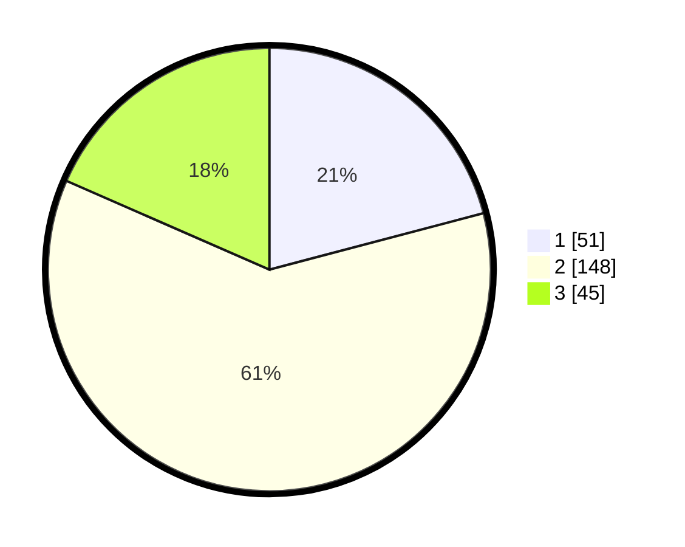

# Hasil

## Grafik

## Tabel

| No. | Nama Paslon    | Suara | Suara (raw) | Persentase |
|:--- |:-------------- | -----:| -----------:| ----------:|
| 1   | ANIES MUHAIMIN | 51    | [51][p-1]   | 20,90      |
| 2   | PRABOWO GIBRAN | 148   | [148][p-2]  | 60,66      |
| 3   | GANJAR MAHFUD  | 45    | [45][p-3]   | 18,44      |

[p-1]: https://github.com/gigit-pemilu/pemilu-2024-19-kepulauan-bangka-belitung/blob/main/pilpres/hitung-suara/sub/19-kepulauan-bangka-belitung/sub/05-bangka-barat/sub/02-simpang-teritip/sub/2001-pelangas/sub/001-tps/sub/paslon-1.txt
[p-2]: https://github.com/gigit-pemilu/pemilu-2024-19-kepulauan-bangka-belitung/blob/main/pilpres/hitung-suara/sub/19-kepulauan-bangka-belitung/sub/05-bangka-barat/sub/02-simpang-teritip/sub/2001-pelangas/sub/001-tps/sub/paslon-2.txt
[p-3]: https://github.com/gigit-pemilu/pemilu-2024-19-kepulauan-bangka-belitung/blob/main/pilpres/hitung-suara/sub/19-kepulauan-bangka-belitung/sub/05-bangka-barat/sub/02-simpang-teritip/sub/2001-pelangas/sub/001-tps/sub/paslon-3.txt

## Foto C Plano

https://sirekap-obj-formc.kpu.go.id/20a0/pemilu/ppwp/19/05/02/20/01/1905022001001-20240215-103112--5a1bbb6f-cdff-4ef0-90b0-26314dd33926.jpg

https://sirekap-obj-formc.kpu.go.id/20a0/pemilu/ppwp/19/05/02/20/01/1905022001001-20240215-103325--339fe706-8505-429a-b747-c8f303161f35.jpg

https://sirekap-obj-formc.kpu.go.id/20a0/pemilu/ppwp/19/05/02/20/01/1905022001001-20240215-103439--6e255162-d983-4908-be7f-537ff03b09ee.jpg

## Metadata

| Key        | Value               |
| ---------- | ------------------- |
| Time Stamp | 2024-02-15 16:30:25 |

