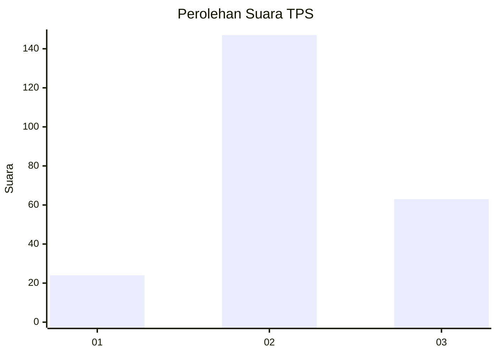
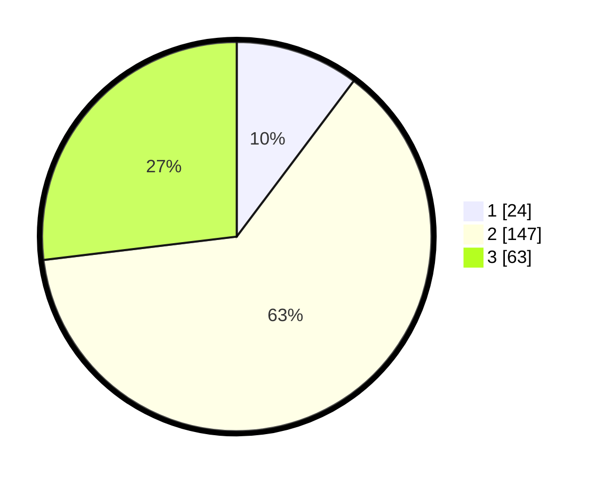

# Hasil

## Grafik

## Tabel

| No. | Nama Paslon    | Suara | Suara (raw) | Persentase |
|:--- |:-------------- | -----:| -----------:| ----------:|
| 1   | ANIES MUHAIMIN | 24    | [24][p-1]   | 10,26      |
| 2   | PRABOWO GIBRAN | 147   | [147][p-2]  | 62,82      |
| 3   | GANJAR MAHFUD  | 63    | [63][p-3]   | 26,92      |

[p-1]: https://github.com/gigit-pemilu/pemilu-2024-19-kepulauan-bangka-belitung/blob/main/pilpres/hitung-suara/sub/19-kepulauan-bangka-belitung/sub/05-bangka-barat/sub/02-simpang-teritip/sub/2001-pelangas/sub/004-tps/sub/paslon-1.txt
[p-2]: https://github.com/gigit-pemilu/pemilu-2024-19-kepulauan-bangka-belitung/blob/main/pilpres/hitung-suara/sub/19-kepulauan-bangka-belitung/sub/05-bangka-barat/sub/02-simpang-teritip/sub/2001-pelangas/sub/004-tps/sub/paslon-2.txt
[p-3]: https://github.com/gigit-pemilu/pemilu-2024-19-kepulauan-bangka-belitung/blob/main/pilpres/hitung-suara/sub/19-kepulauan-bangka-belitung/sub/05-bangka-barat/sub/02-simpang-teritip/sub/2001-pelangas/sub/004-tps/sub/paslon-3.txt

## Foto C Plano

https://sirekap-obj-formc.kpu.go.id/fa04/pemilu/ppwp/19/05/02/20/01/1905022001004-20240215-071948--dabf33cf-7ea5-4260-87cc-27a08bc085ff.jpg

https://sirekap-obj-formc.kpu.go.id/fa04/pemilu/ppwp/19/05/02/20/01/1905022001004-20240215-072159--f847be60-7d6f-42a2-9f0d-d1612a71a988.jpg

https://sirekap-obj-formc.kpu.go.id/fa04/pemilu/ppwp/19/05/02/20/01/1905022001004-20240215-073332--8be23a68-2669-47c9-bf7b-67a18a809992.jpg

## Metadata

| Key        | Value               |
| ---------- | ------------------- |
| Time Stamp | 2024-02-15 20:00:44 |

