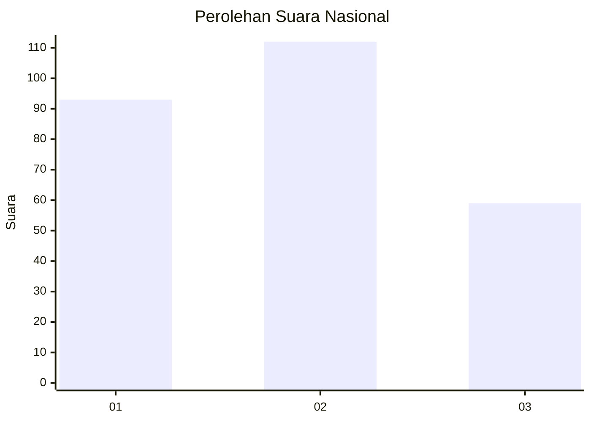
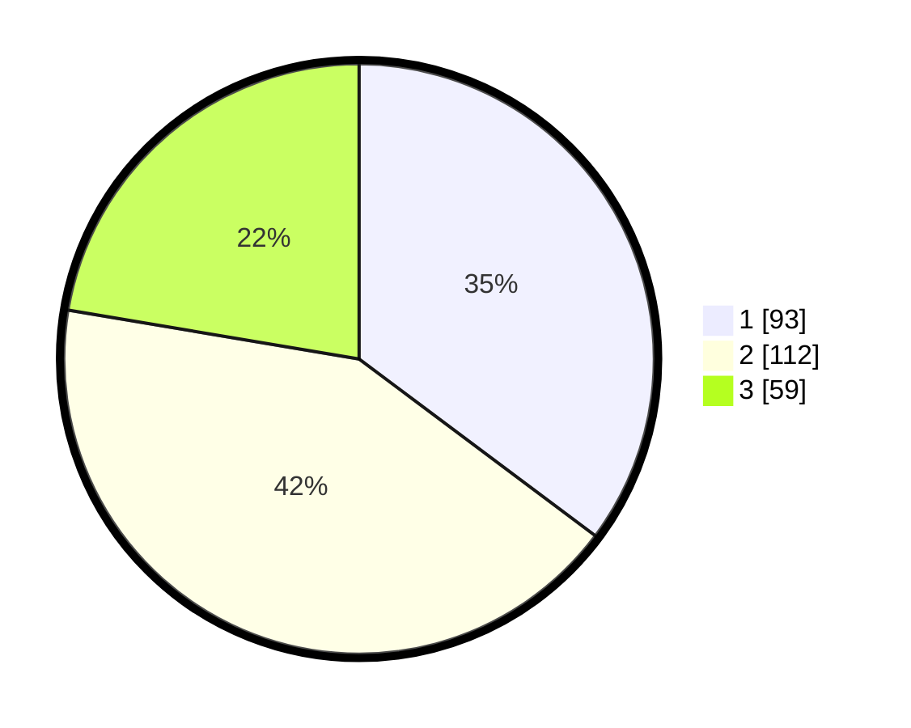

# Hasil

## Grafik

## Tabel

| No. | Nama Paslon    | Suara | Suara (raw) | Persentase |
|:--- |:-------------- | -----:| -----------:| ----------:|
| 1   | ANIES MUHAIMIN | 93    | [93][p-1]   | 35,23      |
| 2   | PRABOWO GIBRAN | 112   | [112][p-2]  | 42,42      |
| 3   | GANJAR MAHFUD  | 59    | [59][p-3]   | 22,35      |

[p-1]: https://github.com/gigit-pemilu/pemilu-2024/blob/main/pilpres/hitung-suara/sub/19-kepulauan-bangka-belitung/sub/05-bangka-barat/sub/02-simpang-teritip/sub/2004-peradong/sub/001-tps/sub/paslon-1.txt
[p-2]: https://github.com/gigit-pemilu/pemilu-2024/blob/main/pilpres/hitung-suara/sub/19-kepulauan-bangka-belitung/sub/05-bangka-barat/sub/02-simpang-teritip/sub/2004-peradong/sub/001-tps/sub/paslon-2.txt
[p-3]: https://github.com/gigit-pemilu/pemilu-2024/blob/main/pilpres/hitung-suara/sub/19-kepulauan-bangka-belitung/sub/05-bangka-barat/sub/02-simpang-teritip/sub/2004-peradong/sub/001-tps/sub/paslon-3.txt

## Foto C Plano

https://sirekap-obj-formc.kpu.go.id/1ba5/pemilu/ppwp/19/05/02/20/04/1905022004001-20240215-010453--b807515d-31a8-4982-9efb-8b468cfd97d0.jpg

https://sirekap-obj-formc.kpu.go.id/1ba5/pemilu/ppwp/19/05/02/20/04/1905022004001-20240215-093945--ca9b4458-0952-4d28-b64d-b6ff3f782d9e.jpg

https://sirekap-obj-formc.kpu.go.id/1ba5/pemilu/ppwp/19/05/02/20/04/1905022004001-20240215-005734--21af8b27-fb4c-4ec0-a565-d797d4013e52.jpg

## Metadata

| Key        | Value               |
| ---------- | ------------------- |
| Time Stamp | 2024-02-15 19:30:26 |

