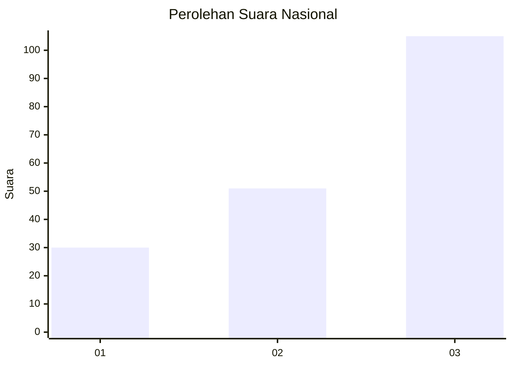
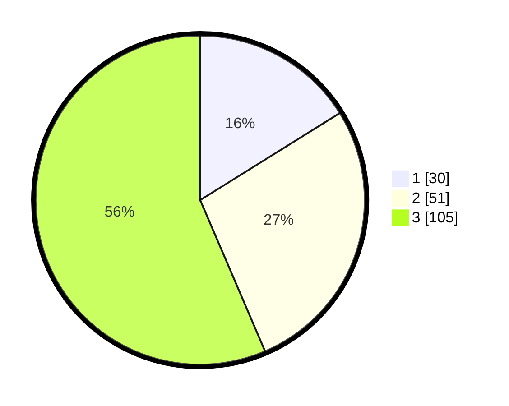

# Hasil

## Grafik

## Tabel

| No. | Nama Paslon    | Suara | Suara (raw) | Persentase |
|:--- |:-------------- | -----:| -----------:| ----------:|
| 1   | ANIES MUHAIMIN | 30    | [30][p-1]   | 16,13      |
| 2   | PRABOWO GIBRAN | 51    | [51][p-2]   | 27,42      |
| 3   | GANJAR MAHFUD  | 105   | [105][p-3]  | 56,45      |

[p-1]: https://github.com/gigit-pemilu/pemilu-2024/blob/main/pilpres/hitung-suara/sub/19-kepulauan-bangka-belitung/sub/05-bangka-barat/sub/02-simpang-teritip/sub/2006-berang/sub/010-tps/sub/paslon-1.txt
[p-2]: https://github.com/gigit-pemilu/pemilu-2024/blob/main/pilpres/hitung-suara/sub/19-kepulauan-bangka-belitung/sub/05-bangka-barat/sub/02-simpang-teritip/sub/2006-berang/sub/010-tps/sub/paslon-2.txt
[p-3]: https://github.com/gigit-pemilu/pemilu-2024/blob/main/pilpres/hitung-suara/sub/19-kepulauan-bangka-belitung/sub/05-bangka-barat/sub/02-simpang-teritip/sub/2006-berang/sub/010-tps/sub/paslon-3.txt

## Foto C Plano

https://sirekap-obj-formc.kpu.go.id/5f5e/pemilu/ppwp/19/05/02/20/06/1905022006010-20240215-001756--04879e0b-3501-4116-a5eb-2d2f44308a72.jpg

https://sirekap-obj-formc.kpu.go.id/5f5e/pemilu/ppwp/19/05/02/20/06/1905022006010-20240215-001821--8d898449-82e3-495f-ab06-36f34116ecbb.jpg

https://sirekap-obj-formc.kpu.go.id/5f5e/pemilu/ppwp/19/05/02/20/06/1905022006010-20240215-001851--9e556d2b-1dda-4719-b3f6-d35c4f0c079c.jpg

## Metadata

| Key        | Value               |
| ---------- | ------------------- |
| Time Stamp | 2024-02-16 11:00:29 |

