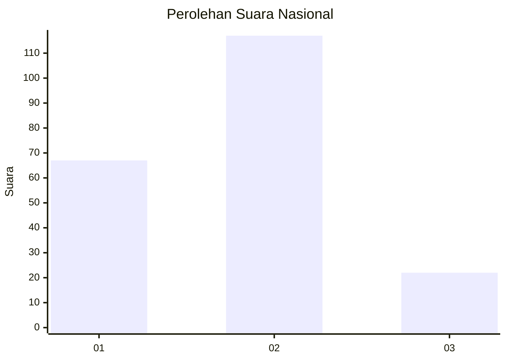
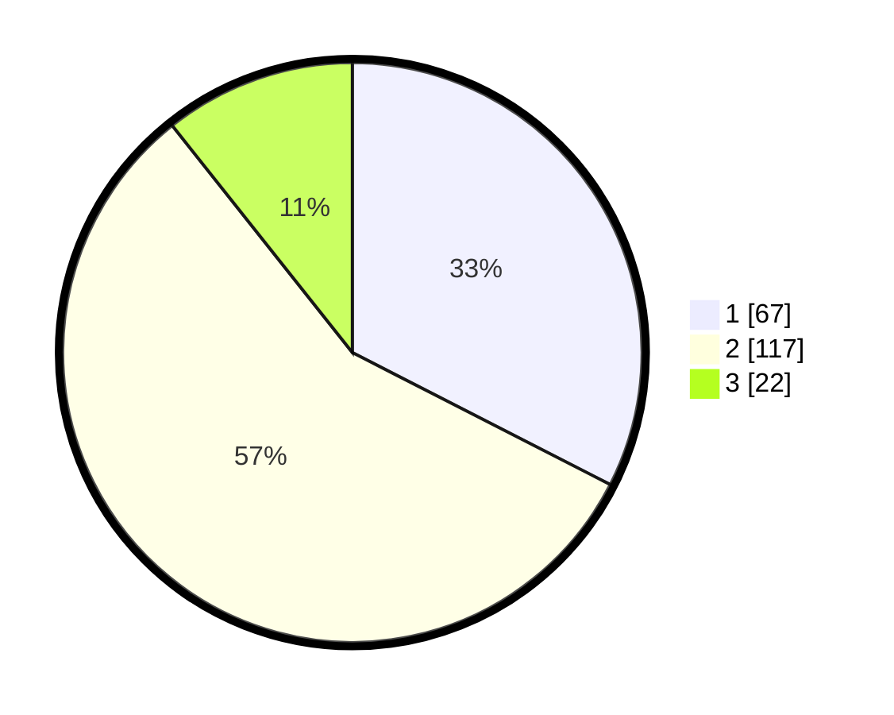

# Hasil

## Grafik

## Tabel

| No. | Nama Paslon    | Suara | Suara (raw) | Persentase |
|:--- |:-------------- | -----:| -----------:| ----------:|
| 1   | ANIES MUHAIMIN | 67    | [67][p-1]   | 32,52      |
| 2   | PRABOWO GIBRAN | 117   | [117][p-2]  | 56,80      |
| 3   | GANJAR MAHFUD  | 22    | [22][p-3]   | 10,68      |

[p-1]: https://github.com/gigit-pemilu/pemilu-2024/blob/main/pilpres/hitung-suara/sub/19-kepulauan-bangka-belitung/sub/05-bangka-barat/sub/03-jebus/sub/2001-jebus/sub/003-tps/sub/paslon-1.txt
[p-2]: https://github.com/gigit-pemilu/pemilu-2024/blob/main/pilpres/hitung-suara/sub/19-kepulauan-bangka-belitung/sub/05-bangka-barat/sub/03-jebus/sub/2001-jebus/sub/003-tps/sub/paslon-2.txt
[p-3]: https://github.com/gigit-pemilu/pemilu-2024/blob/main/pilpres/hitung-suara/sub/19-kepulauan-bangka-belitung/sub/05-bangka-barat/sub/03-jebus/sub/2001-jebus/sub/003-tps/sub/paslon-3.txt

## Foto C Plano

https://sirekap-obj-formc.kpu.go.id/04c8/pemilu/ppwp/19/05/03/20/01/1905032001003-20240218-205748--77e259a8-62c1-46d4-a015-c77180069e1d.jpg

https://sirekap-obj-formc.kpu.go.id/04c8/pemilu/ppwp/19/05/03/20/01/1905032001003-20240216-041731--25783f36-810b-4fce-b429-9b5e17c9e474.jpg

https://sirekap-obj-formc.kpu.go.id/04c8/pemilu/ppwp/19/05/03/20/01/1905032001003-20240216-041730--fd18dcde-7762-4d68-9cb7-0fb24ae90ef8.jpg

## Metadata

| Key        | Value               |
| ---------- | ------------------- |
| Time Stamp | 2024-02-24 22:31:28 |

