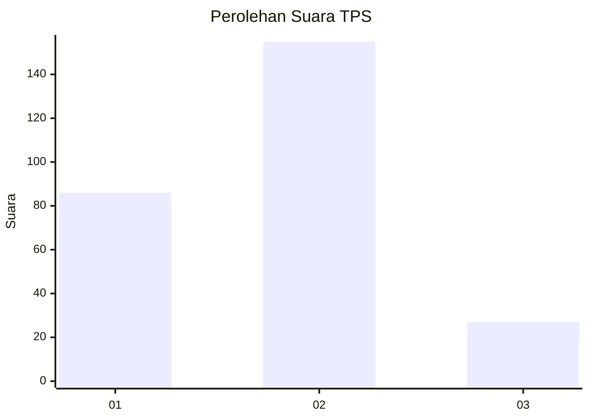
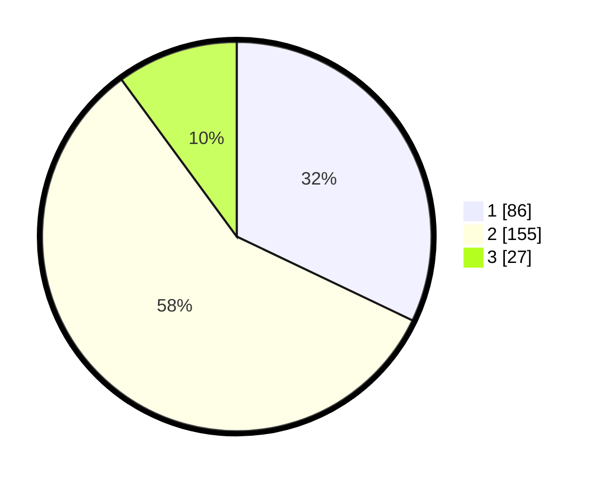

# Hasil

## Grafik

## Tabel

| No. | Nama Paslon    | Suara | Suara (raw) | Persentase |
|:--- |:-------------- | -----:| -----------:| ----------:|
| 1   | ANIES MUHAIMIN | 86    | [86][p-1]   | 32,09      |
| 2   | PRABOWO GIBRAN | 155   | [155][p-2]  | 57,84      |
| 3   | GANJAR MAHFUD  | 27    | [27][p-3]   | 10,07      |

[p-1]: https://github.com/gigit-pemilu/pemilu-2024-19-kepulauan-bangka-belitung/blob/main/pilpres/hitung-suara/sub/19-kepulauan-bangka-belitung/sub/05-bangka-barat/sub/04-kelapa/sub/1001-kelapa/sub/003-tps/sub/paslon-1.txt
[p-2]: https://github.com/gigit-pemilu/pemilu-2024-19-kepulauan-bangka-belitung/blob/main/pilpres/hitung-suara/sub/19-kepulauan-bangka-belitung/sub/05-bangka-barat/sub/04-kelapa/sub/1001-kelapa/sub/003-tps/sub/paslon-2.txt
[p-3]: https://github.com/gigit-pemilu/pemilu-2024-19-kepulauan-bangka-belitung/blob/main/pilpres/hitung-suara/sub/19-kepulauan-bangka-belitung/sub/05-bangka-barat/sub/04-kelapa/sub/1001-kelapa/sub/003-tps/sub/paslon-3.txt

## Foto C Plano

https://sirekap-obj-formc.kpu.go.id/4809/pemilu/ppwp/19/05/04/10/01/1905041001003-20240218-163227--088c94e9-4611-4880-a7cc-c0118d52306b.jpg

https://sirekap-obj-formc.kpu.go.id/4809/pemilu/ppwp/19/05/04/10/01/1905041001003-20240218-163435--151b5732-1d3c-450e-afaa-97c074131e95.jpg

https://sirekap-obj-formc.kpu.go.id/4809/pemilu/ppwp/19/05/04/10/01/1905041001003-20240218-163746--a8a21544-2685-44e1-b854-4b05398fd42f.jpg

## Metadata

| Key        | Value               |
| ---------- | ------------------- |
| Time Stamp | 2024-02-24 22:31:28 |

