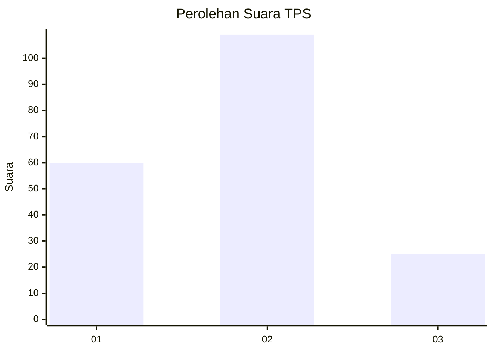
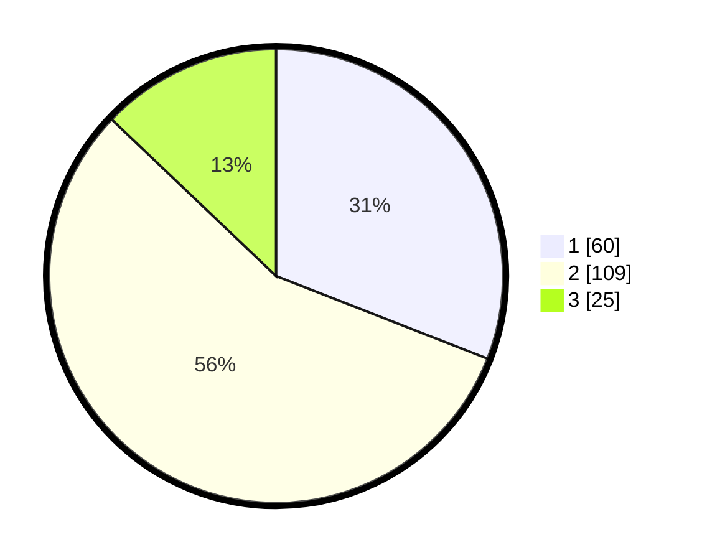

# Hasil

## Grafik

## Tabel

| No. | Nama Paslon    | Suara | Suara (raw) | Persentase |
|:--- |:-------------- | -----:| -----------:| ----------:|
| 1   | ANIES MUHAIMIN | 60    | [60][p-1]   | 30,93      |
| 2   | PRABOWO GIBRAN | 109   | [109][p-2]  | 56,19      |
| 3   | GANJAR MAHFUD  | 25    | [25][p-3]   | 12,89      |

[p-1]: https://github.com/gigit-pemilu/pemilu-2024-19-kepulauan-bangka-belitung/blob/main/pilpres/hitung-suara/sub/19-kepulauan-bangka-belitung/sub/05-bangka-barat/sub/04-kelapa/sub/1001-kelapa/sub/004-tps/sub/paslon-1.txt
[p-2]: https://github.com/gigit-pemilu/pemilu-2024-19-kepulauan-bangka-belitung/blob/main/pilpres/hitung-suara/sub/19-kepulauan-bangka-belitung/sub/05-bangka-barat/sub/04-kelapa/sub/1001-kelapa/sub/004-tps/sub/paslon-2.txt
[p-3]: https://github.com/gigit-pemilu/pemilu-2024-19-kepulauan-bangka-belitung/blob/main/pilpres/hitung-suara/sub/19-kepulauan-bangka-belitung/sub/05-bangka-barat/sub/04-kelapa/sub/1001-kelapa/sub/004-tps/sub/paslon-3.txt

## Foto C Plano

https://sirekap-obj-formc.kpu.go.id/c1d4/pemilu/ppwp/19/05/04/10/01/1905041001004-20240218-164855--53a08da6-2f15-47c6-bc5f-914bc6340b96.jpg

https://sirekap-obj-formc.kpu.go.id/c1d4/pemilu/ppwp/19/05/04/10/01/1905041001004-20240218-165157--0498dc25-d126-49bb-b2fc-13d31ece52ef.jpg

https://sirekap-obj-formc.kpu.go.id/c1d4/pemilu/ppwp/19/05/04/10/01/1905041001004-20240218-165336--a82b0aaf-dadb-42e8-b9e9-e66bc6e54d8f.jpg

## Metadata

| Key        | Value               |
| ---------- | ------------------- |
| Time Stamp | 2024-02-24 22:31:28 |

