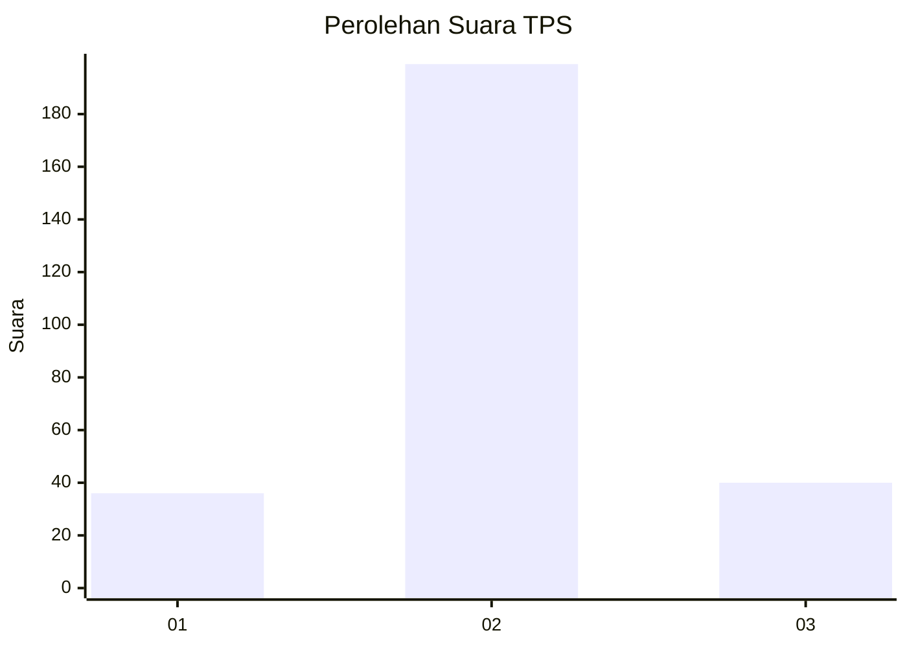
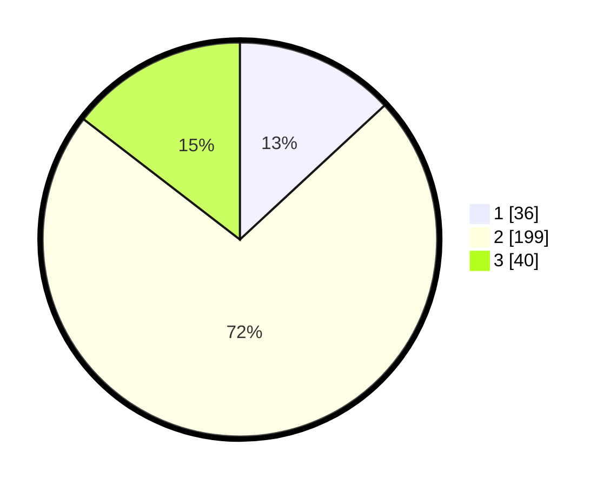

# Hasil

## Grafik

## Tabel

| No. | Nama Paslon    | Suara | Suara (raw) | Persentase |
|:--- |:-------------- | -----:| -----------:| ----------:|
| 1   | ANIES MUHAIMIN | 36    | [36][p-1]   | 13,09      |
| 2   | PRABOWO GIBRAN | 199   | [199][p-2]  | 72,36      |
| 3   | GANJAR MAHFUD  | 40    | [40][p-3]   | 14,55      |

[p-1]: https://github.com/gigit-pemilu/pemilu-2024-19-kepulauan-bangka-belitung/blob/main/pilpres/hitung-suara/sub/19-kepulauan-bangka-belitung/sub/05-bangka-barat/sub/04-kelapa/sub/1001-kelapa/sub/010-tps/sub/paslon-1.txt
[p-2]: https://github.com/gigit-pemilu/pemilu-2024-19-kepulauan-bangka-belitung/blob/main/pilpres/hitung-suara/sub/19-kepulauan-bangka-belitung/sub/05-bangka-barat/sub/04-kelapa/sub/1001-kelapa/sub/010-tps/sub/paslon-2.txt
[p-3]: https://github.com/gigit-pemilu/pemilu-2024-19-kepulauan-bangka-belitung/blob/main/pilpres/hitung-suara/sub/19-kepulauan-bangka-belitung/sub/05-bangka-barat/sub/04-kelapa/sub/1001-kelapa/sub/010-tps/sub/paslon-3.txt

## Foto C Plano

https://sirekap-obj-formc.kpu.go.id/acbf/pemilu/ppwp/19/05/04/10/01/1905041001010-20240218-230030--4347b76c-9696-47d6-a23d-53a970205cf5.jpg

https://sirekap-obj-formc.kpu.go.id/acbf/pemilu/ppwp/19/05/04/10/01/1905041001010-20240218-230157--5789a320-2056-41c5-890b-3e75db665c36.jpg

https://sirekap-obj-formc.kpu.go.id/acbf/pemilu/ppwp/19/05/04/10/01/1905041001010-20240218-230442--cf8bf227-4eef-4814-9d1b-022d01460409.jpg

## Metadata

| Key        | Value               |
| ---------- | ------------------- |
| Time Stamp | 2024-02-22 10:00:00 |

