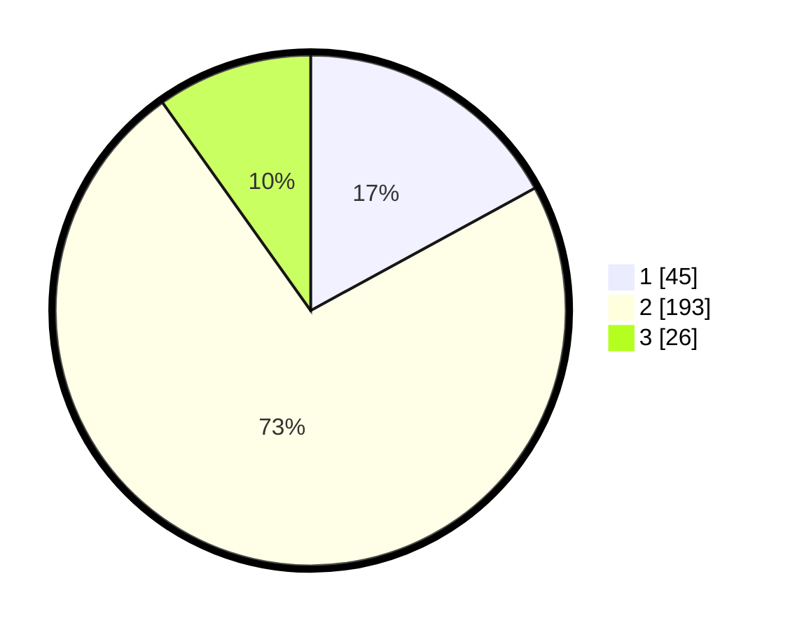

# Hasil

## Grafik

## Tabel

| No. | Nama Paslon    | Suara | Suara (raw) | Persentase |
|:--- |:-------------- | -----:| -----------:| ----------:|
| 1   | ANIES MUHAIMIN | 45    | [45][p-1]   | 17,05      |
| 2   | PRABOWO GIBRAN | 193   | [193][p-2]  | 73,11      |
| 3   | GANJAR MAHFUD  | 26    | [26][p-3]   | 9,85       |

[p-1]: https://github.com/gigit-pemilu/pemilu-2024-19-kepulauan-bangka-belitung/blob/main/pilpres/hitung-suara/sub/19-kepulauan-bangka-belitung/sub/05-bangka-barat/sub/06-parittiga/sub/2002-telak/sub/005-tps/sub/paslon-1.txt
[p-2]: https://github.com/gigit-pemilu/pemilu-2024-19-kepulauan-bangka-belitung/blob/main/pilpres/hitung-suara/sub/19-kepulauan-bangka-belitung/sub/05-bangka-barat/sub/06-parittiga/sub/2002-telak/sub/005-tps/sub/paslon-2.txt
[p-3]: https://github.com/gigit-pemilu/pemilu-2024-19-kepulauan-bangka-belitung/blob/main/pilpres/hitung-suara/sub/19-kepulauan-bangka-belitung/sub/05-bangka-barat/sub/06-parittiga/sub/2002-telak/sub/005-tps/sub/paslon-3.txt

## Foto C Plano

https://sirekap-obj-formc.kpu.go.id/362c/pemilu/ppwp/19/05/06/20/02/1905062002005-20240219-140222--a58294a5-1e30-4f8f-921e-65713eb31e0d.jpg

https://sirekap-obj-formc.kpu.go.id/362c/pemilu/ppwp/19/05/06/20/02/1905062002005-20240221-102824--2109b664-8005-471b-af02-1d93b9ad2951.jpg

https://sirekap-obj-formc.kpu.go.id/362c/pemilu/ppwp/19/05/06/20/02/1905062002005-20240221-102823--20a4ab48-bef6-40f3-baef-1ee80539431d.jpg

## Metadata

| Key        | Value               |
| ---------- | ------------------- |
| Time Stamp | 2024-02-24 22:31:28 |

## DATA PEMILIH TETAP

Jumlah pemilih dalam DPT: **383**.
 * L: **444**.
 * P: **36**.

## DATA PENGGUNA HAK PILIH

Jumlah pengguna hak pilih dalam DPT: **206**.
 * L: **537**.
 * P: **422**.

Jumlah pengguna hak pilih dalam DPTb: **802**.
 * L: **888**.
 * P: **888**.

Jumlah pengguna hak pilih dalam DPK: **802**.
 * L: **8**.
 * P: **884**.

Jumlah pengguna hak pilih: **248**.
 * L: **433**.
 * P: **434**.

## JUMLAH SUARA SAH DAN TIDAK SAH

JUMLAH SELURUH SUARA SAH: **264**.

JUMLAH SUARA TIDAK SAH: **4**.

JUMLAH SELURUH SUARA SAH DAN SUARA TIDAK SAH: **268**.

