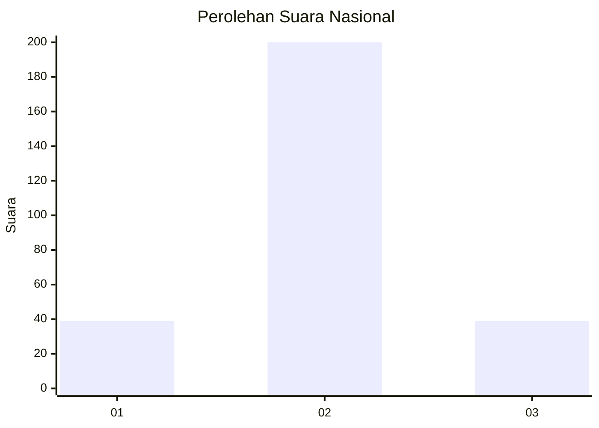

# Hasil

## Grafik

## Tabel

| No. | Nama Paslon    | Suara | Suara (raw) | Persentase |
|:--- |:-------------- | -----:| -----------:| ----------:|
| 1   | ANIES MUHAIMIN | 39    | [39][p-1]   | 14,03      |
| 2   | PRABOWO GIBRAN | 200   | [200][p-2]  | 71,94      |
| 3   | GANJAR MAHFUD  | 39    | [39][p-3]   | 14,03      |

[p-1]: https://github.com/gigit-pemilu/pemilu-2024/blob/main/pilpres/hitung-suara/sub/19-kepulauan-bangka-belitung/sub/05-bangka-barat/sub/06-parittiga/sub/2008-kapit/sub/004-tps/sub/paslon-1.txt
[p-2]: https://github.com/gigit-pemilu/pemilu-2024/blob/main/pilpres/hitung-suara/sub/19-kepulauan-bangka-belitung/sub/05-bangka-barat/sub/06-parittiga/sub/2008-kapit/sub/004-tps/sub/paslon-2.txt
[p-3]: https://github.com/gigit-pemilu/pemilu-2024/blob/main/pilpres/hitung-suara/sub/19-kepulauan-bangka-belitung/sub/05-bangka-barat/sub/06-parittiga/sub/2008-kapit/sub/004-tps/sub/paslon-3.txt

## Foto C Plano

https://sirekap-obj-formc.kpu.go.id/524d/pemilu/ppwp/19/05/06/20/08/1905062008004-20240221-125142--16689fe8-d0c5-4568-b16a-87a4e21582b9.jpg

https://sirekap-obj-formc.kpu.go.id/524d/pemilu/ppwp/19/05/06/20/08/1905062008004-20240221-125236--db6272b4-aa86-4390-ad7e-8261e823ce23.jpg

https://sirekap-obj-formc.kpu.go.id/524d/pemilu/ppwp/19/05/06/20/08/1905062008004-20240221-125358--3a2af960-e472-4f30-9316-06b71b0335e0.jpg

## Metadata

| Key        | Value               |
| ---------- | ------------------- |
| Time Stamp | 2024-02-22 10:00:00 |

## DATA PEMILIH TETAP

Jumlah pemilih dalam DPT: **480**.
 * L: **456**.
 * P: **430**.

## DATA PENGGUNA HAK PILIH

Jumlah pengguna hak pilih dalam DPT: **279**.
 * L: **444**.
 * P: **20**.

Jumlah pengguna hak pilih dalam DPTb: **885**.
 * L: **885**.
 * P: **888**.

Jumlah pengguna hak pilih dalam DPK: **883**.
 * L: **4**.
 * P: **884**.

Jumlah pengguna hak pilih: **378**.
 * L: **450**.
 * P: **433**.

## JUMLAH SUARA SAH DAN TIDAK SAH

JUMLAH SELURUH SUARA SAH: **278**.

JUMLAH SUARA TIDAK SAH: **0**.

JUMLAH SELURUH SUARA SAH DAN SUARA TIDAK SAH: **278**.

