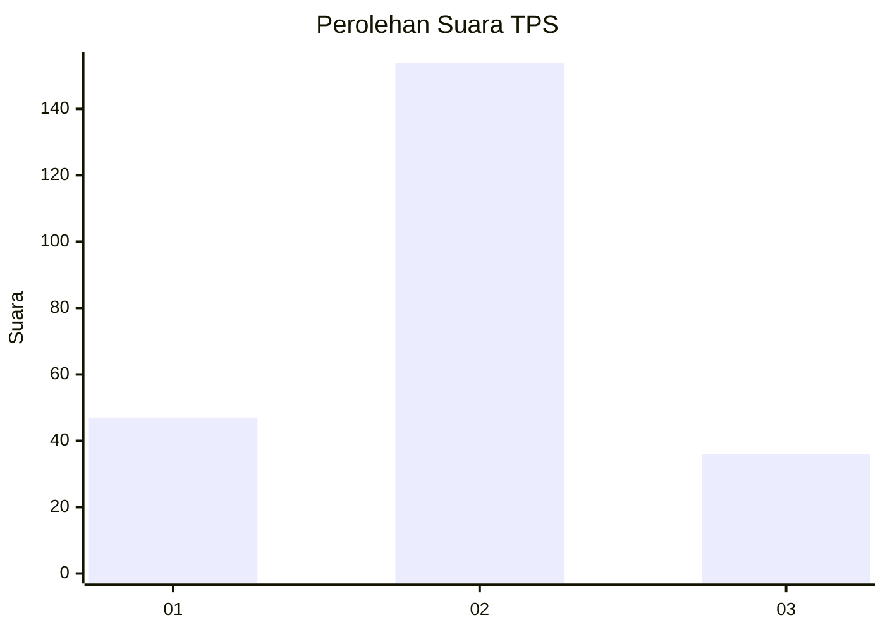
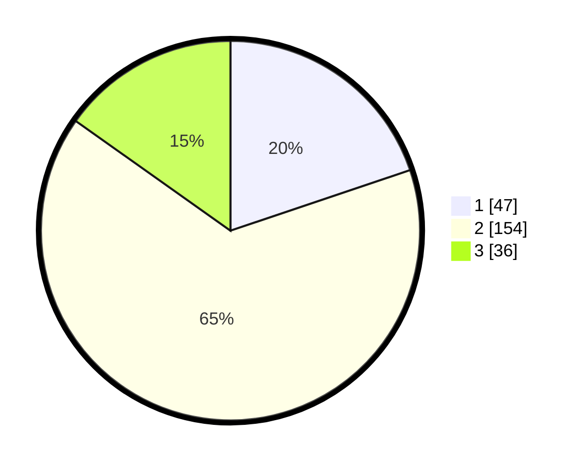

# Hasil

## Grafik

## Tabel

| No. | Nama Paslon    | Suara | Suara (raw) | Persentase |
|:--- |:-------------- | -----:| -----------:| ----------:|
| 1   | ANIES MUHAIMIN | 47    | [47][p-1]   | 19,83      |
| 2   | PRABOWO GIBRAN | 154   | [154][p-2]  | 64,98      |
| 3   | GANJAR MAHFUD  | 36    | [36][p-3]   | 15,19      |

[p-1]: https://github.com/gigit-pemilu/pemilu-2024-19-kepulauan-bangka-belitung/blob/main/pilpres/hitung-suara/sub/19-kepulauan-bangka-belitung/sub/06-belitung-timur/sub/01-manggar/sub/2001-lalang-jaya/sub/005-tps/sub/paslon-1.txt
[p-2]: https://github.com/gigit-pemilu/pemilu-2024-19-kepulauan-bangka-belitung/blob/main/pilpres/hitung-suara/sub/19-kepulauan-bangka-belitung/sub/06-belitung-timur/sub/01-manggar/sub/2001-lalang-jaya/sub/005-tps/sub/paslon-2.txt
[p-3]: https://github.com/gigit-pemilu/pemilu-2024-19-kepulauan-bangka-belitung/blob/main/pilpres/hitung-suara/sub/19-kepulauan-bangka-belitung/sub/06-belitung-timur/sub/01-manggar/sub/2001-lalang-jaya/sub/005-tps/sub/paslon-3.txt

## Foto C Plano

https://sirekap-obj-formc.kpu.go.id/2919/pemilu/ppwp/19/06/01/20/01/1906012001005-20240222-095127--79c7b609-d928-4d06-9dec-4dc6eff6dab5.jpg

https://sirekap-obj-formc.kpu.go.id/2919/pemilu/ppwp/19/06/01/20/01/1906012001005-20240222-095137--e7b460ad-6354-4ea1-a77e-de34bc74c399.jpg

https://sirekap-obj-formc.kpu.go.id/2919/pemilu/ppwp/19/06/01/20/01/1906012001005-20240222-095151--84291c7a-ea68-458e-ad9f-51591412616d.jpg

## Metadata

| Key        | Value               |
| ---------- | ------------------- |
| Time Stamp | 2024-02-24 22:31:28 |

