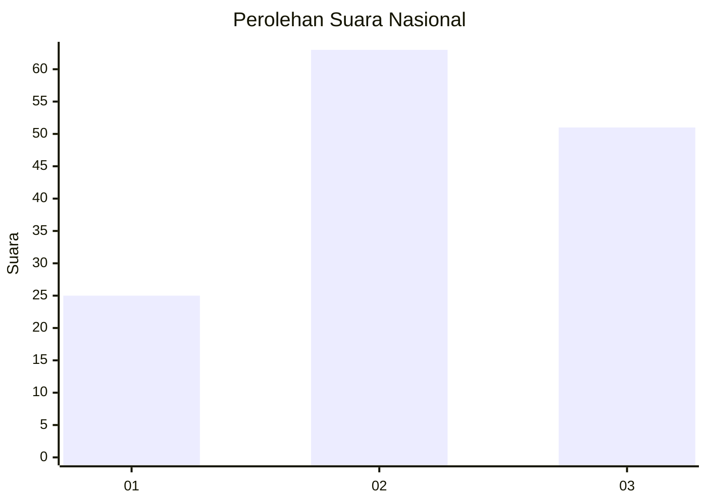
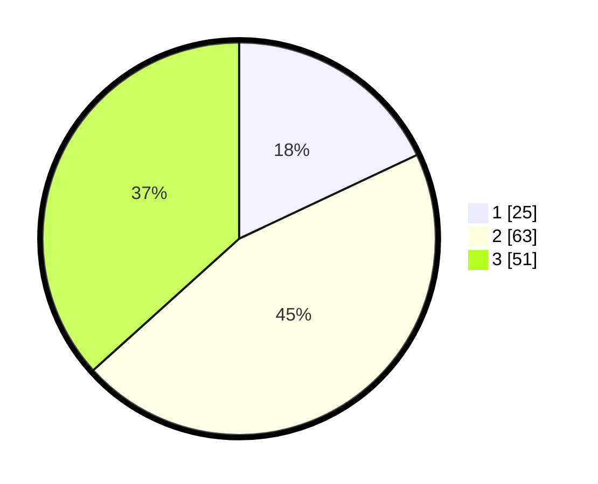

# Hasil

## Grafik

## Tabel

| No. | Nama Paslon    | Suara | Suara (raw) | Persentase |
|:--- |:-------------- | -----:| -----------:| ----------:|
| 1   | ANIES MUHAIMIN | 25    | [25][p-1]   | 17,99      |
| 2   | PRABOWO GIBRAN | 63    | [63][p-2]   | 45,32      |
| 3   | GANJAR MAHFUD  | 51    | [51][p-3]   | 36,69      |

[p-1]: https://github.com/gigit-pemilu/pemilu-2024/blob/main/pilpres/hitung-suara/sub/19-kepulauan-bangka-belitung/sub/06-belitung-timur/sub/01-manggar/sub/2006-lalang/sub/012-tps/sub/paslon-1.txt
[p-2]: https://github.com/gigit-pemilu/pemilu-2024/blob/main/pilpres/hitung-suara/sub/19-kepulauan-bangka-belitung/sub/06-belitung-timur/sub/01-manggar/sub/2006-lalang/sub/012-tps/sub/paslon-2.txt
[p-3]: https://github.com/gigit-pemilu/pemilu-2024/blob/main/pilpres/hitung-suara/sub/19-kepulauan-bangka-belitung/sub/06-belitung-timur/sub/01-manggar/sub/2006-lalang/sub/012-tps/sub/paslon-3.txt

## Foto C Plano

https://sirekap-obj-formc.kpu.go.id/0983/pemilu/ppwp/19/06/01/20/06/1906012006012-20240222-094836--9f6813a1-755f-49bd-a232-ed85267aab64.jpg

https://sirekap-obj-formc.kpu.go.id/0983/pemilu/ppwp/19/06/01/20/06/1906012006012-20240222-094932--b53e591a-3963-4d4f-ab9e-b73d70236c78.jpg

https://sirekap-obj-formc.kpu.go.id/0983/pemilu/ppwp/19/06/01/20/06/1906012006012-20240222-094943--28f73618-ebb9-4464-892c-8c3dab139bde.jpg

## Metadata

| Key        | Value               |
| ---------- | ------------------- |
| Time Stamp | 2024-02-24 22:31:28 |

