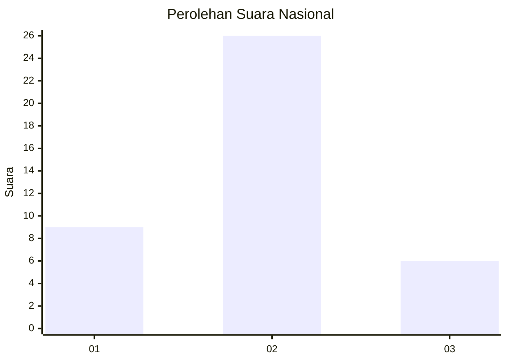
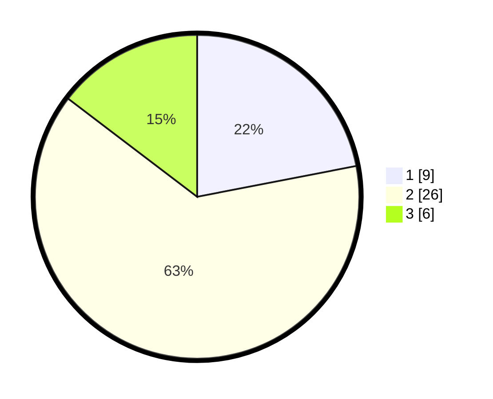

# Hasil

## Grafik

## Tabel

| No. | Nama Paslon    | Suara | Suara (raw) | Persentase |
|:--- |:-------------- | -----:| -----------:| ----------:|
| 1   | ANIES MUHAIMIN | 9     | [9][p-1]    | 21,95      |
| 2   | PRABOWO GIBRAN | 26    | [26][p-2]   | 63,41      |
| 3   | GANJAR MAHFUD  | 6     | [6][p-3]    | 14,63      |

[p-1]: https://github.com/gigit-pemilu/pemilu-2024/blob/main/pilpres/hitung-suara/sub/19-kepulauan-bangka-belitung/sub/06-belitung-timur/sub/03-dendang/sub/2002-jangkang/sub/901-tps/sub/paslon-1.txt
[p-2]: https://github.com/gigit-pemilu/pemilu-2024/blob/main/pilpres/hitung-suara/sub/19-kepulauan-bangka-belitung/sub/06-belitung-timur/sub/03-dendang/sub/2002-jangkang/sub/901-tps/sub/paslon-2.txt
[p-3]: https://github.com/gigit-pemilu/pemilu-2024/blob/main/pilpres/hitung-suara/sub/19-kepulauan-bangka-belitung/sub/06-belitung-timur/sub/03-dendang/sub/2002-jangkang/sub/901-tps/sub/paslon-3.txt

## Foto C Plano

https://sirekap-obj-formc.kpu.go.id/58a7/pemilu/ppwp/19/06/03/20/02/1906032002901-20240219-092506--8adb6317-cba2-4746-9a8d-c81d2e356881.jpg

https://sirekap-obj-formc.kpu.go.id/58a7/pemilu/ppwp/19/06/03/20/02/1906032002901-20240219-092759--ce282fa7-52b0-4adb-b82c-f1ed12ce5825.jpg

https://sirekap-obj-formc.kpu.go.id/58a7/pemilu/ppwp/19/06/03/20/02/1906032002901-20240219-093006--6006acdd-aa3c-4066-8b3d-684575091415.jpg

## Metadata

| Key        | Value               |
| ---------- | ------------------- |
| Time Stamp | 2024-02-19 10:00:00 |

## DATA PEMILIH TETAP

Jumlah pemilih dalam DPT: **81**.
 * L: **45**.
 * P: **36**.

## DATA PENGGUNA HAK PILIH

Jumlah pengguna hak pilih dalam DPT: **21**.
 * L: **15**.
 * P: **6**.

Jumlah pengguna hak pilih dalam DPTb: **22**.
 * L: **11**.
 * P: **11**.

Jumlah pengguna hak pilih dalam DPK: **0**.
 * L: **0**.
 * P: **0**.

Jumlah pengguna hak pilih: **43**.
 * L: **26**.
 * P: **17**.

## JUMLAH SUARA SAH DAN TIDAK SAH

JUMLAH SELURUH SUARA SAH: **41**.

JUMLAH SUARA TIDAK SAH: **2**.

JUMLAH SELURUH SUARA SAH DAN SUARA TIDAK SAH: **43**.

