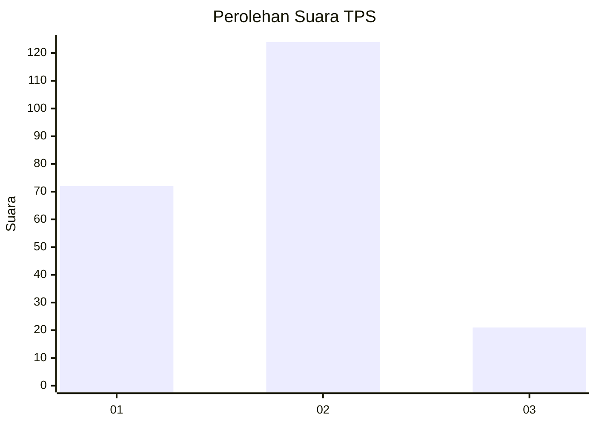
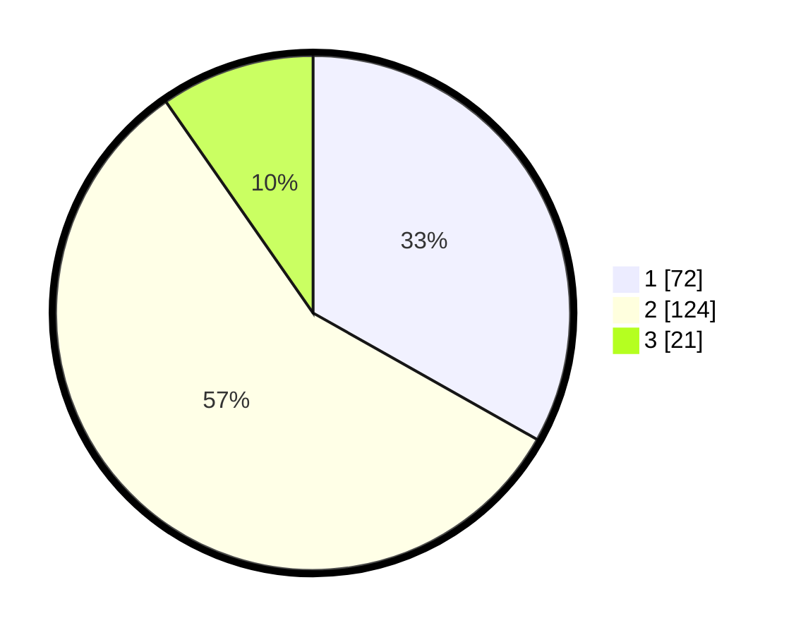

# Hasil

## Grafik

## Tabel

| No. | Nama Paslon    | Suara | Suara (raw) | Persentase |
|:--- |:-------------- | -----:| -----------:| ----------:|
| 1   | ANIES MUHAIMIN | 72    | [72][p-1]   | 33,18      |
| 2   | PRABOWO GIBRAN | 124   | [124][p-2]  | 57,14      |
| 3   | GANJAR MAHFUD  | 21    | [21][p-3]   | 9,68       |

[p-1]: https://github.com/gigit-pemilu/pemilu-2024-19-kepulauan-bangka-belitung/blob/main/pilpres/hitung-suara/sub/19-kepulauan-bangka-belitung/sub/71-kota-pangkal-pinang/sub/01-bukit-intan/sub/1004-semabung-lama/sub/005-tps/sub/paslon-1.txt
[p-2]: https://github.com/gigit-pemilu/pemilu-2024-19-kepulauan-bangka-belitung/blob/main/pilpres/hitung-suara/sub/19-kepulauan-bangka-belitung/sub/71-kota-pangkal-pinang/sub/01-bukit-intan/sub/1004-semabung-lama/sub/005-tps/sub/paslon-2.txt
[p-3]: https://github.com/gigit-pemilu/pemilu-2024-19-kepulauan-bangka-belitung/blob/main/pilpres/hitung-suara/sub/19-kepulauan-bangka-belitung/sub/71-kota-pangkal-pinang/sub/01-bukit-intan/sub/1004-semabung-lama/sub/005-tps/sub/paslon-3.txt

## Foto C Plano

https://sirekap-obj-formc.kpu.go.id/311d/pemilu/ppwp/19/71/01/10/04/1971011004005-20240214-214409--060088d9-b883-4a3e-8ae5-e6b5758e353e.jpg

https://sirekap-obj-formc.kpu.go.id/311d/pemilu/ppwp/19/71/01/10/04/1971011004005-20240214-214719--1ff26341-8cb0-4c32-abab-aa1df6ec544d.jpg

https://sirekap-obj-formc.kpu.go.id/311d/pemilu/ppwp/19/71/01/10/04/1971011004005-20240214-214943--33b1c0ec-4d75-44a8-99a7-1d42918845a8.jpg

## Metadata

| Key        | Value               |
| ---------- | ------------------- |
| Time Stamp | 2024-02-22 12:00:00 |

