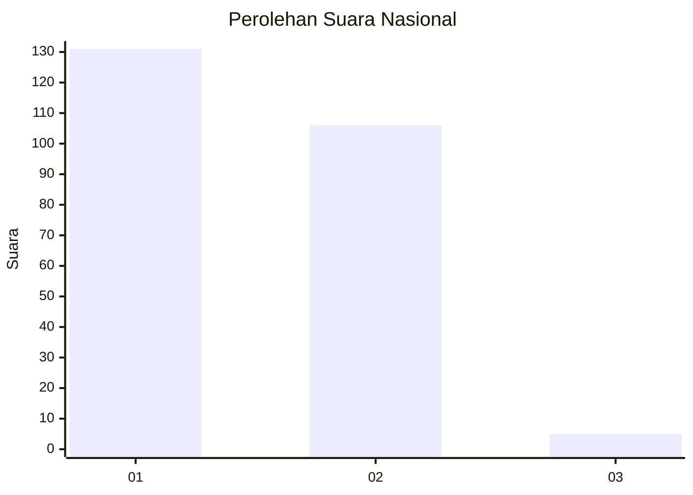
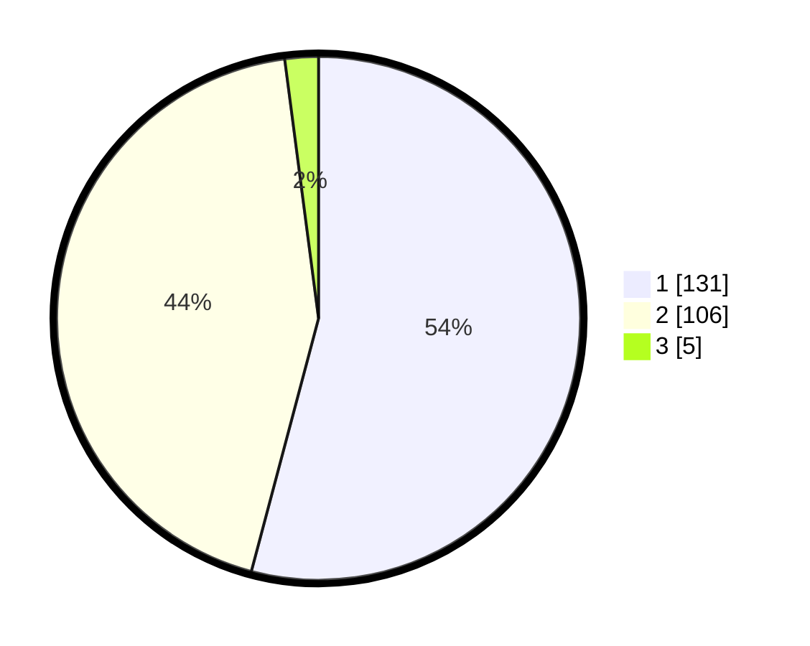

# Hasil

## Grafik

## Tabel

| No. | Nama Paslon    | Suara | Suara (raw) | Persentase |
|:--- |:-------------- | -----:| -----------:| ----------:|
| 1   | ANIES MUHAIMIN | 131   | [131][p-1]  | 54,13      |
| 2   | PRABOWO GIBRAN | 106   | [106][p-2]  | 43,80      |
| 3   | GANJAR MAHFUD  | 5     | [5][p-3]    | 2,07       |

[p-1]: https://github.com/gigit-pemilu/pemilu-2024/blob/main/pilpres/hitung-suara/sub/19-kepulauan-bangka-belitung/sub/71-kota-pangkal-pinang/sub/01-bukit-intan/sub/1007-air-itam/sub/006-tps/sub/paslon-1.txt
[p-2]: https://github.com/gigit-pemilu/pemilu-2024/blob/main/pilpres/hitung-suara/sub/19-kepulauan-bangka-belitung/sub/71-kota-pangkal-pinang/sub/01-bukit-intan/sub/1007-air-itam/sub/006-tps/sub/paslon-2.txt
[p-3]: https://github.com/gigit-pemilu/pemilu-2024/blob/main/pilpres/hitung-suara/sub/19-kepulauan-bangka-belitung/sub/71-kota-pangkal-pinang/sub/01-bukit-intan/sub/1007-air-itam/sub/006-tps/sub/paslon-3.txt

## Foto C Plano

https://sirekap-obj-formc.kpu.go.id/7874/pemilu/ppwp/19/71/01/10/07/1971011007006-20240214-232742--cfc27efa-3dd6-4307-a1c4-a8cf14b3b6b4.jpg

https://sirekap-obj-formc.kpu.go.id/7874/pemilu/ppwp/19/71/01/10/07/1971011007006-20240214-233129--713a2bf9-28d2-47e4-bbfb-b754e0420e68.jpg

https://sirekap-obj-formc.kpu.go.id/7874/pemilu/ppwp/19/71/01/10/07/1971011007006-20240214-233357--cd7e8846-f1c3-4ceb-a45e-b2f342ca8ea6.jpg

## Metadata

| Key        | Value               |
| ---------- | ------------------- |
| Time Stamp | 2024-02-15 16:00:26 |

