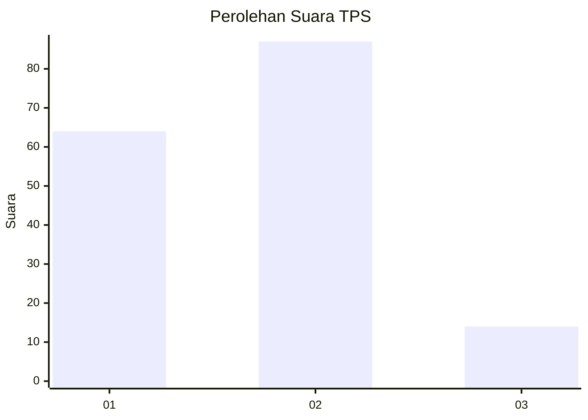

# Hasil

## Grafik

## Tabel

| No. | Nama Paslon    | Suara | Suara (raw) | Persentase |
|:--- |:-------------- | -----:| -----------:| ----------:|
| 1   | ANIES MUHAIMIN | 64    | [64][p-1]   | 38,79      |
| 2   | PRABOWO GIBRAN | 87    | [87][p-2]   | 52,73      |
| 3   | GANJAR MAHFUD  | 14    | [14][p-3]   | 8,48       |

[p-1]: https://github.com/gigit-pemilu/pemilu-2024-19-kepulauan-bangka-belitung/blob/main/pilpres/hitung-suara/sub/19-kepulauan-bangka-belitung/sub/71-kota-pangkal-pinang/sub/02-taman-sari/sub/1001-opas-indah/sub/003-tps/sub/paslon-1.txt
[p-2]: https://github.com/gigit-pemilu/pemilu-2024-19-kepulauan-bangka-belitung/blob/main/pilpres/hitung-suara/sub/19-kepulauan-bangka-belitung/sub/71-kota-pangkal-pinang/sub/02-taman-sari/sub/1001-opas-indah/sub/003-tps/sub/paslon-2.txt
[p-3]: https://github.com/gigit-pemilu/pemilu-2024-19-kepulauan-bangka-belitung/blob/main/pilpres/hitung-suara/sub/19-kepulauan-bangka-belitung/sub/71-kota-pangkal-pinang/sub/02-taman-sari/sub/1001-opas-indah/sub/003-tps/sub/paslon-3.txt

## Foto C Plano

https://sirekap-obj-formc.kpu.go.id/352f/pemilu/ppwp/19/71/02/10/01/1971021001003-20240214-155726--294803d6-d20d-4070-acec-332e7cd2aa4a.jpg

https://sirekap-obj-formc.kpu.go.id/352f/pemilu/ppwp/19/71/02/10/01/1971021001003-20240214-155832--0b5a5086-484b-40dc-9232-5c262dbde9f6.jpg

https://sirekap-obj-formc.kpu.go.id/352f/pemilu/ppwp/19/71/02/10/01/1971021001003-20240214-160055--ad99617a-30f4-4093-958a-1caa7e98d09c.jpg

## Metadata

| Key        | Value               |
| ---------- | ------------------- |
| Time Stamp | 2024-02-15 15:30:25 |

