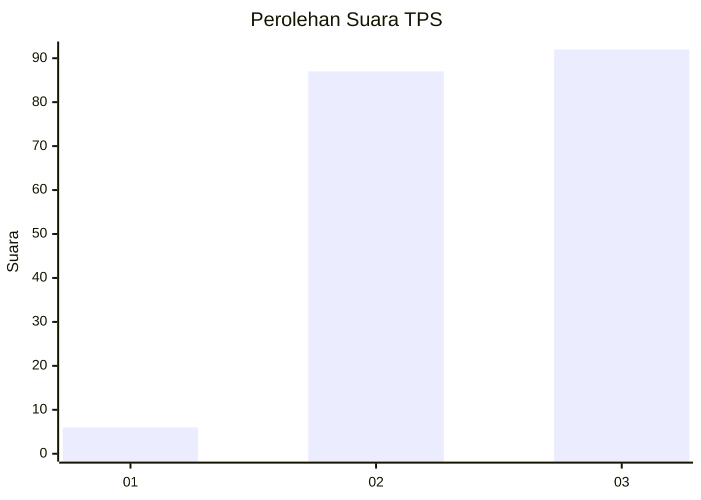
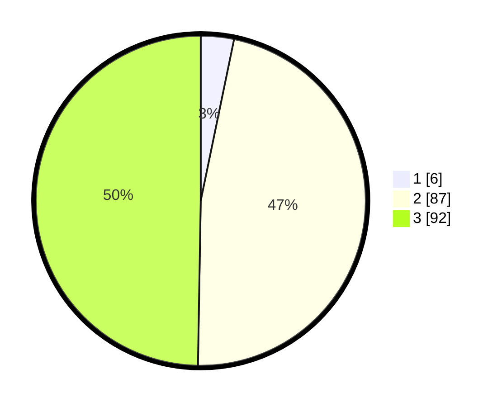

# Hasil

## Grafik

## Tabel

| No. | Nama Paslon    | Suara | Suara (raw) | Persentase |
|:--- |:-------------- | -----:| -----------:| ----------:|
| 1   | ANIES MUHAIMIN | 6     | [6][p-1]    | 3,24       |
| 2   | PRABOWO GIBRAN | 87    | [87][p-2]   | 47,03      |
| 3   | GANJAR MAHFUD  | 92    | [92][p-3]   | 49,73      |

[p-1]: https://github.com/gigit-pemilu/pemilu-2024-19-kepulauan-bangka-belitung/blob/main/pilpres/hitung-suara/sub/19-kepulauan-bangka-belitung/sub/71-kota-pangkal-pinang/sub/03-pangkal-balam/sub/1004-pasir-garam/sub/003-tps/sub/paslon-1.txt
[p-2]: https://github.com/gigit-pemilu/pemilu-2024-19-kepulauan-bangka-belitung/blob/main/pilpres/hitung-suara/sub/19-kepulauan-bangka-belitung/sub/71-kota-pangkal-pinang/sub/03-pangkal-balam/sub/1004-pasir-garam/sub/003-tps/sub/paslon-2.txt
[p-3]: https://github.com/gigit-pemilu/pemilu-2024-19-kepulauan-bangka-belitung/blob/main/pilpres/hitung-suara/sub/19-kepulauan-bangka-belitung/sub/71-kota-pangkal-pinang/sub/03-pangkal-balam/sub/1004-pasir-garam/sub/003-tps/sub/paslon-3.txt

## Foto C Plano

https://sirekap-obj-formc.kpu.go.id/c54f/pemilu/ppwp/19/71/03/10/04/1971031004003-20240214-200305--2245d650-5261-45ef-bc73-f6c9f04fce97.jpg

https://sirekap-obj-formc.kpu.go.id/c54f/pemilu/ppwp/19/71/03/10/04/1971031004003-20240214-200602--62053548-bc14-449f-97c3-6b7a8fa9bed3.jpg

https://sirekap-obj-formc.kpu.go.id/c54f/pemilu/ppwp/19/71/03/10/04/1971031004003-20240214-200447--1295c32b-0257-4b0b-b49f-df9a33172386.jpg

## Metadata

| Key        | Value               |
| ---------- | ------------------- |
| Time Stamp | 2024-02-15 22:00:27 |

