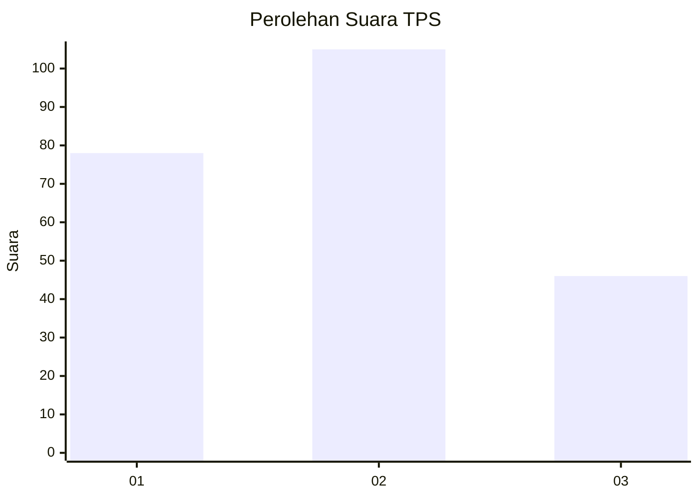
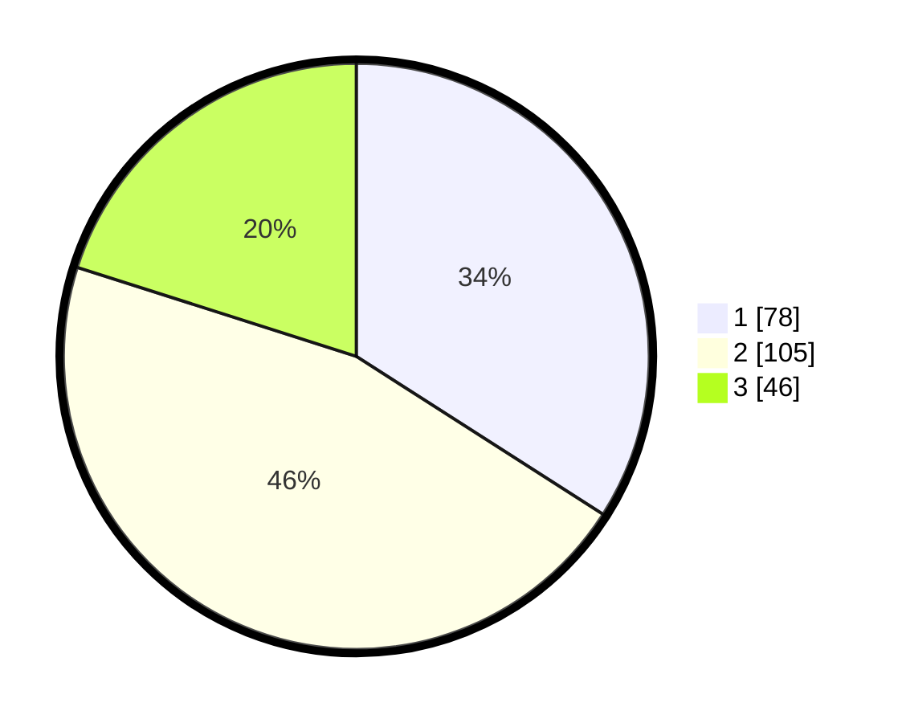

# Hasil

## Grafik

## Tabel

| No. | Nama Paslon    | Suara | Suara (raw) | Persentase |
|:--- |:-------------- | -----:| -----------:| ----------:|
| 1   | ANIES MUHAIMIN | 78    | [78][p-1]   | 34,06      |
| 2   | PRABOWO GIBRAN | 105   | [105][p-2]  | 45,85      |
| 3   | GANJAR MAHFUD  | 46    | [46][p-3]   | 20,09      |

[p-1]: https://github.com/gigit-pemilu/pemilu-2024-19-kepulauan-bangka-belitung/blob/main/pilpres/hitung-suara/sub/19-kepulauan-bangka-belitung/sub/71-kota-pangkal-pinang/sub/03-pangkal-balam/sub/1004-pasir-garam/sub/006-tps/sub/paslon-1.txt
[p-2]: https://github.com/gigit-pemilu/pemilu-2024-19-kepulauan-bangka-belitung/blob/main/pilpres/hitung-suara/sub/19-kepulauan-bangka-belitung/sub/71-kota-pangkal-pinang/sub/03-pangkal-balam/sub/1004-pasir-garam/sub/006-tps/sub/paslon-2.txt
[p-3]: https://github.com/gigit-pemilu/pemilu-2024-19-kepulauan-bangka-belitung/blob/main/pilpres/hitung-suara/sub/19-kepulauan-bangka-belitung/sub/71-kota-pangkal-pinang/sub/03-pangkal-balam/sub/1004-pasir-garam/sub/006-tps/sub/paslon-3.txt

## Foto C Plano

https://sirekap-obj-formc.kpu.go.id/05e2/pemilu/ppwp/19/71/03/10/04/1971031004006-20240214-231130--7cbc07f7-3a06-4ee6-ad9c-f66cba051284.jpg

https://sirekap-obj-formc.kpu.go.id/05e2/pemilu/ppwp/19/71/03/10/04/1971031004006-20240214-231249--049878c3-df25-48ea-b117-19d05b3dee60.jpg

https://sirekap-obj-formc.kpu.go.id/05e2/pemilu/ppwp/19/71/03/10/04/1971031004006-20240214-231413--1229e9a0-c383-4ef4-8029-6d504259d102.jpg

## Metadata

| Key        | Value               |
| ---------- | ------------------- |
| Time Stamp | 2024-02-15 12:00:28 |

