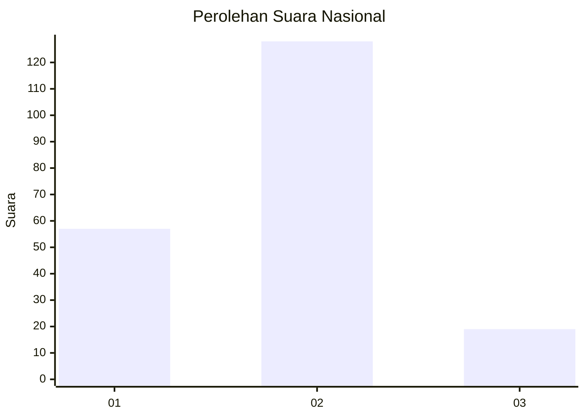
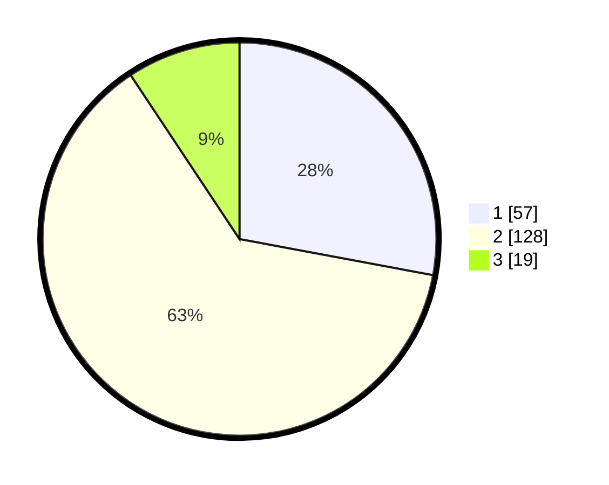

# Hasil

## Grafik

## Tabel

| No. | Nama Paslon    | Suara | Suara (raw) | Persentase |
|:--- |:-------------- | -----:| -----------:| ----------:|
| 1   | ANIES MUHAIMIN | 57    | [57][p-1]   | 27,94      |
| 2   | PRABOWO GIBRAN | 128   | [128][p-2]  | 62,75      |
| 3   | GANJAR MAHFUD  | 19    | [19][p-3]   | 9,31       |

[p-1]: https://github.com/gigit-pemilu/pemilu-2024/blob/main/pilpres/hitung-suara/sub/19-kepulauan-bangka-belitung/sub/71-kota-pangkal-pinang/sub/04-rangkui/sub/1001-pintu-air/sub/003-tps/sub/paslon-1.txt
[p-2]: https://github.com/gigit-pemilu/pemilu-2024/blob/main/pilpres/hitung-suara/sub/19-kepulauan-bangka-belitung/sub/71-kota-pangkal-pinang/sub/04-rangkui/sub/1001-pintu-air/sub/003-tps/sub/paslon-2.txt
[p-3]: https://github.com/gigit-pemilu/pemilu-2024/blob/main/pilpres/hitung-suara/sub/19-kepulauan-bangka-belitung/sub/71-kota-pangkal-pinang/sub/04-rangkui/sub/1001-pintu-air/sub/003-tps/sub/paslon-3.txt

## Foto C Plano

https://sirekap-obj-formc.kpu.go.id/6a63/pemilu/ppwp/19/71/04/10/01/1971041001003-20240214-193650--4f4fbc17-6893-4fe9-b7f5-fcbc10887997.jpg

https://sirekap-obj-formc.kpu.go.id/6a63/pemilu/ppwp/19/71/04/10/01/1971041001003-20240214-193929--fbf578a6-d7f3-4083-9e5c-fcecb410450a.jpg

https://sirekap-obj-formc.kpu.go.id/6a63/pemilu/ppwp/19/71/04/10/01/1971041001003-20240214-194014--ff94d3f2-7cf9-4917-a24a-bcf6acd6242d.jpg

## Metadata

| Key        | Value               |
| ---------- | ------------------- |
| Time Stamp | 2024-02-15 15:30:25 |

