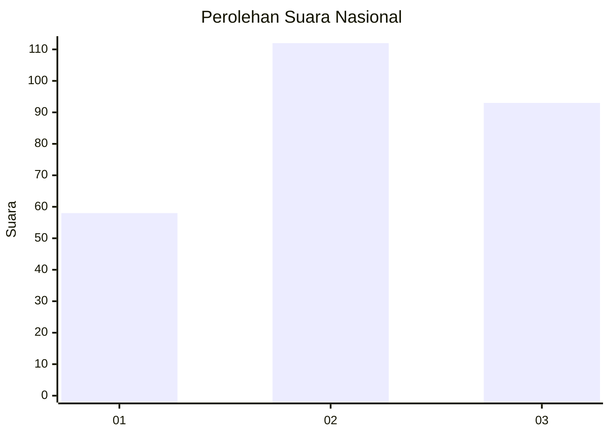
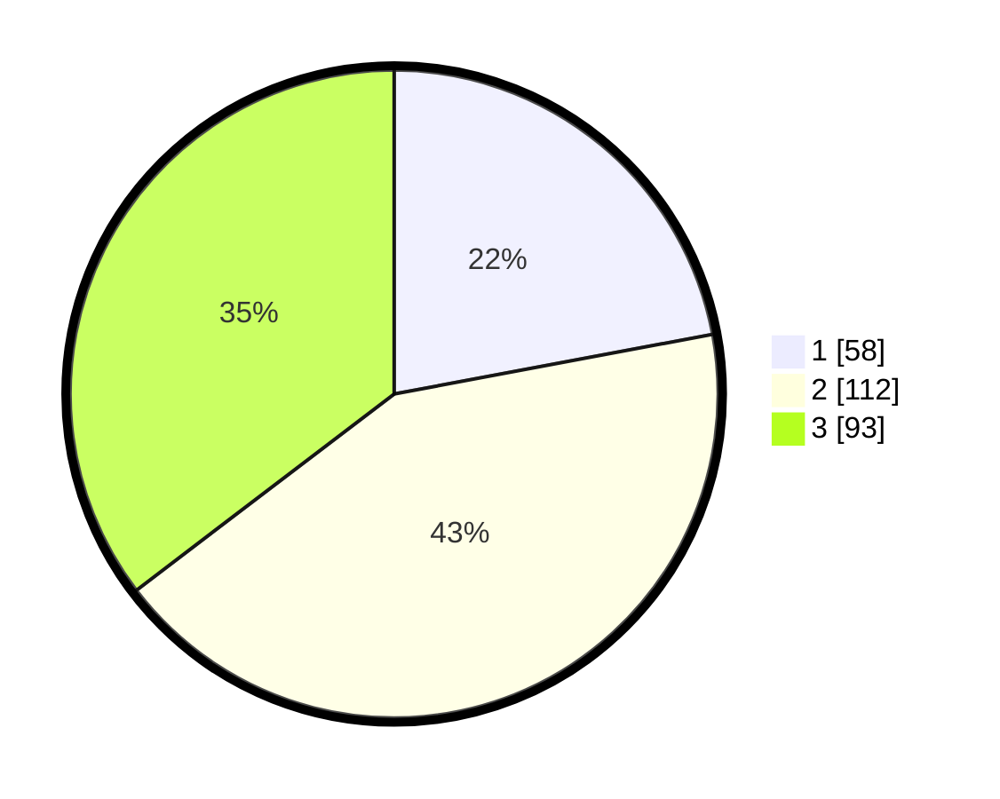

# Hasil

## Grafik

## Tabel

| No. | Nama Paslon    | Suara | Suara (raw) | Persentase |
|:--- |:-------------- | -----:| -----------:| ----------:|
| 1   | ANIES MUHAIMIN | 58    | [58][p-1]   | 22,05      |
| 2   | PRABOWO GIBRAN | 112   | [112][p-2]  | 42,59      |
| 3   | GANJAR MAHFUD  | 93    | [93][p-3]   | 35,36      |

[p-1]: https://github.com/gigit-pemilu/pemilu-2024/blob/main/pilpres/hitung-suara/sub/19-kepulauan-bangka-belitung/sub/71-kota-pangkal-pinang/sub/05-gerunggang/sub/1004-bukit-sari/sub/011-tps/sub/paslon-1.txt
[p-2]: https://github.com/gigit-pemilu/pemilu-2024/blob/main/pilpres/hitung-suara/sub/19-kepulauan-bangka-belitung/sub/71-kota-pangkal-pinang/sub/05-gerunggang/sub/1004-bukit-sari/sub/011-tps/sub/paslon-2.txt
[p-3]: https://github.com/gigit-pemilu/pemilu-2024/blob/main/pilpres/hitung-suara/sub/19-kepulauan-bangka-belitung/sub/71-kota-pangkal-pinang/sub/05-gerunggang/sub/1004-bukit-sari/sub/011-tps/sub/paslon-3.txt

## Foto C Plano

https://sirekap-obj-formc.kpu.go.id/177e/pemilu/ppwp/19/71/05/10/04/1971051004011-20240215-024331--ee37421c-7cb3-44f7-a6b7-9e2bef8482b1.jpg

https://sirekap-obj-formc.kpu.go.id/177e/pemilu/ppwp/19/71/05/10/04/1971051004011-20240215-024738--fd60b4b3-9284-4c83-b856-0435bc110d08.jpg

https://sirekap-obj-formc.kpu.go.id/177e/pemilu/ppwp/19/71/05/10/04/1971051004011-20240215-014231--d4968bfa-5037-413e-9154-50db57bab9ec.jpg

## Metadata

| Key        | Value               |
| ---------- | ------------------- |
| Time Stamp | 2024-02-17 10:30:03 |

