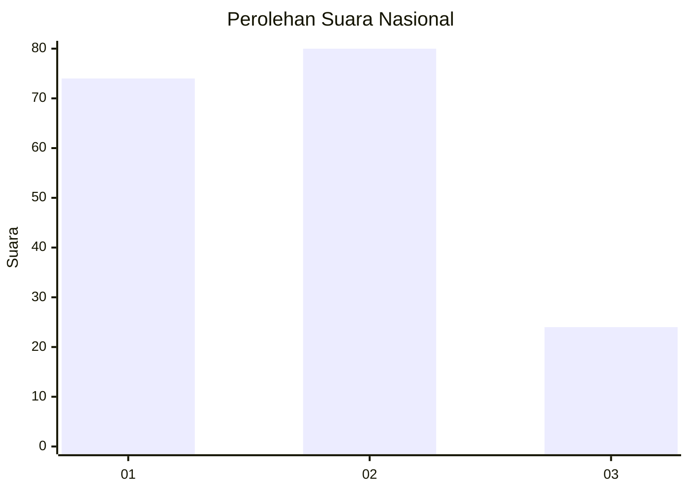
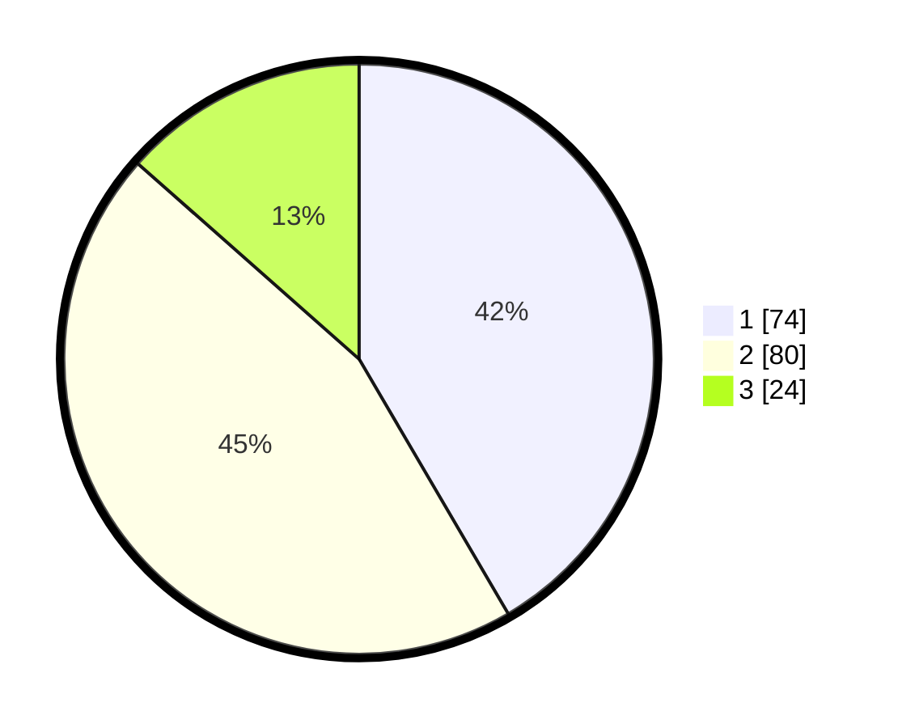

# Hasil

## Grafik

## Tabel

| No. | Nama Paslon    | Suara | Suara (raw) | Persentase |
|:--- |:-------------- | -----:| -----------:| ----------:|
| 1   | ANIES MUHAIMIN | 74    | [74][p-1]   | 41,57      |
| 2   | PRABOWO GIBRAN | 80    | [80][p-2]   | 44,94      |
| 3   | GANJAR MAHFUD  | 24    | [24][p-3]   | 13,48      |

[p-1]: https://github.com/gigit-pemilu/pemilu-2024/blob/main/pilpres/hitung-suara/sub/19-kepulauan-bangka-belitung/sub/71-kota-pangkal-pinang/sub/05-gerunggang/sub/1004-bukit-sari/sub/013-tps/sub/paslon-1.txt
[p-2]: https://github.com/gigit-pemilu/pemilu-2024/blob/main/pilpres/hitung-suara/sub/19-kepulauan-bangka-belitung/sub/71-kota-pangkal-pinang/sub/05-gerunggang/sub/1004-bukit-sari/sub/013-tps/sub/paslon-2.txt
[p-3]: https://github.com/gigit-pemilu/pemilu-2024/blob/main/pilpres/hitung-suara/sub/19-kepulauan-bangka-belitung/sub/71-kota-pangkal-pinang/sub/05-gerunggang/sub/1004-bukit-sari/sub/013-tps/sub/paslon-3.txt

## Foto C Plano

https://sirekap-obj-formc.kpu.go.id/17e0/pemilu/ppwp/19/71/05/10/04/1971051004013-20240215-003712--25c2c673-844d-43d2-a0cb-96c0b88a82f7.jpg

https://sirekap-obj-formc.kpu.go.id/17e0/pemilu/ppwp/19/71/05/10/04/1971051004013-20240215-003920--0277b8c8-6286-49b7-9eff-8dc93d345ddc.jpg

https://sirekap-obj-formc.kpu.go.id/17e0/pemilu/ppwp/19/71/05/10/04/1971051004013-20240215-004053--baf9baea-e26f-4c49-8df9-6c282f57a8fb.jpg

## Metadata

| Key        | Value               |
| ---------- | ------------------- |
| Time Stamp | 2024-02-15 15:30:25 |

