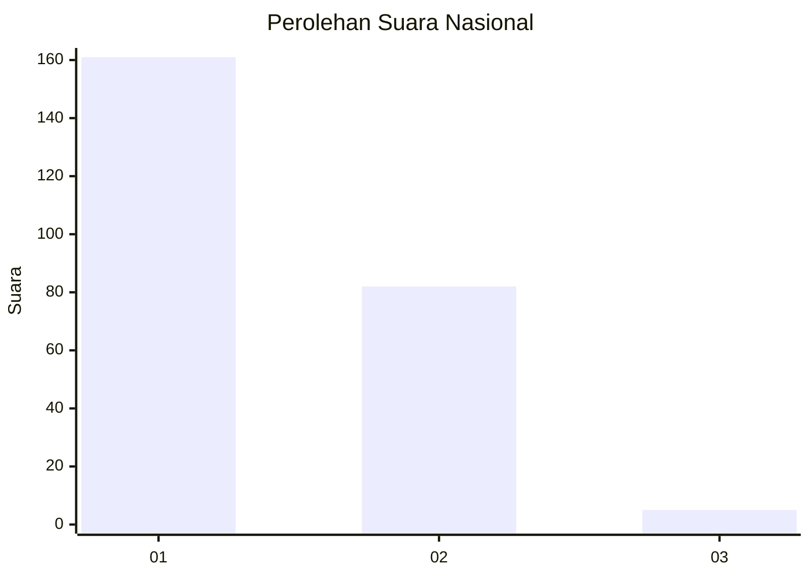
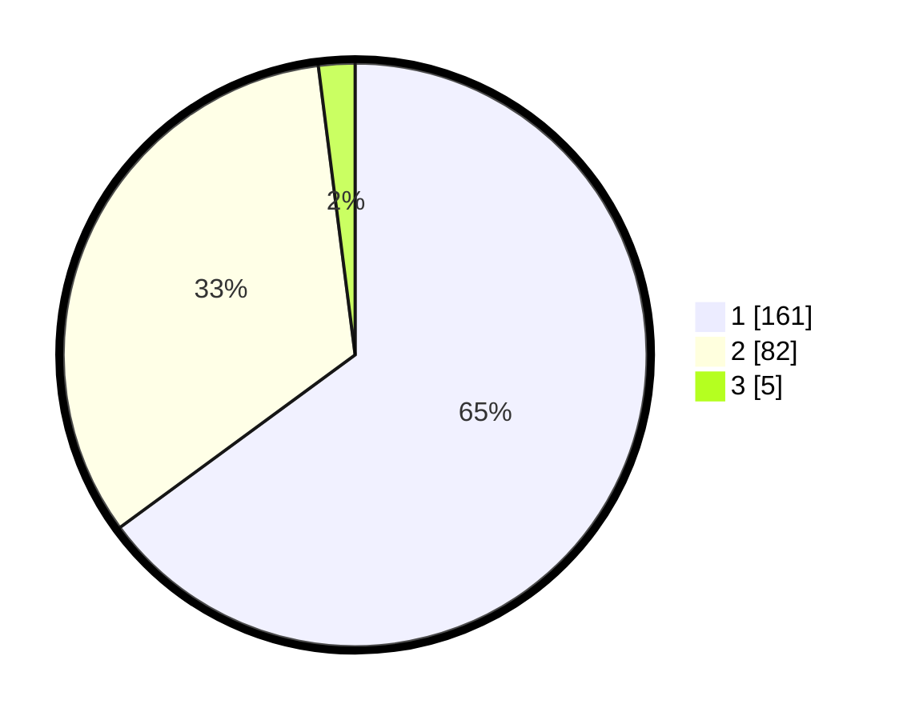

# Hasil

## Grafik

## Tabel

| No. | Nama Paslon    | Suara | Suara (raw) | Persentase |
|:--- |:-------------- | -----:| -----------:| ----------:|
| 1   | ANIES MUHAIMIN | 161   | [161][p-1]  | 64,92      |
| 2   | PRABOWO GIBRAN | 82    | [82][p-2]   | 33,06      |
| 3   | GANJAR MAHFUD  | 5     | [5][p-3]    | 2,02       |

[p-1]: https://github.com/gigit-pemilu/pemilu-2024/blob/main/pilpres/hitung-suara/sub/19-kepulauan-bangka-belitung/sub/71-kota-pangkal-pinang/sub/05-gerunggang/sub/1005-tua-tunu-indah/sub/002-tps/sub/paslon-1.txt
[p-2]: https://github.com/gigit-pemilu/pemilu-2024/blob/main/pilpres/hitung-suara/sub/19-kepulauan-bangka-belitung/sub/71-kota-pangkal-pinang/sub/05-gerunggang/sub/1005-tua-tunu-indah/sub/002-tps/sub/paslon-2.txt
[p-3]: https://github.com/gigit-pemilu/pemilu-2024/blob/main/pilpres/hitung-suara/sub/19-kepulauan-bangka-belitung/sub/71-kota-pangkal-pinang/sub/05-gerunggang/sub/1005-tua-tunu-indah/sub/002-tps/sub/paslon-3.txt

## Foto C Plano

https://sirekap-obj-formc.kpu.go.id/7f85/pemilu/ppwp/19/71/05/10/05/1971051005002-20240215-001750--a5604d3c-7593-45af-a43b-93ae487c2dd6.jpg

https://sirekap-obj-formc.kpu.go.id/7f85/pemilu/ppwp/19/71/05/10/05/1971051005002-20240215-002137--6537e60b-30e6-46c2-a3b2-edfe0fa6eb8f.jpg

https://sirekap-obj-formc.kpu.go.id/7f85/pemilu/ppwp/19/71/05/10/05/1971051005002-20240215-002224--c13cf2dc-f96a-4ad2-81ea-c5d5c4e526da.jpg

## Metadata

| Key        | Value               |
| ---------- | ------------------- |
| Time Stamp | 2024-02-15 15:30:25 |

