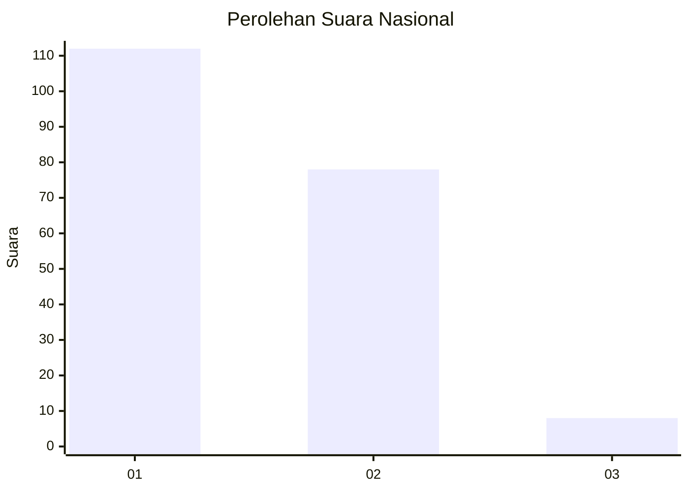
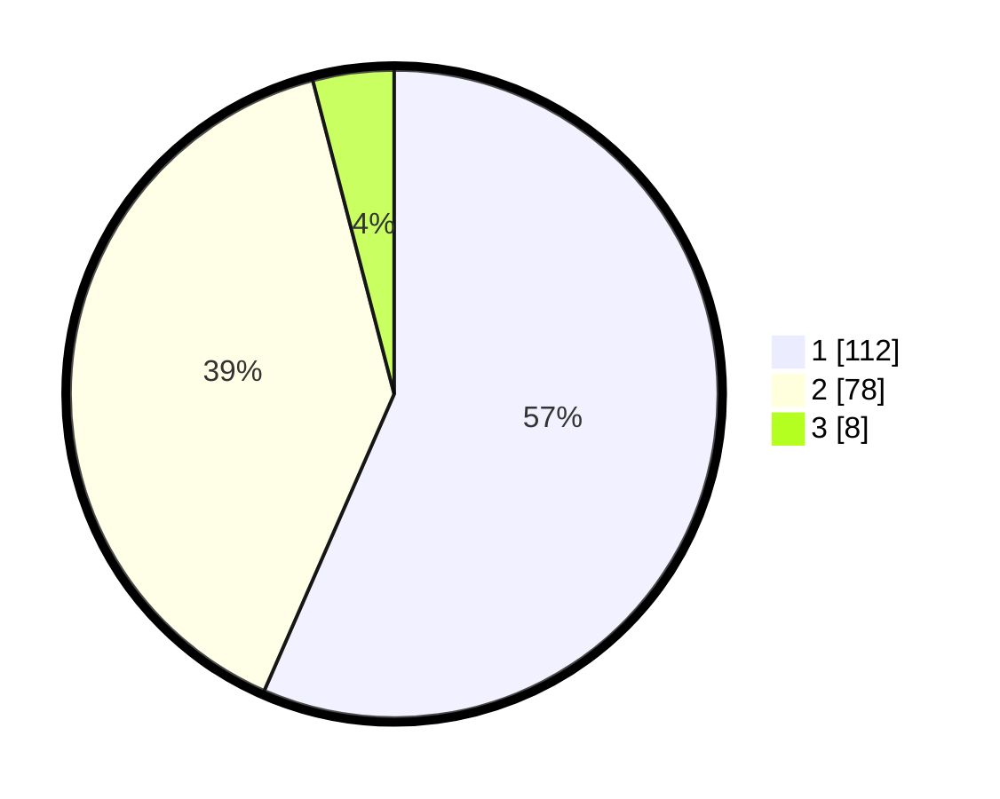

# Hasil

## Grafik

## Tabel

| No. | Nama Paslon    | Suara | Suara (raw) | Persentase |
|:--- |:-------------- | -----:| -----------:| ----------:|
| 1   | ANIES MUHAIMIN | 112   | [112][p-1]  | 56,57      |
| 2   | PRABOWO GIBRAN | 78    | [78][p-2]   | 39,39      |
| 3   | GANJAR MAHFUD  | 8     | [8][p-3]    | 4,04       |

[p-1]: https://github.com/gigit-pemilu/pemilu-2024/blob/main/pilpres/hitung-suara/sub/19-kepulauan-bangka-belitung/sub/71-kota-pangkal-pinang/sub/05-gerunggang/sub/1005-tua-tunu-indah/sub/004-tps/sub/paslon-1.txt
[p-2]: https://github.com/gigit-pemilu/pemilu-2024/blob/main/pilpres/hitung-suara/sub/19-kepulauan-bangka-belitung/sub/71-kota-pangkal-pinang/sub/05-gerunggang/sub/1005-tua-tunu-indah/sub/004-tps/sub/paslon-2.txt
[p-3]: https://github.com/gigit-pemilu/pemilu-2024/blob/main/pilpres/hitung-suara/sub/19-kepulauan-bangka-belitung/sub/71-kota-pangkal-pinang/sub/05-gerunggang/sub/1005-tua-tunu-indah/sub/004-tps/sub/paslon-3.txt

## Foto C Plano

https://sirekap-obj-formc.kpu.go.id/514e/pemilu/ppwp/19/71/05/10/05/1971051005004-20240215-020454--a3f454f2-038d-4546-9144-33e4ec9e0ec9.jpg

https://sirekap-obj-formc.kpu.go.id/514e/pemilu/ppwp/19/71/05/10/05/1971051005004-20240215-020635--a2371ac4-d54e-4d2c-bb40-fb6597943dcc.jpg

https://sirekap-obj-formc.kpu.go.id/514e/pemilu/ppwp/19/71/05/10/05/1971051005004-20240215-024454--5935fc56-ddd0-4e30-996a-98fa6335d55a.jpg

## Metadata

| Key        | Value               |
| ---------- | ------------------- |
| Time Stamp | 2024-02-15 16:00:26 |

