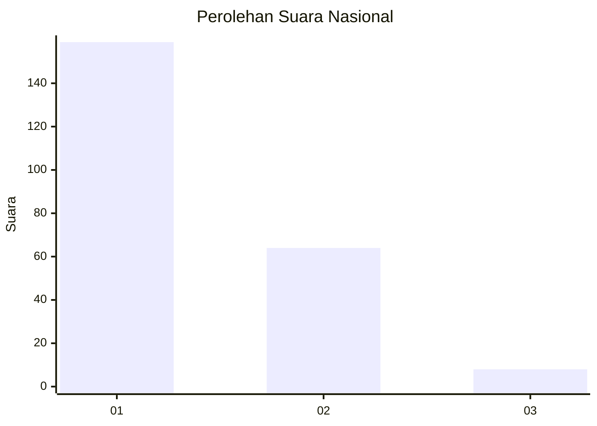
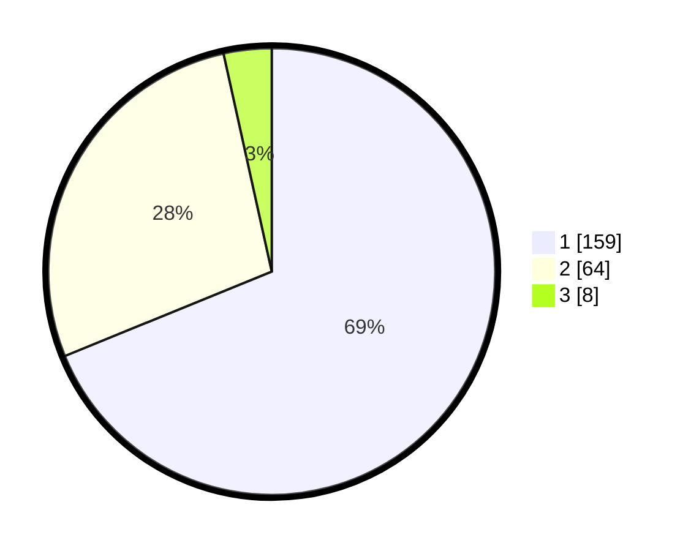

# Hasil

## Grafik

## Tabel

| No. | Nama Paslon    | Suara | Suara (raw) | Persentase |
|:--- |:-------------- | -----:| -----------:| ----------:|
| 1   | ANIES MUHAIMIN | 159   | [159][p-1]  | 68,83      |
| 2   | PRABOWO GIBRAN | 64    | [64][p-2]   | 27,71      |
| 3   | GANJAR MAHFUD  | 8     | [8][p-3]    | 3,46       |

[p-1]: https://github.com/gigit-pemilu/pemilu-2024/blob/main/pilpres/hitung-suara/sub/19-kepulauan-bangka-belitung/sub/71-kota-pangkal-pinang/sub/05-gerunggang/sub/1005-tua-tunu-indah/sub/008-tps/sub/paslon-1.txt
[p-2]: https://github.com/gigit-pemilu/pemilu-2024/blob/main/pilpres/hitung-suara/sub/19-kepulauan-bangka-belitung/sub/71-kota-pangkal-pinang/sub/05-gerunggang/sub/1005-tua-tunu-indah/sub/008-tps/sub/paslon-2.txt
[p-3]: https://github.com/gigit-pemilu/pemilu-2024/blob/main/pilpres/hitung-suara/sub/19-kepulauan-bangka-belitung/sub/71-kota-pangkal-pinang/sub/05-gerunggang/sub/1005-tua-tunu-indah/sub/008-tps/sub/paslon-3.txt

## Foto C Plano

https://sirekap-obj-formc.kpu.go.id/127e/pemilu/ppwp/19/71/05/10/05/1971051005008-20240215-005518--640b8e34-0d00-4c2e-b5d5-0ecbc8da51a2.jpg

https://sirekap-obj-formc.kpu.go.id/127e/pemilu/ppwp/19/71/05/10/05/1971051005008-20240215-005608--233fd4cc-cd27-4855-b7f4-6871509b15cf.jpg

https://sirekap-obj-formc.kpu.go.id/127e/pemilu/ppwp/19/71/05/10/05/1971051005008-20240215-005728--3c120950-d8b7-43d7-a382-98b2cb76bb69.jpg

## Metadata

| Key        | Value               |
| ---------- | ------------------- |
| Time Stamp | 2024-02-15 16:00:26 |

