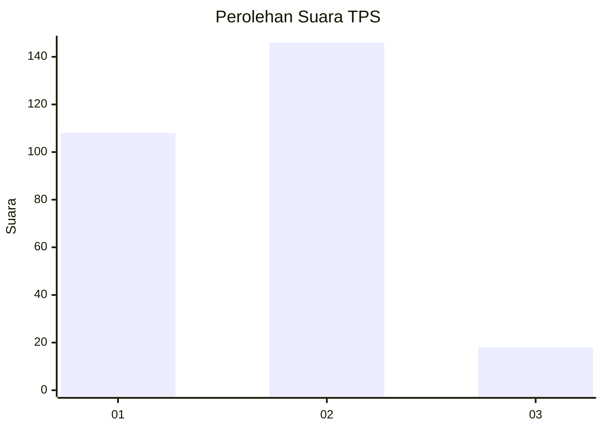

# Hasil

## Grafik

## Tabel

| No. | Nama Paslon    | Suara | Suara (raw) | Persentase |
|:--- |:-------------- | -----:| -----------:| ----------:|
| 1   | ANIES MUHAIMIN | 108   | [108][p-1]  | 39,71      |
| 2   | PRABOWO GIBRAN | 146   | [146][p-2]  | 53,68      |
| 3   | GANJAR MAHFUD  | 18    | [18][p-3]   | 6,62       |

[p-1]: https://github.com/gigit-pemilu/pemilu-2024-19-kepulauan-bangka-belitung/blob/main/pilpres/hitung-suara/sub/19-kepulauan-bangka-belitung/sub/71-kota-pangkal-pinang/sub/05-gerunggang/sub/1007-air-kepala-tujuh/sub/017-tps/sub/paslon-1.txt
[p-2]: https://github.com/gigit-pemilu/pemilu-2024-19-kepulauan-bangka-belitung/blob/main/pilpres/hitung-suara/sub/19-kepulauan-bangka-belitung/sub/71-kota-pangkal-pinang/sub/05-gerunggang/sub/1007-air-kepala-tujuh/sub/017-tps/sub/paslon-2.txt
[p-3]: https://github.com/gigit-pemilu/pemilu-2024-19-kepulauan-bangka-belitung/blob/main/pilpres/hitung-suara/sub/19-kepulauan-bangka-belitung/sub/71-kota-pangkal-pinang/sub/05-gerunggang/sub/1007-air-kepala-tujuh/sub/017-tps/sub/paslon-3.txt

## Foto C Plano

https://sirekap-obj-formc.kpu.go.id/4bd4/pemilu/ppwp/19/71/05/10/07/1971051007017-20240215-055309--2f0061a7-5dc9-49ab-b096-e79ecc132bba.jpg

https://sirekap-obj-formc.kpu.go.id/4bd4/pemilu/ppwp/19/71/05/10/07/1971051007017-20240215-055209--c14e434c-9813-4a7f-903b-dcebc662dfa8.jpg

https://sirekap-obj-formc.kpu.go.id/4bd4/pemilu/ppwp/19/71/05/10/07/1971051007017-20240215-055200--5d5a19e0-8b1c-435b-a443-092f878edb33.jpg

## Metadata

| Key        | Value               |
| ---------- | ------------------- |
| Time Stamp | 2024-02-17 11:00:02 |

